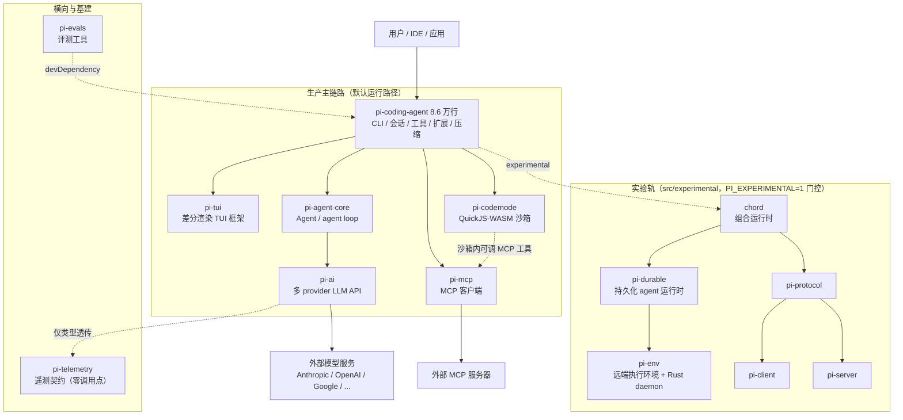

# 主体架构总览

pi 是一个**最小化、可扩展的 agent harness**：把「模型调用 + 工具执行 + 会话管理 + 终端界面」装配成一个 coding agent，并留出扩展点让你按自己的工作流改造它。本仓库是它的 monorepo（14 个 workspace 包，约 17.8 万行 TypeScript，全部 v1.1.0）。

本篇是整套文档的总览：先建立全景与分层，再拆解**生产主链路**与**实验轨**两条线，最后是工程体系与关键设计决策。细节分别见各包文档。

[返回索引](index.md) · 术语见 [glossary](glossary.md)

## 一、全景分层图



读图要点：

- **箭头方向 = 依赖方向**。生产链路是一条清晰的纵线：产品编排（coding-agent）→ agent 运行时 → 模型 API。
- **实验轨自成体系**（右下）：chord 是零 Pi 依赖的通用底座，durable 在其上重建了一套持久化 agent 运行时，env 把执行搬到远端。整条实验轨默认不加载。
- **MCP 与 codemode 是条件性关键路径**：使用了 MCP 的用户会默认经由 codemode 沙箱（见 [glossary「exposure」](glossary.md)）。

## 二、依赖矩阵

内部依赖关系（2026-10 校验自各包 `package.json`，均为 v1.1.0）：

| 包 | 内部依赖 | 被谁依赖 | 轨道 | 规模（src TS） |
|------|---------|---------|------|----------------|
| `pi-coding-agent` | chord, agent-core, ai, codemode, mcp, tui（devDeps: client, protocol, server） | 顶层产品 | 生产 | 8.6 万行 / 300 文件 |
| `pi-agent-core` | pi-ai | coding-agent | 生产 | 2519 行 / 6 文件 |
| `pi-ai` | pi-telemetry | agent-core, durable, coding-agent, evals(dev) | 生产 | 2.7 万行 / 197 文件 |
| `pi-tui` | 无 | coding-agent（88 个文件消费） | 生产 | 1.9 万行 / 46 文件 |
| `pi-mcp` | 无 | coding-agent | 生产 | 3243 行 / 18 文件 |
| `pi-codemode` | 无 | coding-agent | 生产（条件） | 1837 行 / 10 文件 |
| `pi-telemetry` | 无 | pi-ai（仅 1 个类型字段） | 横向 | 935 行 / 6 文件 |
| `chord` | 无 | protocol, client, server, durable, env, coding-agent | 实验基座 | 8817 行 / 29 文件 |
| `pi-durable` | chord, pi-ai | env；coding-agent（仅 experimental 目录，未在 package.json 声明） | 实验 | 2.0 万行 / 67 文件 |
| `pi-env` | chord, pi-durable | 无（独立产品，仓内无消费者） | 实验 | 2073 行 TS + Rust daemon |
| `pi-protocol` | chord（仅用 `JsonValue` 类型） | client, server | 实验 | 869 行 / 8 文件 |
| `pi-client` | chord, pi-protocol | coding-agent（devDep） | 实验 | 1135 行 / 8 文件 |
| `pi-server` | chord, pi-protocol | coding-agent（devDep） | 实验 | 1958 行 / 16 文件 |
| `pi-evals` | 无（devDeps: ai, coding-agent；private 不发布） | 无 | 工具 | 1446 行 / 5 文件 |

两个值得注意的点：

- coding-agent 声明了 `chord` 依赖，但全仓 grep 显示它的 chord 使用**全部**位于 `src/experimental/`（发布入口明令不得导入该目录）。
- `pi-durable` 不在 coding-agent 的 package.json 中，实验代码靠 npm workspaces 提升解析；`pi-env` 则是完整的独立产品。

## 三、生产主链路解剖

一条用户消息的完整旅程（骨架；逐跳 file:line 见 [关键数据流时序图](data-flows.md)）：

1. **启动与模式分派**：`cli.ts` → `main.ts`；`resolveAppMode`（`packages/coding-agent/src/main.ts:112`）根据参数与 TTY 判定进入 interactive / print / json / rpc 四种模式之一。详见 [启动与运行模式](packages/coding-agent-startup.md)。
2. **会话装配**：`AgentSession`（`core/agent-session.ts:378`）创建/恢复会话，装配 `pi-agent-core` 的 `Agent`、内置工具、扩展、模型层。详见 [核心运行时](packages/coding-agent-runtime.md)。
3. **agent loop**：`Agent.prompt()` 驱动循环（`packages/agent/src/agent-loop.ts:38`）：转录经 `convertToLlm` 转成模型消息 → 通过 `StreamFn` 调用模型。详见 [agent 运行时](packages/agent.md)。
4. **模型调用**：`StreamFn` 由 coding-agent 注入，落到 pi-ai 的 `Models.stream`（`packages/ai/src/models.ts:250`）→ provider 工厂 → wire API 适配 → 外部模型 SSE。详见 [pi-ai](packages/ai.md)。
5. **工具执行**：模型的工具调用回到 loop 执行（bash/edit/read 等内置工具，实现 `AgentTool` 契约），结果追加回转录；文件写操作经 `file-mutation-queue` 串行化。
6. **界面渲染**：agent 事件（`AgentEvent`）→ interactive 模式 → pi-tui 差分渲染。详见 [pi-tui](packages/tui.md)。
7. **持久化与压缩**：每个条目 append 到 JSONL 会话树；接近 token 上限时触发 compaction。

扩展点贯穿全链路：约 40 个事件钩子、工具/命令/provider/渲染器注册，见 [扩展系统与 SDK](packages/coding-agent-extensions.md)。

## 四、实验轨解剖

实验轨在回答一个问题：**如果 agent 需要崩溃可恢复、可远程、可组合，架构应该长什么样？**

| 维度 | 生产链路 | 实验轨（durable） |
|------|---------|------------------|
| agent loop | `Agent` 类，内存态隐式状态 | task 状态机（phase/checkpoint 显式建模），一切经 Storage 提交后才可见 |
| 工具副作用 | 直接执行 | 先提交 intent（含 replay 策略）再执行；崩溃恢复时按策略重跑或标记 interrupted |
| 存储 | 单文件 JSONL 会话树（append-only） | 后端可插拔：memory / SQLite / JSONL / Cloudflare Durable Objects |
| 恢复 | 无（会话文件可读但不含运行中状态） | `Harness.open` 对账（running → pending）→ 调度器续跑 |
| 跨进程 | 不涉及 | env 把 `ExecutionEnv`（文件/Shell）搬到 SSH 远端；protocol/client/server 提供多客户端远程会话 |

实验轨的三个组件：

- **chord**（[文档](packages/chord.md)）：facets + services + replicated state + delta 引擎。为「可组合、可热替换、可远程」设计的通用底座，与 Pi 完全解耦（PLANNING.md 明文铁律：不得导入任何 `@earendil-works/pi-*`）。
- **durable**（[文档](packages/durable.md)）：在 chord 之上重建的持久化 agent 运行时。**不依赖 agent-core**，两者是概念平行演化——例如 `AgentTool.replay` 字段在 agent 包中定义但无人消费，在 durable 的 ToolTask 中才真正生效。
- **env**（[文档](packages/env.md)）：TS 客户端 + 部署到远端的 Rust daemon，实现 durable 的 `ExecutionEnv` 契约。

## 五、两条远程路径

pi 有**两套互不相干**的远程/进程间机制，不要混淆：

| 维度 | RPC 模式（JSONL） | C/S 体系（CBOR） |
|------|------------------|------------------|
| 协议 | JSONL over stdio，人类可读 | CBOR 分帧（4 字节长度前缀），`PROTOCOL_VERSION = 8` |
| 拓扑 | 父进程启动并控制一个 pi 子进程，单会话 | 多客户端连接一个 server，多 session、多 attachment |
| 入口 | `coding-agent` 的 `./rpc-entry` 导出，`pi --mode rpc` | `packages/{protocol,client,server}` + coding-agent `experimental/` 子命令 |
| 成熟度 | 成熟：文档完备（`docs/rpc*.md`），定位 IDE/多语言集成 | 实验：有协议 codec 与 conformance 测试，默认不加载 |
| 详细文档 | [启动与运行模式](packages/coding-agent-startup.md) | [远程会话 C/S 体系](packages/remote-sessions.md) |

## 六、横向与基建

- **pi-telemetry**（[文档](packages/telemetry.md)）：vendor-neutral 遥测契约 + 参考实现 + conformance 套件。现状是**契约先行**：全仓零 `startSpan` 调用点，pi-ai 仅透传类型字段。不要与 coding-agent 的安装遥测（`core/telemetry.ts`，统计匿名版本使用）混淆。
- **pi-evals**（[文档](packages/evals.md)）：不进入任何运行时。host 模式在本机用 vitest in-process 评测 coding-agent；docs 模式用 Docker 双镜像做配对对比，量化「文档带来的能力提升（lift）」。

## 七、monorepo 工程与供应链

**工作区与构建**：npm workspaces（含 `packages/coding-agent/examples/extensions/*` 若干子工作区），Node ≥ 22.19。构建顺序即依赖序：

```
chord → tui → telemetry → codemode → mcp → ai → durable → env
      → agent → protocol → client → server → coding-agent
```

**质量门禁**（`npm run check`）：biome 格式化/静态检查 → 固定依赖校验（`check:pinned-deps`）→ 运行时依赖边界（`check:runtime-deps`）→ TS 相对导入规范 → 入口图校验（`check:entry-graphs`，如防止发布入口导入 experimental）→ 安装锁校验 → `tsc --noEmit` → 浏览器冒烟。

**供应链硬化**（详见根 `README.md`）：直接外部依赖钉死精确版本（`save-exact`、`min-release-age=2`）；`package-lock.json` 是依赖唯一事实源；`pi.dev` 安装器走 `install-lock/` 锁定传递依赖；各类安装在支持时全部 `--ignore-scripts`；CI 定期 `npm audit`；生命周期脚本依赖需显式 allowlist。

**其他交付形态**：Nix flake、standalone 二进制（bun 编译，`scripts/build-binaries.sh`）、供外部项目消费的打包工具（`pack:packages` + `scripts/use-local-packages.mjs`）。

## 八、关键架构决策解读

**1. TUI 为什么独立成包（pi-tui）？**
coding-agent 有 88 个源文件消费 pi-tui。独立成包让「终端渲染」与「agent 业务」解耦：pi-tui 自带 `test/virtual-terminal.ts`（基于 @xterm/headless）可独立测试，也能被其他终端应用复用。

**2. agent-core 为什么不依赖 provider 目录？**
若 agent 包直接 import pi-ai 的 provider 实现，任何模型目录变化都会牵动核心运行时。pi 的做法是 `StreamFn` 契约注入（`packages/agent/src/stream-fn.ts`）：宿主决定「怎么调模型」，agent 包只消费流。副产品是 `proxy.ts` 可以指向一个 SSE 代理端点，让浏览器等场景复用同一套 loop。

**3. durable 为什么不复用 agent-core 的 loop？**
持久化要求把每一处副作用显式建模：工具执行前先提交 intent（含 `replay` 策略）再执行，崩溃恢复才能决定「重跑还是标记 interrupted」。内存 loop 的状态是隐式的，无法在崩溃后对账，所以 durable 选择 task 状态机重写——这也解释了 `AgentTool.replay` 在生产 loop 中「定义了但无人消费」的现象。

**4. chord 为什么零 Pi 依赖？**
chord 的定位是可独立打包使用的通用组合运行时（facet/service/replicated state），PLANNING.md 明文禁止导入任何 Pi 包，并有 check 脚本保障。这使它不会随 Pi 的内部演化而被迫改接口，但也意味着它在 Pi 里目前只是实验基座。

**5. 会话存储为什么留在 coding-agent？**
生产需要的是「人类可读、git 友好、可分支」的文件格式，自研 JSONL 会话树（`session-manager.ts`）直接满足；durable 的 Storage 抽象是下一代尝试，尚未接管生产路径。改动会话格式时注意 `core/migrations.ts` 的迁移机制。

**6. 模型目录为什么是生成式的？**
40+ provider 的模型元数据（上下文长度、价格、能力）靠手写维护不现实。pi-ai 从 models.dev 等外部源拉取生成 `models.generated.ts` 与各 provider 的 `data/*.json`。**永远不要手改生成产物**，改生成器（`scripts/generate-models.ts`）后重新生成。

**7. 「不做 sub-agent 和 plan mode」**
pi 的有意取舍：核心保持最小，把这类能力留给扩展生态（见根 README“skips features like sub-agents and plan mode”）。二次开发想加这些能力，正确的落点是扩展，不是改核心。

## 九、阅读地图

| 想了解 | 读 |
|--------|-----|
| 概念定义与易混淆对照 | [术语表](glossary.md) |
| 启动参数、四种运行模式、RPC | [coding-agent 启动与运行模式](packages/coding-agent-startup.md) |
| 会话、工具、压缩、模型层（产品核心） | [coding-agent 核心运行时](packages/coding-agent-runtime.md) |
| 写扩展、打包、嵌入 SDK | [coding-agent 扩展系统与 SDK](packages/coding-agent-extensions.md) |
| agent loop 与工具执行语义 | [agent 运行时](packages/agent.md) |
| 模型调用、provider 适配、认证 | [pi-ai](packages/ai.md) |
| 终端渲染 | [pi-tui](packages/tui.md) |
| MCP / 沙箱执行 | [MCP 客户端](packages/mcp.md) · [codemode](packages/codemode.md) |
| 实验轨（持久化/远程/组合运行时） | [chord](packages/chord.md) · [durable](packages/durable.md) · [env](packages/env.md) · [远程 C/S](packages/remote-sessions.md) |
| 遥测契约 / 评测 | [telemetry](packages/telemetry.md) · [evals](packages/evals.md) |
| 端到端数据流 | [关键数据流时序图](data-flows.md) |
| 动手改代码 | [二次开发指南](development.md) · [改造指引](recipes.md) |

---

[返回索引](index.md) · 任务与进度：[roadmap](../roadmap/README.md)
