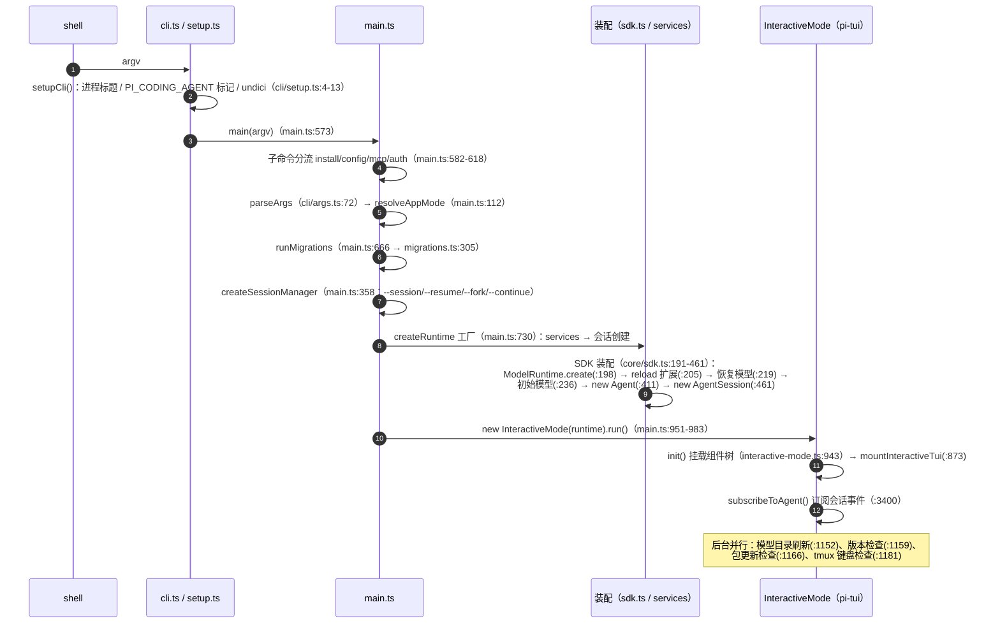
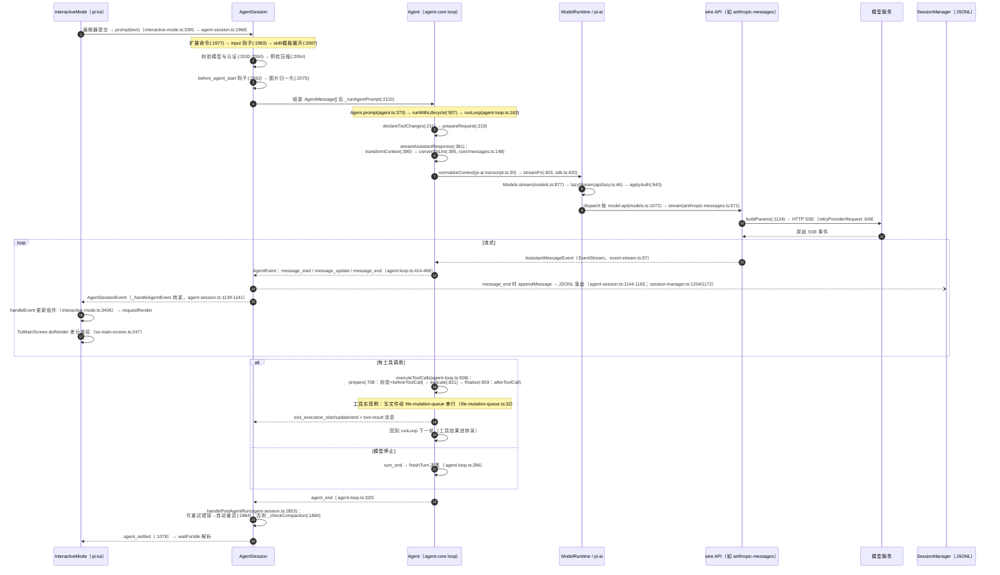
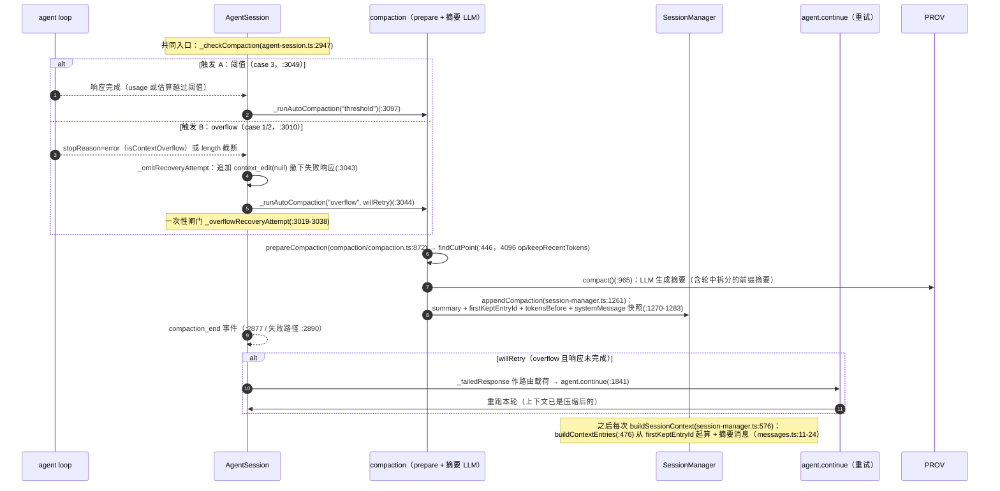
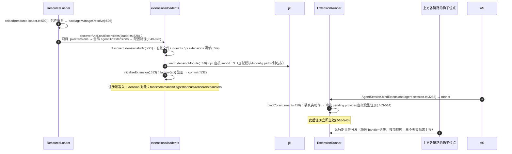
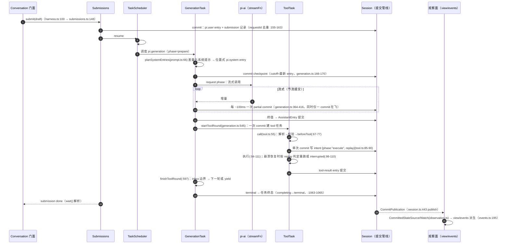
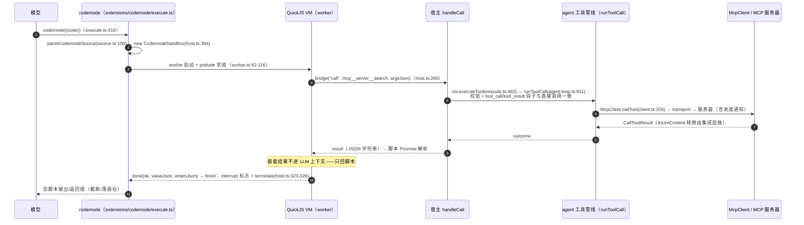

# 关键数据流时序图

汇总篇：把前面各包文档里的流程串成**端到端链路**。每条流给出触发点、参与文件（`file:line`）与**数据形态的每一次转换**。所有引用都来自本套文档各篇（均已按源码核实）。

[返回索引](index.md) · 术语见 [glossary](glossary.md) · 所属任务：T17（见 [roadmap](../roadmap/tasks.md)）

阅读建议：先看每张图的「形态」列（数据在每一跳变成了什么），再顺着参与者看代码位置。

## 一、启动链路：shell → 交互模式就绪

**触发**：用户在终端敲下 `pi`。

关键形态转换：`argv: string[]` → `Args`（`cli/args.ts:13`）→ `AppMode`（`main.ts:112`）→ `CreateAgentSessionOptions`（`core/sdk.ts`）→ `AgentSession`（持 `Agent`）→ TUI 组件树就绪，进入事件驱动。

## 二、一次用户消息的全链路（生产轨）

这是 pi 的主动脉。**触发**：用户在编辑器里输入并回车。

**形态转换链**（一条消息的每一跳）：

| 形态 | 产生点 | 说明 |
|------|--------|------|
| `string` / 图片块 | 编辑器提交 | 用户可见的输入 |
| `AgentMessage`（user，含自定义消息类型） | `AgentSession.prompt` 组装（`agent-session.ts:2079-2104`） | 可含 `bashExecution`/`custom` 等扩展消息 |
| `Message[]` | `convertToLlm`（`core/messages.ts:148`） | 扩展消息转 user；`!!` 与通知被过滤 |
| `TranscriptContext` | `normalizeContext`（pi-ai `utils/transcript.ts:30`） | system prompt/工具折叠进首条 system 消息（branded 类型） |
| provider 请求体 | wire API `buildParams`（`anthropic-messages.ts:1124`） | 厂商协议形态（消息/工具/思考参数） |
| `AssistantMessageEvent` | provider SSE → wire 适配 | `start → *_delta → *_end → done` |
| `AssistantMessage` | `EventStream.result()` | 终值消息（usage/stopReason） |
| `AgentEvent` | `streamAssistantResponse` 桥接 | `message_*` / `tool_execution_*` / `turn_*` / `agent_*` |
| `AgentSessionEvent` | `_handleAgentEvent` 转发 | 加 `queue_update`/`entry_appended`/`compaction_*`/`auto_retry_*` |
| `SessionEntry`（JSONL 一行） | `message_end` 时持久化 | `message` 条目（含 `id`/`parentId` 树结构） |
| 终端字节 | pi-tui 差分渲染 | 只写变化行（CSI 2026 帧包裹） |

## 三、压缩（compaction）：阈值与 overflow 两条触发

**触发 A（阈值）**：一轮响应完成后的 post-run 检查。
**触发 B（overflow）**：provider 报上下文溢出错误 / 可恢复的 length 截断。

**手动触发**：`/compact` → `session.compact`（`agent-session.ts:2764`）：先 `abort()`（`:2765`）→ `session_before_compact` 钩子（可取消/自定义摘要，`:2792-2812`）→ `appendCompaction`（`:2847`）→ `compaction_end`（`:2877`）；手动路径**永不自动重试**。

关键语义：压缩单元是**一次原子提交**（一个 compaction 条目 + 边界系统提示快照）；重放时模型看到的上下文 = 摘要 + `firstKeptEntryId` 之后的保留段。

## 四、扩展生命周期：从磁盘到每个钩子

**触发**：启动装配、`/reload`、或会话替换后的重绑定。

**钩子在主动脉上的位点**（回看第二节的编号）：

| 位点 | 事件 | 分发实现 |
|------|------|---------|
| `prompt` 入口（`agent-session.ts:1977/1993`） | 扩展命令、`input` | `runner` 命令表 / `emitInput` |
| 请求前（`:2062`） | `before_agent_start`（可改提示/工具/模型） | `emitBeforeAgentStart`（`runner.ts:1420`） |
| 上下文（`sdk.ts:436-440` 的 `transformContext`） | `context` / `context_with_system` | `emitContext`（`runner.ts:1298`，两阶段） |
| provider 请求（`sdk.ts:383-395`） | `before_provider_request` / `before_provider_headers` / `after_provider_response` | `emitBeforeProviderRequest`（`:1361`）等 |
| 工具调用（`agent-session.ts:652-655`） | `tool_call`（可 block）/ `tool_result`（可改结果） | `emitToolCall`（`:1242`，短路）/ `emitToolResult`（`:1183`） |
| 消息与轮（`:1103` 事件泵） | `message_*` / `turn_*` / `agent_*` / `agent_before_settle` | 各 `emit*` |
| `!` 命令与 RPC bash（`rpc-mode.ts:561`） | `user_bash`（可接管执行） | `emitUserBash`（`:1262`，异常 rethrow） |

## 五、实验轨对照：durable 的一次问答

**触发**：`Conversation.submit()`（[durable](packages/durable.md)）。与第二节逐段对照阅读——同样的语义（提示、流式、工具、压缩），不同的持久化纪律（**每一步先提交**）。

**崩溃恢复对照**（实验轨独有）：`Harness.open`（`harness.ts:411`）→ `openTasks`（`scheduler.ts:239`）：`running → pending` 保留 checkpoint 重放（`:252-253`）→ reconcile 补推 abort 标记、failFast、撤回排队输入（`:527-540`）→ 续跑。判据：phase 必须产生持久进展，否则 fault（`:963-966`）。

**两轨的关键差异一句话**：生产轨「执行 → 出错时用记忆中的状态继续」；实验轨「**提交意图 → 执行 → 用提交的记录对账**」。

## 六、（可选）MCP 工具经 codemode 沙箱执行

**触发**：模型调用 `codemode` 工具，脚本里 `await tools.mcp__server__search(...)`（MCP 默认 exposure 就是 codemode，见 [MCP](packages/mcp.md) 流程 7）。

## 七、一页速查：文件与职责对照

| 形态/关注点 | 生产者 | 消费者 |
|-------------|--------|--------|
| `AgentSessionEvent` | `agent-session.ts:1039`（`_emit`） | TUI（`:3406`）、RPC（`rpc-mode.ts:355`）、print/json（`print-mode.ts:108`） |
| `CommitPublication`（durable） | `session.ts:447`（`#publish`） | view/events/taskGraph（`view.ts`/`events.ts`/`task-graph.ts`） |
| `AssistantMessageEvent` | wire API | agent loop 桥接（`agent-loop.ts:414-468`） |
| JSONL 会话文件 | `session-manager.ts:1172`（`_persist`） | `--resume` 选择器、`--export`、fork |
| `codemode-store` entry | `execute.ts:502-507` | 下次脚本执行的 `readCodemodeStore`（`:233-243`） |
| 协议帧（CBOR） | `protocol` 编解码 | `client`/`server`（[远程会话](packages/remote-sessions.md)） |

## 八、相关文档

- 链条上的各篇（按出现顺序）：[启动与运行模式](packages/coding-agent-startup.md)、[coding-agent 核心运行时](packages/coding-agent-runtime.md)、[agent 运行时](packages/agent.md)、[pi-ai](packages/ai.md)、[pi-tui](packages/tui.md)、[扩展系统与 SDK](packages/coding-agent-extensions.md)、[MCP](packages/mcp.md)、[codemode](packages/codemode.md)、[durable](packages/durable.md)、[chord](packages/chord.md)、[远程会话](packages/remote-sessions.md)
- 下一步：[二次开发指南](development.md)（怎么构建/调试/扩展点地图）· [改造指引](recipes.md)（改哪里速查）

---

[返回索引](index.md) · 任务与进度：[roadmap](../roadmap/README.md)
