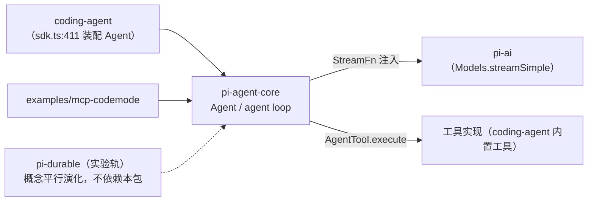
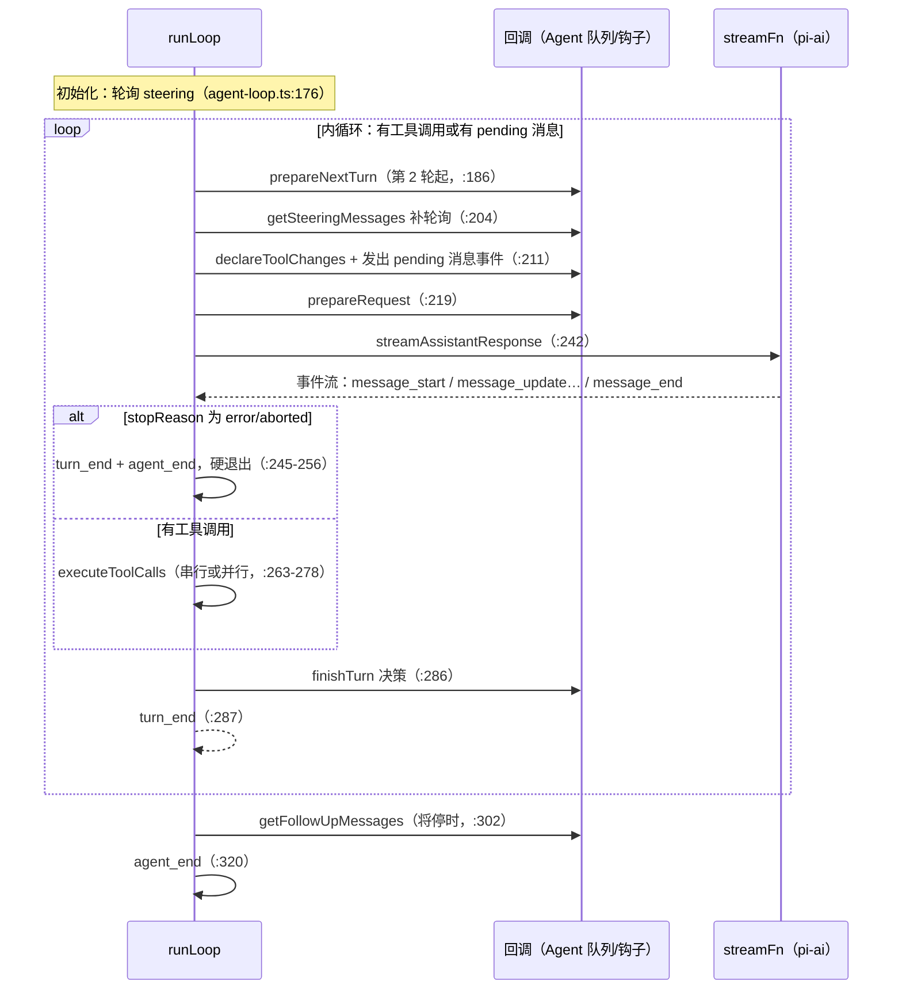

# pi-agent-core（agent 运行时）

`packages/agent`（包名 `@earendil-works/pi-agent-core`，仅 6 个源文件、约 2500 行）是 pi 的 **agent 运行时**：有状态的 `Agent` 类 + 低层 agent loop + 工具执行管线 + 事件协议。coding-agent 的生产循环用的就是它。

[返回索引](../index.md) · 术语见 [glossary](../glossary.md) · 所属任务：T04（见 [roadmap](../../roadmap/tasks.md)）

## 一、定位

一句话职责：**把「转录 → 模型调用 → 工具执行 → 转录」的循环跑起来，并通过事件流对外暴露一切**——但自己不碰模型厂商、不碰文件系统、不碰 UI。

在架构中的位置：



边界与关系：

- 依赖只有 `pi-ai`（类型与 `validateToolArguments` 等）与 `typebox`。**不依赖 provider 目录**：模型调用经 `StreamFn` 契约注入（`stream-fn.ts`），宿主决定「怎么调模型」。
- coding-agent **没有自己的第二套循环**：`coding-agent/src/core/sdk.ts:411` 直接 `new Agent({...})`，`AgentSession`（T07）只是它的上层编排（会话文件、模型解析、扩展事件）。
- 与 durable 是**平行演化**，不是调用关系：两个包的钩子命名（`beforeToolCall`/`afterToolCall`）、`terminate` 批语义、steering/follow-up 队列行为一致，但 durable 用 task 状态机重写了持久化版本。`AgentTool.replay`（`types.ts:490`）在本包的 loop 中**定义了但无人消费**，到 durable 的 ToolTask 才真正生效（详见「现状与陷阱」）。

## 二、目录结构与模块地图

| 文件 | 职责 |
|------|------|
| `src/agent.ts`（613 行） | `Agent` 类：状态（`MutableAgentState`）、双队列（steering/follow-up）、运行生命周期（`runWithLifecycle`/`handleRunFailure`/`finishRun`）、事件归约（`processEvents`） |
| `src/agent-loop.ts`（949 行） | 循环本体：`agentLoop`/`agentLoopContinue`（公开）与 `runAgentLoop`/`runAgentLoopContinue`/`runLoop`（sink 式内部实现）；工具声明差量（`declareToolChanges`）；响应流桥接（`streamAssistantResponse`）；工具执行管线（prepare/execute/finalize、串并行）；`runToolCall`（嵌套调用复用） |
| `src/types.ts`（539 行） | 全部契约：`StreamFn`、`AgentMessage`、`AgentTool`/`AgentToolResult`、`AgentLoopConfig`（含全部钩子）、`AgentEvent`、`QueueMode` 等 |
| `src/stream-fn.ts`（20 行） | `setDefaultStreamFn`/`getDefaultStreamFn`：宿主注入默认模型运行时的插槽 |
| `src/proxy.ts`（393 行） | `streamProxy`：把模型调用路由到服务器 `/api/stream` 的 SSE 客户端实现（浏览器等场景） |
| `src/index.ts`（5 行） | 全量 re-export |
| `test/`（约 4000 行） | 行为规格：`agent-loop.test.ts`（41 个用例：事件序、钩子时序、串并行、terminate、截断防护）、`agent.test.ts`、`e2e.test.ts`、`proxy.test.ts` |
| `examples/mcp-codemode/` | 把 MCP 工具与 codemode 沙箱包成 `AgentTool` 的完整示例（`tools.ts:40`/`:83`/`:116`） |

## 三、核心数据结构

### AgentMessage 与 declaration merging

```ts
export type AgentMessage = Message | CustomAgentMessages[keyof CustomAgentMessages];
```

`AgentMessage`（`types.ts:374`）是 pi-ai `Message` 联合类型 + **应用自定义消息**。下游通过 TypeScript declaration merging 扩展 `CustomAgentMessages`（`types.ts:365`）加入自己的消息类型（如 UI 通知、artifact），再在 `convertToLlm` 里转换或过滤掉。注意源码 JSDoc 示例里的模块名写的是旧包名 `@mariozechner/agent`（`types.ts:357`），实际包名是 `@earendil-works/pi-agent-core`。

### AgentState 与 AgentContext

- `AgentState`（`types.ts:382`）：`Agent` 对外状态。`systemPrompt` 只读（从 system 消息**重放**得出）；`tools`/`messages` 是 accessor——赋值整个数组会**浅拷贝**（`agent.ts:97-105`）；`isStreaming`/`streamingMessage`/`pendingToolCalls`/`errorMessage` 是运行状态。
- `AgentContext`（`types.ts:502`）：低层循环的输入快照——`messages`（转录）+ `tools`（**可执行**工具）。与转录里「已向模型声明」的工具可能不同，差量由 `declareToolChanges` 在每次请求前对齐（见流程 3）。

### AgentTool（工具契约）

`AgentTool`（`types.ts:466`）在 pi-ai `Tool`（name/description/typebox 参数）基础上扩展：

```ts
interface AgentTool<...> extends Tool<...> {
  label: string;                                    // UI 显示名
  execute(toolCallId, params, signal?, onUpdate?): Promise<AgentToolResult>;  // 抛错或 isError:true 表示失败
  prepareArguments?(args): Static<TParameters>;     // 校验前的兼容垫片
  outputSchema?: TSchema;                           // structuredContent 的 schema
  replay?: "never" | "safe";                        // 崩溃恢复策略（本包不消费，见下）
  executionMode?: "sequential" | "parallel";        // 单工具强制串行
}
```

`AgentToolResult`（`types.ts:424`）：`content`（给模型的文本/图片）+ `details`（给 UI/日志）+ `structuredContent`（给程序调用方，**不发给模型**）+ `isError`/`terminate`。`terminate: true` 是**批次终止**提示：只有一批内**所有**工具结果都置位才生效（`shouldTerminateToolBatch`，`agent-loop.ts:690`）。

### AgentLoopConfig（循环契约与全部钩子）

`AgentLoopConfig`（`types.ts:193`）继承 pi-ai `SimpleStreamOptions`（temperature、reasoning 等），核心字段：

| 字段 | 位置 | 契约要点 |
|------|------|---------|
| `convertToLlm`（必填） | `types.ts:222` | `AgentMessage[] → Message[]`，**不得 throw**（抛错会打断低层循环且不产生正常事件序列）；不能转换的消息（UI 通知等）应过滤 |
| `transformContext` | `types.ts:244` | 在 `convertToLlm` **之前**作用于 AgentMessage 层（裁剪旧消息、注入外部上下文），同样不得 throw |
| `getApiKey` | `types.ts:254` | 每次 LLM 调用前动态解析 key（应对长工具执行期间过期的 OAuth token） |
| `finishTurn` | `types.ts:155` | 每轮 `turn_end` 前决策 `{action:"continue"|"end"}`；`end` 不再轮询队列直接退出 |
| `prepareRequest` | `types.ts:186` | **每次**请求前（含第一次）替换 context/model/thinkingLevel；不轮询队列 |
| `prepareNextTurn` | `types.ts:278` | 上一轮结束后、下一轮开始前替换状态或追加消息（如压缩后的上下文） |
| `getSteeringMessages` / `getFollowUpMessages` | `types.ts:293`/`:306` | 队列供给回调，不得 throw，无消息返回 `[]` |
| `beforeToolCall` / `afterToolCall` | `types.ts:326`/`:341` | 工具钩子（见流程 4） |
| `toolExecution` | `types.ts:317` | `"sequential"` / `"parallel"`（默认 parallel） |

### StreamFn 与 AgentEvent

- `StreamFn`（`types.ts:33`）：`(model, context, options) => AssistantMessageEventStream | Promise<...>`。契约：**不得 throw / 不得返回 rejected promise**；失败必须编码进流（以 `stopReason: "error" | "aborted"` 的终值消息收尾）。pi-ai 的 `Models.streamSimple` 天然满足此形状。
- `AgentEvent`（`types.ts:516`）：运行时事件的完整联合——
  - 生命周期：`agent_start` / `agent_end`
  - 轮：`turn_start` / `turn_end`
  - 消息：`message_start` / `message_update`（仅 assistant，含原始 `assistantMessageEvent`）/ `message_end`
  - 工具：`tool_execution_start` / `tool_execution_update`（partialResult）/ `tool_execution_end`

## 四、关键运行流程

### 1. 双循环与 turn 生命周期（`runLoop`，`agent-loop.ts:163`）



要点：

- **内循环**条件：`hasMoreToolCalls || pendingMessages.length > 0`（`:183`）。工具批耗尽后 `finishTurn` 返回 `{action:"continue"}` 会触发**恰好一次**的「仅上下文」续轮（`:294-298`、`:310-314`），除非已有工具结果/steering/follow-up 自然满足。
- **steering 的三个轮询点**：循环开始（`:176`，覆盖「等待期间用户已输入」）、`prepareNextTurn` 之后（`:204`，覆盖长准备期间入队）、`finishTurn` 之后（`:295`）。**follow-up 只在「将停」时轮询**（`:302`）。
- error/aborted 是**硬退出**：`finishTurn` 不参与，直接 `turn_end` + `agent_end`。

### 2. 请求组装与两道转换边界（`streamAssistantResponse`，`agent-loop.ts:381`）

调用链：`transformContext`（AgentMessage → AgentMessage，`:390`）→ `convertToLlm`（AgentMessage → pi-ai `Message`，`:395`）→ `normalizeContext`（折叠 system prompt/工具进首条 system 消息，`:397`）→ `getApiKey` 动态解析（`:400`）→ `streamFn(model, transcript, { ...config, apiKey, signal })`（`:403`）。

pi-ai 事件 → AgentEvent 的桥接（`:414-468`）：

- `start` → 把 `partial` 消息放入 context 并 emit `message_start`（`:416-421`）；
- `*_start/_delta/_end` → 原位替换 context 末条消息，emit `message_update`（携带原始事件）；
- `done`/`error` → `result()` 取终值消息替换占位，emit `message_end`（`:443-455`）。`result()` 顺带把 `thinkingLevel` 记到终值消息上（`:409`）。

### 3. 工具声明差量（`declareToolChanges`，`agent-loop.ts:333`）

`context.tools` 是**运行时能执行**的工具；转录里 system 消息声明的是**模型可见**的工具。每次请求前：

1. 若有 pending system 消息，其 `toolsAdded/toolsRemoved` 被**视为意图并重写**为「已提交转录 vs 可执行集」的差量（`:341-357`）；
2. 否则算出差量，非空时插入一条新 system 消息——位置在第一条非 system 的 pending 消息之前（`:358-362`）；
3. 无差量且无 pending system 消息则原样返回（不产生多余消息）。

这保证「按序重放全部 system 消息 == 当前 `context.tools`」（对应测试：`agent.test.ts` "declares tool loadout changes…"、"merges tool changes into a pending system message"、"rewrites pending tool declarations…"）。

### 4. 工具批执行管线（`executeToolCalls`，`agent-loop.ts:508`）

模式选择（`:516-522`）：`config.toolExecution === "sequential"` **或**批内任一工具 `executionMode === "sequential"` 时整批串行，否则并行（默认）。

单次调用的三段管线：

1. **prepare**（`prepareToolCall`，`:708`）：找工具（未找到 → immediate error 结果）→ `prepareArguments`（兼容垫片，`:694`）→ `validateToolArguments`（typebox 校验，来自 pi-ai）→ `beforeToolCall` 钩子（可 `{block: true, reason?, terminate?}` 阻止执行，`:728-756`）→ abort 检查。任何异常都收敛为 immediate error 结果。
2. **execute**（`executePreparedToolCall`，`:821`）：调用 `tool.execute(toolCallId, args, signal, onUpdate)`；`onUpdate` 推入 `tool_execution_update` 事件（工具 settle 后忽略迟到的 update，`:827`）；记录 `durationMs`（单调时钟，不含钩子）。
3. **finalize**（`finalizeExecutedToolCall`，`:859`）：`afterToolCall` 钩子**字段级覆盖**（`content`/`details`/`usage`/`isError`/`terminate`）；注意：替换 `content` 而未提供 `structuredContent` 时后者被丢弃（`:884-895`，二者可能不再匹配）。

事件与消息顺序（关键差异）：

- **串行**：逐个「start → 执行 → end → message」；abort 后停止余下调用（`:575`）。
- **并行**：先把全部调用**串行 preflight**（prepare + `tool_execution_start`，`:596-644`），再 `Promise.all` 执行（`:646`）；`tool_execution_end` 按**完成顺序**发出，而 tool-result 消息在最后按**助手消息源顺序**批量发出（`:649-654`）。UI 需按 `toolCallId` 关联而不是依靠顺序。

两个防护：

- **截断防护**：`stopReason === "length"` 时**不执行任何工具调用**，全部返回错误结果让模型重发（`failToolCallsFromTruncatedMessage`，`:478`；原因：流式 JSON 抢救解析可能产出「能过校验但静默缺参」的调用）。
- **嵌套调用**：工具内部要调其他工具时用 `runToolCall`（`:811`）——走同一 prepare/hooks/execute 管线（权限检查一致），但不发事件、不追加消息；`examples/mcp-codemode/tools.ts:83` 是标准用法。

### 5. Agent 类的运行生命周期（`agent.ts`）

- **单飞保护**：`activeRun` 存在时 `prompt()`/`continue()`/`reset()` 直接抛错（`:373`/`:384`/`:355`）；运行中要追加输入用 `steer()`/`followUp()`。
- `runWithLifecycle`（`:507`）：建 `AbortController`、置 `isStreaming`、执行，异常走 `handleRunFailure`（`:532`）——**合成一条 `stopReason: "error"|"aborted"` 的 assistant 消息**，并补发完整事件序列（`message_start` → `message_end` → `turn_end` → `agent_end`），保证 UI 不会「卡在半路」；`finally` 走 `finishRun`（`:550`）清状态并 resolve `waitForIdle()`。
- `processEvents`（`:565`）：先做**状态归约**（streamingMessage 跟踪、`messages.push`、pendingToolCalls 集合增删、`turn_end` 时记录 `errorMessage`），然后**按订阅顺序 `await` 每个 listener**（`:609-611`）。这就是「事件屏障」语义：run 的 settle 包含全部 listener 完成——coding-agent 的 TUI 渲染与会话落盘都在 listener 里，因此 `await agent.prompt()` 返回时，副作用已全部完成。
- **队列模型**：`PendingMessageQueue`（`:143`）支持 `"all"`（一次 drain 全部）与 `"one-at-a-time"`（默认，`agent.ts:247-248`，只取最旧一条）。`steer()` 在每轮工具执行后注入；`followUp()` 只在将停时注入。Agent 把两个队列接到 loop 的 `getSteeringMessages`/`getFollowUpMessages`（`:496-503`）。`finishTurn` 以 `action:"end"` 结束时**不清队列**（测试 "keeps queues when finishTurn ends the run"）。

### 6. 传输层：StreamFn 注入与 proxy 模式

- 默认注入：宿主调用 `setDefaultStreamFn(fn)`（`stream-fn.ts:11`），`Agent` 构造时没传 `streamFn` 则用它（`agent.ts:236`；为兼容旧编译产物保留的兜底，`agent.ts:231` 注释）。coding-agent 的注入点见 `sdk.ts:420-431`（包了 cache warmer 与请求选项）。
- **proxy 模式**（`proxy.ts:107`）：`streamProxy` 向 `<proxyUrl>/api/stream` POST `{model, context, options}`，服务器负责鉴权与真实调用。协议事件 `ProxyAssistantMessageEvent`（`:23`）**剥离了 partial 字段**以省带宽，客户端在 `processProxyEvent`（`:257`）里本地重建 partial 消息。两个细节：流干净 EOF 却没有 `done`/`error` 事件时合成 error（`:219-230`，防止消费者永远等待）；abort 通过取消 reader 实现（`:136-144`）。

## 五、对外接口与扩展点

公开 API（`index.ts:1-5` 全量导出）：

- **类**：`Agent`（`prompt`/`continue`/`steer`/`followUp`/`abort`/`waitForIdle`/`reset`/`subscribe`/`peekQueuedMessages` + 可写字段 `convertToLlm`/`transformContext`/`streamFunction`/各钩子）
- **低层函数**：`agentLoop`/`agentLoopContinue`（返回 `EventStream<AgentEvent, AgentMessage[]>`，`:38`/`:71`）、`runAgentLoop`/`runAgentLoopContinue`（sink 式，`:102`/`:128`）、`runToolCall`（嵌套调用，`:811`）
- **传输**：`streamProxy`、`setDefaultStreamFn`
- **类型**：`types.ts` 全部

扩展点速查（都是配置即扩展，无需 fork）：

| 想做什么 | 用什么 |
|----------|--------|
| 增加自定义消息类型（UI 通知等） | `CustomAgentMessages` declaration merging + `convertToLlm` 过滤/转换 |
| 请求前裁剪/注入上下文 | `transformContext` |
| 工具审批/权限/拦截 | `beforeToolCall` 返回 `{block: true, reason}` |
| 结果脱敏/审计/改写 | `afterToolCall`（字段级覆盖，注意 structuredContent 规则） |
| 控制继续/结束/内部续轮 | `finishTurn` + `prepareRequest` + `prepareNextTurn` |
| 换模型调用方式（代理、测试） | `streamFn` / `setDefaultStreamFn` / `streamProxy` |
| 工具内部调其他工具 | `runToolCall` |
| 限制并发语义 | `Agent.toolExecution` 或单工具 `executionMode` |
| 运行中引导/排队 | `steer()`/`followUp()` + `steeringMode`/`followUpMode` |

下游装配参照：`packages/coding-agent/src/core/sdk.ts:411`（`new Agent` 全参装配），钩子接线在 `agent-session.ts:653-654`。

## 六、现状与陷阱

1. **`AgentTool.replay` 定义了但本包不消费**（`types.ts:490`）：全包 grep 只有定义处。它是为 durable 的崩溃恢复准备的（durable 的 ToolTask 用 `replay:"safe"` 决定重跑）。在本包执行链里它没有任何效果——不要在工具里指望它。
2. **`StreamFn` 不得 throw 是硬契约**：`runLoop` 不会捕获 streamFn 的同步抛错；直接使用低层 `agentLoop` API 时违反契约会 reject。走 `Agent` 类时有 `handleRunFailure` 兜底（合成事件序列），但语义已从「流内错误」降级为「run 失败」。
3. **`beforeToolCall` 修改参数不会被重新校验**：钩子拿到的是已校验对象，可以原位修改（测试 "should execute mutated beforeToolCall args without revalidation"）。它适合做审批/审计，不适合信任边界之外的篡改防护——校验发生在钩子**之前**。
4. **并行模式的顺序语义**：`tool_execution_end` 按完成序、结果消息按源序（`agent-loop.ts:646-654`）。依赖事件顺序的 UI/日志代码必须按 `toolCallId` 关联。
5. **默认队列模式是 `one-at-a-time`**（`agent.ts:247-248`）：一次 drain 只注入最旧一条 steering/follow-up。想一次性注入全部要显式设 `steeringMode`/`followUpMode`（coding-agent 从 settings 读取，见 `sdk.ts:441-442`）。
6. **`prepareNextTurn` 有两个版本**：旧的 `prepareNextTurn(signal?)` 与新的 `prepareNextTurnWithContext(context, signal)`；两者都在时优先 WithContext（`agent.ts:484-492`）。写新集成用后者。
7. **事件屏障是特性也是约束**：`processEvents` 会 `await` 每个 listener（`agent.ts:609-611`），慢 listener 会拖慢整个 run 的 settle。UI 里做重活要么异步化要么放 QueueMicrotask——但注意 run 的 idle 判定就依赖这个 await。
8. **`length` 截断宁可全错不执行**：见流程 4 的截断防护。模型收到错误结果后重发表演更好于执行半截参数——如果你实现依赖 `length` 场景的「尽力执行」，本包的设计不支持。

## 七、二次开发落点

| 需求 | 落点 |
|------|------|
| 在应用里嵌入 pi 的 agent 能力 | `new Agent({ streamFn, convertToLlm, initialState })` + `subscribe`；模型调用自选（pi-ai 或 `streamProxy`） |
| 自定义消息类型进转录 | declaration merging + `convertToLlm`（参考 coding-agent 的 `core/messages.ts`，T07） |
| 加工具审批/权限层 | `beforeToolCall`（coding-agent 的对应实现在 `agent-session.ts:658` 起） |
| 工具结果加工/脱敏 | `afterToolCall` |
| 压缩/裁剪上下文 | `transformContext` 或 `prepareNextTurn` 替换 context（coding-agent 的 compaction 走后者，T07） |
| 通过服务器代理模型调用 | `streamProxy` + 自建 `/api/stream` 服务端（durable 系有对应实现，T12） |
| 实现新的持久化/恢复语义 | 参考 durable（T12）——它重写了本包的同类概念，是「平行演化」的对方 |

## 八、相关文档

- [packages/agent/README.md](../../packages/agent/README.md)——用户向 API 文档（本包 README 质量高，含事件时序图；本篇是其源码视角补充）
- `packages/agent/examples/mcp-codemode/`——MCP + codemode 包装成 AgentTool 的完整示例
- 本套文档：[pi-ai](ai.md)（`StreamFn` 的提供方与 `validateToolArguments` 来源）、[coding-agent 核心运行时](coding-agent-runtime.md)（`AgentSession` 如何装配本包）、[durable](durable.md)（平行演化的持久化实现）、[glossary](../glossary.md)、[architecture](../architecture.md)

---

[返回索引](../index.md) · 任务与进度：[roadmap](../../roadmap/README.md)
