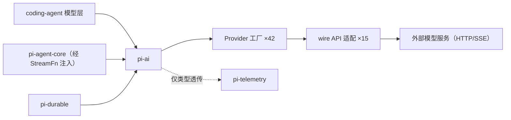
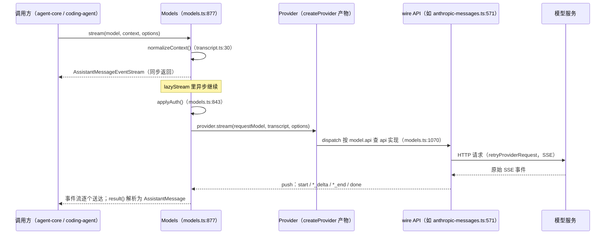

# pi-ai（多 provider LLM 统一 API）

`packages/ai`（包名 `@earendil-works/pi-ai`，约 2.7 万行、197 个源文件）是 pi 的模型调用层：把 40+ 家模型服务统一成一套流式事件协议，供 `pi-agent-core`、`pi-durable` 与 coding-agent 的模型层消费。

[返回索引](../index.md) · 术语见 [glossary](../glossary.md) · 所属任务：T03（见 [roadmap](../../roadmap/tasks.md)）

## 一、定位

一句话职责：**给「一次模型请求」提供统一的类型、事件协议、认证与错误语义**，把厂商差异（HTTP 协议、SSE 格式、思考参数、缓存标记）全部封在 wire API 适配层里。

在架构中的位置：



边界（重要）：

- pi-ai **不含 agent 概念**：没有循环、没有工具执行，只有「工具声明（`Tool`）、工具调用的数据结构（`ToolCall`）与参数校验」。
- `src/index.ts` 是**side-effect free 的 core barrel**：不引入生成目录、provider 工厂、OAuth 实现（源码注释约定）。需要这些能力时从子路径导入（见「对外接口」）。

## 二、目录结构与模块地图

| 路径 | 职责 |
|------|------|
| `src/types.ts`（1191 行） | 全部核心类型：消息与内容块、`Model` 族、`Provider`/`Models` 之外的请求选项、事件协议、各 API 的 compat 设置 |
| `src/models.ts`（1263 行） | `Models` 集合接口与实现、`createModels`、`createProvider`、`hasApi`、成本计算、思考级别工具函数 |
| `src/index.ts`（48 行） | core barrel（side-effect 边界，见上） |
| `src/providers/` | 42 个内建 provider 工厂（`<id>.ts`）+ 生成包装（`<id>.models.ts`）+ 模型数据（`data/*.json`，构建期生成）+ `faux.ts`（测试假 provider） |
| `src/providers/all.ts`（190 行） | 内建注册表：`builtinProviders()` / `builtinModels()` / `getBuiltinModel*()` 类型化读取 |
| `src/api/` | 15 个 wire API 实现（`anthropic-messages.ts`、`openai-completions.ts`、`google-generative-ai.ts` 等）+ `*.lazy.ts` 惰性包装 + 共享件（`transform-messages.ts`、`constrained-sampling.ts`、`*-shared.ts`） |
| `src/api/lazy.ts` | `lazyStream`（同步返回流、异步做 setup）与 `lazyApi`（动态 import 包装 wire 实现） |
| `src/auth/` | 认证解析（`resolve.ts`）、契约（`types.ts`）、标准实现助手（`helpers.ts`）、环境上下文（`context.ts`）、凭据存储接口（`credential-store.ts`）+ `oauth/`（12 个登录/刷新流程） |
| `src/utils/`（26 个文件） | 事件流（`event-stream.ts`）、转录规范化（`transcript.ts`）、工具校验（`validation.ts`）、重试（`retry.ts`/`provider-retry.ts`）、溢出识别（`overflow.ts`）、错误体（`error-body.ts`）等 |
| `src/models.generated.ts`（309 行） | 三张聚合目录：`MODELS` / `IMAGE_MODELS` / `CLASSIFIER_MODELS`（生成产物） |
| `src/model-catalog.ts` | 生成 shard 的类型推导辅助（`flattenChatModelCatalog` 等，`const` 泛型把 JSON 形状推导为 `Model<Api>` 类型） |
| `src/models-store.ts` | 动态模型目录的持久化接口（`ModelsStore`，含 etag/lastModified 增量字段） |
| `src/compat.ts`（302 行） | 旧的全局 API（过渡层，见「现状与陷阱」） |
| `src/cli.ts` | 开发用 OAuth 登录小工具（写 `auth.json`） |
| `src/env-api-keys.ts`、`src/oauth.ts`、`src/image-models.ts`、`src/images*.ts`、`src/legacy-api-aliases.ts`、`src/bedrock-provider.ts`、`src/bun-oauth.ts`、`src/session-resources.ts` | 兼容子路径出口与会话资源清理注册（`registerSessionResourceCleanup`） |
| `scripts/generate-models.ts`（3684 行） | 模型目录生成器；另有 `check-model-data.ts`、`hydrate-model-catalog.ts` 等辅助 |

三种「模型操作」贯穿全包（类型层 `ModelTypeMap`，`types.ts:1181`）：**chat**（`stream`）、**image**（`generateImages`）、**classifier**（`classify`）。

## 三、核心数据结构

### 消息体系（`src/types.ts`）

```ts
export type Message = SystemMessage | UserMessage | AssistantMessage | ToolResultMessage;
```

| 结构 | 位置 | 关键点 |
|------|------|--------|
| `SystemMessage` | `types.ts:528` | 首条 system 消息即系统提示；后续 system 消息可携带 `content` 追加、`sections` 按名替换/删除、`toolsAdded`/`toolsRemoved` 改变工具集——**按序重放得到当前 prompt 与工具** |
| `UserMessage` | `types.ts:546` | 文本或文本+图片 |
| `AssistantMessage` | `types.ts:552` | 内容块数组 + `usage` + `stopReason` + 提供方元信息（`responseModel`/`responseId`/`providerThinkingLevel`）+ 失败时的 `errorMessage`/`diagnostics` |
| `ToolResultMessage` | `types.ts:607` | 支持文本/图片；`nestedCalls` 记录工具内嵌套调用（如 codemode 脚本），**只入会话记录、不发给模型** |

内容块：`TextContent`（`:401`）、`ThinkingContent`（`:407`，含 redacted 思考的加密重放语义）、`ImageContent`（`:417`）、`ToolCall`（`:423`，参数是完整 `JsonObject`；流式过程中由 `toolcall_delta` 逐段生成）。

### Context 与 TranscriptContext

- `Context`（`types.ts:753`）是**调用方输入**：`{ systemPrompt?, messages, tools? }`。
- `TranscriptContext`（`types.ts:767`）是**规范化后的请求上下文**，带唯一 symbol brand——只有 `normalizeContext()`（`utils/transcript.ts:30`）能产生它；system prompt 与工具被折叠进首条 system 消息（`createInitialSystemMessage`，`transcript.ts:10`）。裸 `Context` 无法意外流到 provider 代码里。

配套的重放工具（都在 `transcript.ts`，是理解「工具差量」的关键）：

- `getCurrentSystemMessage`（`:73`）把全部 system 消息重放为一条当前消息；`getCurrentTools`（`:58`）重放出当前工具集；
- `resolveTranscript`（`:115`）根据模型是否支持 mid-conversation system messages 决定「原样保留」或 `collapseSystemMessages`（`:108`，折叠为单条头部消息）；
- `resolveTranscriptTools`（`:229`）决定工具声明放请求顶层还是锚定在 system 消息处（`anchorsAdditions`）。

### Model 族与 Provider/Models

- `BaseModel` / `Model` / `ImageModel` / `ClassifierModel`（`types.ts:1118`/`:1132`/`:1168`/`:1175`）：模型目录条目；chat 是默认类型（无 `type` 字段）。`Model` 上的关键字段：`contextWindow`、`maxTokens`、`reasoning`、`thinkingLevelMap`（把 pi 的思考级别映射到厂商值，`null` 表示不支持）、`promptCache`、`samplingParams`、`compat`（按 api 收窄的兼容设置，`:1154`）。
- `Provider`（`models.ts:150`）：运行时的具体单元——id/name、`auth`（必填）、`getModels()`（同步、目录）、`refreshModels?`（动态目录）、`stream`/`streamSimple`/`fetchDeferred?`/`cancelDeferred?`、`generateImages?`/`classify?`。
- `Models`（`models.ts:250`）：provider 集合 + 认证应用 + 请求便捷方法。读取接口有三档：不带限定词的（`getModels`/`getModel`/`getAvailable`）只返回 chat；`*OfType` 返回单一类型；`getAllModels`/`getAllAvailable` 返回全部类型。

### 事件协议（`AssistantMessageEvent`，`types.ts:788`）

```
start →（text_start/delta/end | thinking_start/delta/end | toolcall_start/delta/end）* → done | error
```

- `partial` 是**实时组装中的响应**，不是事件时点快照：`*_start` 时块为空，`*_delta` 逐段增长，`*_end` 是权威值。
- 成功流：`start` 在前，`done` 终止；setup 阶段失败可以直接 `error`（无 `start`）；`start` 之后的失败也以 `error` 终止。
- `AssistantMessageEventStream`（`utils/event-stream.ts:97`）在 `done`/`error` 时给终值补 `durationMs`（单调时钟计时）；`result()` 返回终结消息。基类 `EventStream`（`:26`）就是 push/end/result 的异步迭代队列。

## 四、关键运行流程

### 1. 一次流式请求的生命周期（核心流程）



调用链细节（以 Anthropic 为例）：

1. `Models.stream`（`models.ts:877`）：同步 `normalizeContext` → `lazyStream(model, setup)`（`api/lazy.ts:46`）——**立即返回流对象**，setup（查 provider、解析认证、派发）在流背后异步执行；setup 抛错会被捕获并转为流内的 `error` 事件（`createSetupErrorMessage`，`lazy.ts:4`）。
2. `applyAuth`（`models.ts:843`）：`getAuth` 解析出 `apiKey/headers/baseUrl/env`，与请求级 options 合并（显式 options 逐字段优先），并应用 `transformHeaders`。
3. `Provider.stream` → `createProvider` 的 `dispatch`（`models.ts:1072`）：按 `model.api` 在 `api` map 里找实现；找不到返回一条直接报错的流（`ModelsError("stream")`，`:1078`）。
4. wire 实现（`api/anthropic-messages.ts:571`）：`resolveTranscript` 折叠 system 消息（`:577`）→ `createClient`（`:982`，SDK 客户端 + OAuth beta 头）→ `buildParams`（`:1124`，消息/工具/思考参数转换）→ 用户回调 `onPayload` → `retryProviderRequest` 发起请求（`:649`）→ `onResponse` → push `start` → SSE 解码循环（`iterateAnthropicEvents`，解码器 `:379-569`）逐事件 push。
5. 终止：`done`（带最终 `AssistantMessage`）或 `error`；`complete()` = `stream().result()`（`models.ts:893`）。

### 2. Provider 构建与派发（`createProvider`，`models.ts:1041`）

- `api` 可以是**单个实现**（所有 chat 模型共用）或**按 `model.api` 的 map**（混合 API 的 provider，如 OpenRouter）；`images`/`classifiers` 同样按 api 分派。三者至少有一个，否则构造即抛错（`:1052`）。
- 静态基线模型 + 动态 overlay 的合并逻辑在 `currentModels`（`:1059`）：动态层按「类型 + id」覆盖基线。
- 动态 provider（有 `fetchModels`）的 `refreshModels`（`:1093`）：先**恢复**上次持久化的目录（`context.stored`，经 `publish({update})`），网络允许时再抓取并 `publish({persist, update})`。

### 3. 认证解析（`auth/resolve.ts`，核心语义）

优先级（`resolveProviderAuth`，`resolve.ts:33`）：

1. 请求级显式 `options.apiKey`；
2. **已存储凭据**（credential store，每个 provider 一条）：OAuth 走 `resolveStoredOAuth`（`:161`）——剩余有效期 <5 分钟触发刷新；api_key 走 `resolveApiKey`（`:193`）；
3. 环境/环境变量等 ambient 来源（由 provider 自己的 `ApiKeyAuth.resolve` 实现，如 `providers/anthropic.ts:19` 的顺序：凭据 → `ANTHROPIC_AUTH_TOKEN` → OAuth token → API key → workload identity federation）。

关键不变式：**存储的凭据拥有优先权，刷新失败不会静默回退到环境变量**（`resolve.ts:27-32` 注释）。OAuth 刷新在 `CredentialStore.modify` 的锁内进行（`refreshStoredOAuthCredential`，`:119`）：`signal` 只取消「等锁」，一旦刷新开始就忽略取消——避免丢弃已轮换的 refresh token；`modify` 是存储的唯一写路径（`auth/types.ts:86`），因此并发请求不会双重刷新。

### 4. 动态模型目录刷新（`Models.refresh`，`models.ts:552`）

- 每个 provider 一个 generation 计数 + AbortController（`beginProviderRefresh`，`:497`）：新的刷新会作废并中止旧的（`supersedeProviderRefresh`，`:486`）。
- 两阶段执行：先**离线恢复**（`runProviderRefreshPhase(..., allowNetwork=false)`，`:533`），再（凭据就绪且允许网络时）在线刷新——保证目录先可用。
- 发布经 `publishProviderModels`（`:504`）：按 provider 串行链排队，落 `ModelsStore`（持久化）后再同步更新内存；被作废的发布直接跳过。
- 失败不 reject：错误收集进 `ModelsRefreshResult.errors`（`:107`）。

### 5. 工具调用参数校验（`utils/validation.ts`）

模型返回 `ToolCall` 后，执行方（agent 包/durable）调用：

1. `validateToolCall`（`:302`）按名字找工具 → `validateToolArguments`（`:317`）；
2. 参数 `structuredClone` → `normalizeOptionalNulls`（`:240`，删除可选字段的 `null`）→ typebox `Value.Convert`；
3. 非 typebox 的 JSON Schema 额外走 `coerceWithJsonSchema`（`:194`，宽容强转：字符串数字、布尔等）；
4. typebox 校验器按 schema 对象缓存（WeakMap，`:6`）；失败时抛出带路径与「Received arguments」的格式化错误（`:347`）。

工具声明侧：`Tool`（`types.ts:736`）可带 `constrainedSampling`（`json_schema` 或 grammar 变体，`:726`），代码侧比较声明用 `declarationsEqual`（`transcript.ts:140`），工具差量计算用 `getToolStateChanges`（`:150`）。

### 6. 模型目录生成链路（`scripts/generate-models.ts`）

`generateModels()`（`:2710`）的流水线：

1. **拉取四个上游**（`:2716-2720`）：models.dev（主源，含 reasoning 选项元数据）、OpenRouter、Vercel AI Gateway、Radius（无鉴权公开目录）；
2. **合并 + 大量静态修正表**：合并时 models.dev 优先（`:2723`），之后是数百行针对具体 provider/模型的 override（思考级别映射、价格分层、tool streaming 支持、排除清单等）；
3. **按 provider 分组**并写出到暂存目录：`src/providers/data/<id>.json` + `.manifest.json`（含 `generatedAt`）（`:3522-3543`）；
4. **生成代码**：每个 provider 一个 `<id>.models.ts` shard（导入 data json，用 `model-catalog.ts` 的 flatten 函数把 JSON 形状推导成 `Model<Api>` 类型，`anthropic.models.ts` 即样板），最后聚合出 `src/models.generated.ts`（`:3563-3621`）；
5. **原子替换 + 失败回滚**：数据目录 rename 替换，失败恢复旧目录（`:3625-3633`）；代码侧也有 `restoreGeneratedCatalog` 回滚（`:3553`）。

npm scripts（`packages/ai/package.json`）：`generate-models`（全量）、`hydrate-model-data`（`--data-only`，仅数据）、`generate-model-catalog`（`--json-only`，发布用目录产物）、`check:model-data`（校验）；`build` = 先 generate 再 `build:offline`（校验 + tsc + 复制 data 到 dist）。

## 五、对外接口与扩展点

**子路径出口**（`packages/ai/package.json` exports）：

| 子路径 | 内容 |
|--------|------|
| `.` | core barrel：类型 + `models.ts`/`models-store.ts` + auth + `faux` + 常用 utils |
| `./models` | `createModels`/`createProvider`/`Provider`/`Models` |
| `./providers/*` | 各 provider 工厂（`providers/all.ts` 的 `builtinProviders()`/`builtinModels()` 聚合） |
| `./api/*` | 各 wire API 实现与 `.lazy` 包装 |
| `./utils/*` | 工具模块（transcript、validation、retry 等） |
| `./compat` | 旧全局 API（过渡，见下） |
| `./oauth`、`./bedrock-provider`、`./bun-oauth` | 面向打包场景的独立出口（避免把 Node 专属/OAuth 重量级实现拉进不需要的 bundle） |

**典型用法**（新代码）：`createModels()` + `builtinProviders()` 注册（或直接用 `builtinModels()`，`providers/all.ts:184`）；从 `getBuiltinModel("anthropic", "claude-...")` 类型安全取模型；`models.stream(model, context, options)`。

**扩展点**：

- **自定义 provider**：`createProvider({ id, auth, models, api })`，加进自己的 `Models` 集合即可（coding-agent 的扩展 `registerProvider`、models.json 自定义 provider 都走这条路）。
- **动态目录**：`fetchModels`（`models.ts:1013`）实现增量抓取；`modelsStore` 提供持久化。
- **认证**：`auth/helpers.ts` 的 `envApiKeyAuth`（标准「凭据 → 环境变量」）与 `lazyOAuth`（延迟加载 OAuth 实现）；复杂场景自写 `ApiKeyAuth`（`auth/types.ts:170`）或 `OAuthAuth`（`:221`）。
- **请求期钩子**（`ProviderRequestOptions`，`types.ts:138`）：`onPayload`（改请求体）、`onResponse`（看响应头/状态）、`onProviderStreamEvent`（观察原始流事件）、`transformHeaders`（`ModelsRequestTransforms`，`models.ts:112`）。
- **测试**：`providers/faux.ts` 的 faux provider，或 `compat.ts` 的 `registerFauxProvider`（`:162`）。

## 六、现状与陷阱

1. **生成产物 vs 手写代码**：`models.generated.ts`、`providers/*.models.ts`、`providers/data/*.json` 全部是生成产物（文件头有注释）；AGENTS.md 明确禁止手改，改 `scripts/generate-models.ts` 后重新生成。注意 `data/` 目录在 checkout 中不存在——它在构建期生成（`build` 会先跑 `generate-models`），直接跑单测以外的未构建源码时需要先 hydrate。
2. **compat.ts 是过渡层**：保留旧的全局 `stream`/`complete`（`compat.ts:252`）+ api-registry（`registerApiProvider`，`:128`）+ 环境变量 API key 注入。文件注释写明「coding-agent ModelManager 迁移完成后删除」。它在模块顶层有副作用（自动注册内置 API provider，`:215`）——不要从浏览器场景导入。新代码一律用 `createModels` + provider 工厂。
3. **错误语义不统一是刻意的**：`streamSimple` 直接调用在认证缺失时**同步 throw**；一旦返回流，全部错误编码为 `error` 事件（`types.ts:374-377`、`lazy.ts` 的 catch）；`complete()`/`generateImages()`/`classify()` 永不 reject（错误在终值消息里）。处理失败必须检查 `stopReason`/`errorMessage`。
4. **TranscriptContext 的 brand 是有意的**：绕过 `normalizeContext` 直接把裸 `Context` 传给 provider 会在类型层报错（`types.ts:759-770`）。自己实现工具/集成时用 `normalizeContext` 或 `collapseSystemMessages` 转换。
5. **请求选项的 provider 细节**：`samplingParams` 只被 OpenAI-compatible 适配器应用（`types.ts:206-213`）；`cacheRetention`/`sessionId` 的效果取决于 provider 与模型的 compat 设置——排查缓存命中问题先看 `Model.compat` 与 wire 实现里的 `resolveCacheRetention`（`anthropic-messages.ts:69`）。
6. **三个 lazy 层**：`api/*.lazy.ts`（wire 实现按需 import）、`lazyOAuth`（OAuth 流程按需加载）、barrel 的 side-effect free 约定。做 bundle/体积工作时从这里入手；`bedrock-provider`/`bun-oauth` 子路径就是为打包边界而拆的。
7. **动态 provider 与目录持久化**：Radius 等 provider 没有静态目录（`KnownProvider` 里有但 `builtinProviders()` 返回的是动态实现）；目录经 `ModelsStore` 持久化，etag/lastModified 用于增量刷新（`models-store.ts:3`）。
8. **`modelsAreEqual` / `hasApi` 是运行时收窄的正确姿势**：动态查出的模型是 `Model<Api>`，用 `hasApi(model, "anthropic-messages")`（`models.ts:1196`）拿到精确类型后再取流选项。

## 七、二次开发落点

| 需求 | 改动位置 |
|------|----------|
| 接入自有 OpenAI 兼容端点 | 不改 pi-ai：`createProvider` + `setProvider`（coding-agent 侧走 models.json / 扩展 `registerProvider`，见 [coding-agent 扩展与 SDK](coding-agent-extensions.md)） |
| 新增内建 provider | `packages/ai/src/providers/<id>.ts` 工厂 + 注册到 `providers/all.ts`（`builtinProviders()` 列表）+ 数据源接入 `scripts/generate-models.ts` |
| 新增 wire API（新协议） | `src/api/<name>.ts` 实现 `ProviderStreams`（`types.ts:292`）+ `<name>.lazy.ts` 包装 + 扩展 `KnownApi`/`ApiOptionsMap`（`types.ts:263）与相应 compat 接口 |
| 改模型元数据/价格/思考映射 | `scripts/generate-models.ts`，然后 `npm run generate-models`（不要动生成产物） |
| 自定义认证 | `auth/helpers.ts` 的 `envApiKeyAuth`/`lazyOAuth` 起步；非标准场景实现 `ApiKeyAuth`/`OAuthAuth` |
| 请求期观测/改写 | `onPayload`/`onResponse`/`onProviderStreamEvent`/`transformHeaders` |
| 测试模型行为 | faux provider（`providers/faux.ts`） |
| 嵌入应用中直接调用 | `createModels()` + `builtinProviders()`，API 手册见下方 README |

## 八、相关文档

- [packages/ai/README.md](../../packages/ai/README.md)——用户向 API 手册（Quick Start、Auth、Tools、Constrained Sampling、Image、Classification、Thinking、Custom Providers、Faux Provider、Browser Usage 等章节），本篇是其源码视角的补充
- coding-agent 文档：`custom-provider.md`、`models.md`、`providers.md`、`virtual-models.md`（如何把 provider 接进 pi 产品）
- 本套文档：[agent 运行时](agent.md)（`StreamFn` 如何把 pi-ai 注入 agent loop）、[coding-agent 核心运行时](coding-agent-runtime.md)（模型解析/凭据存储）、[glossary](../glossary.md)、[architecture](../architecture.md)

---

[返回索引](../index.md) · 任务与进度：[roadmap](../../roadmap/README.md)
