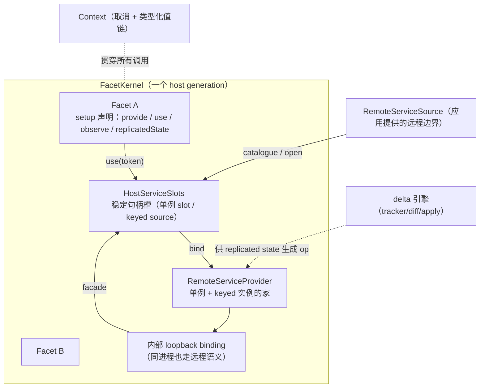

# chord（应用组合运行时）

> **先读这一条：chord 当前不在 pi 的默认运行路径上。** 它是实验轨的基座（见 [architecture](../architecture.md)），消费方只有 `pi-durable`、`pi-env`、`pi-client/server/protocol` 与 coding-agent 的 `src/experimental/`。它的定位是「下一代宿主基座」：当 pi 需要「可组合、可热替换、可远程」的架构时，答案长什么样。本仓库中它还有一个特殊身份：**唯一零 Pi 依赖的包**。

`packages/chord`（包名 `@earendil-works/chord`，29 个源文件、约 8800 行）是**与 Pi 完全解耦的应用组合运行时**：facets（插件单元）、services（服务）、replicated state（复制状态）、delta 引擎、以及可插拔的远程服务边界。

[返回索引](../index.md) · 术语见 [glossary](../glossary.md) · 所属任务：T11（见 [roadmap](../../roadmap/tasks.md)）

## 一、定位与边界

一句话职责：**把「多个独立开发、可能分处不同进程/环境的插件」组合成一个可校验、可热替换、可远程连接的服务依赖图**。

**零 Pi 依赖是铁律**（PLANNING.md §2）：不得 import 任何 `@earendil-works/pi-*`、不得出现 Pi 词汇（Session/Harness/agent/model/TUI…一律禁用）、必须能独立打包使用。这条规则有测试与打包流程保障（`test/boundary`、独立 pack）。

消费格局（实证）：

| 消费方 | 使用方式 |
|--------|---------|
| `pi-durable` | 最大消费者：replicated state、delta、Context 贯穿其内核（[durable](durable.md)） |
| coding-agent `src/experimental/` | facet host、service catalog、replicated state 全套（`PI_EXPERIMENTAL=1` 门控） |
| `pi-client`/`pi-server`/`pi-protocol` | 依赖 chord 的类型与服务语义（[远程会话 C/S 体系](remote-sessions.md)） |

规格与实现是两个词表，**本篇做「规格 → 实现」映射**：

| PLANNING.md（规格词） | 实现词 | 说明 |
|----------------------|--------|------|
| Plugin | **Facet** | 实现最终选了 `Facet`（`defineFacet`）；README 用「facet = plugin 按环境拆分的部分」解释这层语义 |
| plugin loader | `FacetLoader` | 静态/组合/打包三种实现 |
| symmetric RPC peer（§9） | **未实现** | `src/rpc/` 不存在；远程 = 应用提供 `RemoteServiceTransport`。替代品是 T14 的 C/S 体系 |
| structural replacement（§6.1） | **未实现** | 实现只有 shape-preserving `reload()`（同 ID 同形状） |
| Connection | `RemoteServiceSource` | 边界接口，应用自己实现 |

## 二、目录结构与模块地图

| 路径 | 职责 |
|------|------|
| `src/api.ts`（110 行） | 根导出函数：`createFacetHost`（`:22`）、`defineFacet`（`:69`）、`defineService`（`:73-85`，拦截 `$chord.` 保留前缀）、`replicatedState`（`:91-106`，两种重载：初值 / 外部 source）、`createRemoteServiceBinding`（`:87`）、三种 loader 工厂（`:32-67`） |
| `src/types.ts`（339 行） | 全部契约：`Context`/`ContextKey`、严格 JSON（`JsonValue`/`JsonRepresentation`，`:21-36`）、replicated state 家族（`:38-119`）、服务家族（`:121-249`）、远程边界（`:251-279`）、facet 家族（`:281-339`）。**类型级远程合约校验**在 `:164-182`（非 JSON 成员直接 `never`） |
| `src/context/index.ts`（121 行） | Go 风格调用上下文：`BACKGROUND_CONTEXT`（`:55`）、`withContextValue`/`withAbortSignal`/`withCancel`/`awaitWithContext`（`:63`/`:71`/`:83`/`:98`）；名字放子路径导出避免污染根 API |
| `src/facets/host.ts`（906 行） | **`FacetKernel`**（`:340`）：`FacetLifecycle` 状态机（`:59`）、`HostServiceSlots`（`:219`）、`LocalKeyedServiceRegistry`（`:154`）、`StagedServiceSpawner`（`:287`）、activate/reload/terminate、图校验与拓扑排序（`:808-880`） |
| `src/facets/loader.ts`（6 行） | `disposeLoadedFacets`：逆序释放 loaded generation |
| `src/services/provider.ts`（633 行） | `RemoteServiceProvider`（`:79`）：实现分类、方法调用、单例替换、keyed 代际、订阅（快照+缓冲+溢出 reset）；`createRemoteServiceEndpoint`（`:549`）处理 `$chord.service` 控制调用 |
| `src/services/consumer.ts`（713 行） | 消费端：`MemberSlot`（`:26`，Proxy：调用=方法、`.value/.subscribe`=状态）、`ServiceFacade`（`:142`）、`KeyedBinding`（`:249`）、`RemoteServiceBindingImpl`（`:444`） |
| `src/services/state.ts`（457 行） | 复制状态内核：`ReplicatedStatePublisher`（`:109`）、`StateSubscriber`（`:28`）、`MutableReplicatedStateImpl`（`:184`）、`ReplicatedStateReplica`（`:344`）、`attachReplicatedStateSource`（`:324`） |
| `src/services/state-codec.ts`（176 行） | 每订阅独立的 delta path 字典（encoder `:60`/decoder `:99`）；reset/replaced/unavailable 全清、closed 单实例清（`:27-90`） |
| `src/services/wire.ts`（248 行） | `$chord.service` 线语法：控制调用构造/解码（`:40-132`）、结构校验（`assertProviderUpdate`，`:143`；reset 必须是单条根替换 `:160`） |
| `src/services/handle.ts`（113）/`instances.ts`（151）/`loopback.ts`（17）/`errors.ts`（26）/`state-internals.ts`（19） | `ServiceSlot`（未绑定 resolve 抛 disconnected，`:34`）；keyed 实例目录（每观察者可取消，`:133`；`replace` 拒绝同代 `:51`）；进程内 loopback transport（`:5`）；8 个稳定错误码（`:1`） |
| `src/delta/tracker.ts`（2205 行） | 事务化 delta 引擎主体：overlay 写入模型、proxy traps、4096 op 折叠 |
| `src/delta/index.ts`（694）/`diff.ts`（523）/`apply-immutable-trusted.ts`（128）/`revision-validator.ts`（75）/`draft.ts` | `Op` 与 `apply`/`applyImmutable`/`applyImmutableBatches`（`:326`/`:409`/`:419`）、`assertSafePath`（`:279`，拒 `__proto__` 等）、两个 revision 间的最小化 diff、编码器/解码器（`:523`/`:622`） |
| `src/delta/README.md` | delta 的完整所有权契约（变更权责表 + 重放指南） |
| `src/node/`（`bundle.ts` 222 / `bundle-loader.ts` 416 / `package.ts` 232 / `manifest.ts` 39） | Node 侧打包与加载（esbuild → content-addressed CJS + manifest；`node:vm` 编译加载） |
| `PLANNING.md`（859 行） | 规格与 WP（work package）清单——本篇的映射基准 |

## 三、核心概念模型

词汇关系（README 的官方解释，`:16-59`）：

- **Facet**：一个插件（plugin）按运行环境拆开的部分（backend/browser/TUI…），是独立打包与运行的单元；`setup()` 是**同步声明**——只允许声明依赖/提供/观察/激活回调，不能调服务、不能异步、不能事后新增依赖（PLANNING §5.1，实现上 `FacetLifecycle.assertSettingUp` 强制，`host.ts:71-75`）。
- **Service**：类型化的稳定 token（`defineService`）；**singleton**（一提供多消费）或 **keyed**（一个提供者拥有动态实例集合，多观察者）。可 `local: true`（进程内、任意 JS 契约）或默认可远程暴露（严格 JSON 契约）。
- **Replicated state**：权威单写者最新值复制；`change(context, cb)` 是原子 overlay 事务；消费者拿到完整不可变值。
- **Delta**：意图保留的 JSON 操作批次（`Op[]`）——复制状态在传输层的表示，也是独立的可组合原语。
- **Context**：调用级取消与类型化值（应用可携带权限/遥测而不让 chord 依赖它们）。

## 四、关键运行流程

### 1. FacetKernel.activate（`host.ts:388`）——六阶段装配

1. **setup**（`:390-397`）：逐 facet 建 `FacetRuntime` 并同步 `setup`；返回 Promise 直接抛错（"setup must be synchronous"，`:379-386`）。
2. **assembling**（`:398-402`）：先 `#resolveExternalServices`（`:596`，向所有 `RemoteServiceSource` 取 catalogue；**同一服务被两个 source 提供 → 报错**；缺失依赖可由唯一一个 `acceptsUnavailableServices` 的 source 暂领）；再 `validateFacets`（`:808`）做**图校验**：重复提供者（同 token 两个 facet 提供 → 报错）、singleton/keyed 模式不匹配、缺失提供者、**环检测**（DFS 剩余计数法，`:858-880`），产出**拓扑序**；然后 `#assembleProviders`（`:655`，建 `RemoteServiceProvider` + **内部 loopback binding** + local keyed registry）与 `#bindServices`（`:687`）。
3. **connecting**（`:404-409`）：等所有外部绑定 + 内部绑定 `ready(BACKGROUND_CONTEXT)`。
4. **activating**（`:411-412`）：按拓扑序逐个 `lifecycle.activate()`——观察任务启动（`:121`）、`onActivate` 回调按注册序 await（`:122`）。
5. **active**：`#phase = "active"`。
6. 任一阶段失败：`#terminate()` 全量清理，清理错误与首错聚合成 `AggregateError`（`:414-420`）。

**同进程也走远程语义**（关键设计）：所有可远程服务——即使提供者与消费者在同一个 host——都经 `RemoteServiceProvider` + **loopback transport** + `RemoteServiceBindingImpl`（`:661-666`）；只有显式 `local: true` 的服务走直连。这样「替换、复制状态、keyed 代际」这些语义与进程分布无关（PLANNING §7.2）。

### 2. Shape-preserving reload（`host.ts:423`）

`reload(facets)` 只允许替换**已存在 ID** 的 facet（`:428-430`），且每个替换件必须**形状一致**（同 requires/provides 的 id 与模式，`sameFacetShape`，`:891-902`）——这就是「shape-preserving」的含义。

时序（`:433-510`）：

1. **暂存**：逐候选建 runtime、跑同步 setup、校验形状与远程实现（`#validateReplacementProvisions`，`:521` → provider 的 `validateReplacement`）。任一步失败 → 清理候选、host 保持原状（`:447-458`）。
2. **候选激活**：按原拓扑序 activate 候选（`:466`）；再次校验实现（`:467`）。失败 → 处置候选 + 终止 host（`:468-479`），旧代仍在。
3. **切割（cutover）**（`:481-505`）：替换 `#facets` 映射 → 逐 provision **直接替换**：local 单例 `bindSingleton` 换实现、远程单例 `provider.replace(...)`（**没有 unavailable 空窗**，README `:253-259`）→ 逆序 dispose 旧 facet → 最后连接 keyed 实例（旧实例关闭、新实例用新代际）。
4. **切割后失败 = 终止 host**（`:506-509`，无回滚——README 明说 "no rollback after cutover"，PLANNING §6.1）。

性质（README `:255-261` 与 PLANNING §6.1）：存活单例 facade 保持对象同一性；已捕获的方法在切割前打旧提供者、切割后打新提供者；复制状态 facade 安装替换快照而**不会先变成 unhydrated**。

### 3. 服务与状态传输（provider ↔ consumer）

**快照/更新/reset 协议**（provider 侧，`services/provider.ts`）：

- `subscribe`（`:239`）**同步返回快照**（state 成员为根替换 `[["r", value]]`），并开始把后续增量放进缓冲；只有 `activate()`（`:264`）才开闸按序 drain——「建立订阅即安装更新捕获，再取快照」的无缝语义（PLANNING §8.5-6）。
- **每订阅缓冲上限 100 条**（不含正在投递的那条）；第 101 条到来时**全量丢弃缓冲、改发 `{type:"reset", snapshot}`**：快照里每个 state 是根替换 + 新 sequence 基线，并携带当前 keyed 实例成员（丢弃的 spawn/close/replace 事件不会留下陈旧实例），reset 带触发溢出的那次发布的 context（README `:90-98`）。**这是溢出后唯一的恢复路径**。
- 六种更新类型（`types.ts:221-234`）：`state`（增量 op 批）/`reset`/`unavailable`/`replaced`/`spawned`/`closed`。
- 快照 sequence 可以是 0，常规 update 从 1 起（wire 校验 `:201`/`:148`）；普通 update 里出现**根操作不允许跨 sequence**（README `:100-105`）。

**consumer 侧**（`services/consumer.ts` + `services/state.ts`）：

- `use(token)` 立即返回稳定 proxy（`RemoteServiceBindingImpl.use`，`:467`）：**方法调用**=远程 invoke（`invoke`，provider `:214`，keyed 还校验 generation，不符报 `service_stale_instance`，`:403`）；**`.value`/`.subscribe`**=复制状态。kind 混用报错（`MemberSlot`，`:104`）；方法必须把 `Context` 放尾参（`:128`）。
- **未就绪时的语义是「惰性不报错」**：未 hydrate 时 proxy 可用、`.value` 为 `undefined`、subscribe 挂起；只有真正调用瞬间 target 未激活才 reject（`:123-127`）。`ready()` 按 readiness revision 循环等待（`:520`）。
- **cursor 连续性校验**（`state.ts:394-397`）：replica 的 update 必须 `sequence === 前一值 + 1`，断裂即 clear 并报错；hydrate 必须是全量根（`:379`）。`StateSubscriber` 队列同样 100 条溢出（未启动的 hydration 保留首帧，其余清空，`:43-49`）。
- **codec 隔离**（`state-codec.ts`）：provider 端每个 (instance, member) 一个 encoder、consumer 端一个 decoder，各自维护**独立的 delta path 字典**；reset/replaced/unavailable 全清、closed 只删该实例（`:27-90`）。同一订阅内编解码顺序必须一致，否则报 "Unknown service state"。

### 4. delta 引擎（`src/delta/`）

**overlay 写入模型**（`tracker.ts`）：`track(initial)`（`:321`，**接管所有权，不再遍历**）→ `beginChange()` 打开事务 → `change.state.xxx` 的每次赋值被 Proxy trap 捕获（`:383-424`）写进 overlay（对象 `writes/deletes`、数组的 piece 结构 `ArrayOverlay`，`:19-54`）→ `prepare()`（`:181`）把 overlay 与上一修订 diff 成 `Op[]` → `adopt()`（`:254`）校验并换根。

关键常量与折叠：

- 操作数超过 **4096**（`MAX_DELTA_OPERATIONS`，`:112`）折叠为**完整替换**（`[["r", root]]`，`:1666`/`:1707`）；简单对象节点超过 128（`MAX_SIMPLE_OBJECT_NODES`，`:113`）走通用路径。
- `diff.ts` 在**两个不可变修订之间**生成最小化操作（字符串前后缀复用、数组 LCS/置换、代价比较；同上限 4096，`diff.ts:5`）。
- 路径安全：`assertSafePath`（`index.ts:279`）拦截 `__proto__` 等保留段；非法 key 的写入折叠到更高层操作（README delta `:168-171`）。

**所有权契约是整个引擎的地基**（delta README 的变更权责表 + 主 README `:129-137`）：不做防御性拷贝、不 freeze——**非法变更不会被抓到，而是静默腐化状态**。规则速记：传给 `track`/`replicatedState`/`replace` 的根归引擎；draft 只在 change 开着时可写、写入的值会被克隆；`tracker.value`/`prepared.*`/apply 的输入输出一律不可变。重放有两条路：`applyImmutable`（推荐，可扇出到任意多个不可变副本，结果与输入共享容器）与 `apply`（可变副本，必须自持根与批次副本）。

### 5. Node 打包与加载（`src/node/`）

- **打包**（`bundle.ts:39`）：esbuild 把每个 entry 打成独立 **CommonJS** 文件（`format:"cjs"`，`:98`；动态导入一律降级 `supported: {"dynamic-import": false}`，`:107`，由加载器的受限 `require` 承接）；**`@earendil-works/chord` 强制外部化**（`:97`，插件必须用宿主的同一份运行时与品牌 symbol）；内容寻址命名（`entryNames: facet-xxx-[hash]`）+ `chord-facets.json` manifest；整体写入**临时目录后原子 rename**（`:45-70`），加载器永远看不到半成品。包级 API（`package.ts`）从 `package.json` 读身份/版本，按宿主给定的约定路径找 entry、`chord.facets` 可覆盖或禁用；peerDependencies 外部化。
- **加载**（`bundle-loader.ts:134`）：校验 manifest → 按需校验**SHA-256 完整性**（默认开启，`:228-243`）→ 用 **`node:vm` 的 `compileFunction`** 编译（`:7`/`:192`，刻意不进 Node 的 CJS/ESM 模块缓存，这是「卸载代际」能成立的前提，PLANNING §5.4）；外部依赖经宿主解析、走受限 `require`（`:177-197`，未声明外部直接报错）。`readFacetBundleArtifact`/`createFacetBundleArtifactLoader`（`:84`）供跨 Node 主机的产物传输。

## 五、对外接口与扩展点

- **根导出**：`createFacetHost` / `defineFacet` / `defineService` / `replicatedState` / `createRemoteServiceBinding` / 三种 loader 工厂；wire 与 codec 全套；大部分类型。子路径：`/context`（上下文函数）、`/delta`（独立 delta 库）、`/bundler`（esbuild 打包）、`/node`（vm 加载）——**Node 专属能力不进主入口**（PLANNING §12）。
- **FacetEnvironment**（`types.ts:281`）：`use`/`observe`（声明依赖）、`provide`/`provideMany`（提供单例/keyed）、`replicatedState`、`own`/`onActivate`/`onDeactivate`（资源所有权）。
- **远程边界（应用实现）**：`RemoteServiceSource`（`:308`，提供 catalogue 与 open）+ `RemoteServiceTransport`（`:259`，`invoke`/`subscribe`）。**chord 不规定 framing/路由/传输**——这是它目前与 T14 C/S 体系的分工线。
- **自定义服务层**：任何实现了 wire 语法（`$chord.service` 控制调用 + snapshot/update 结构）的 adapter 都能做远程；`createRemoteServiceEndpoint`（provider `:549`）是服务端一侧的即用件。
- **测试入口**：`test/` 25 个文件是行为契约——`services.test.ts`（端到端）、`service-delivery.test.ts`（投递队列与溢出 reset）、`state-fuzz.test.ts`（状态一致性 fuzz）、`delta-benchmark/`、`delta-tracker/retention.test.ts`、`boundary.test.ts`（零 Pi 依赖检查）。

## 六、现状与陷阱（规格 → 差异 + 实现坑）

**规格差距（写作时最重要的部分）**：

1. **对称 RPC 未实现**（PLANNING §9 整节）：`src/rpc/` 不存在；远程服务经应用自备的 `RemoteServiceTransport`。仓库内的 C/S 体系（[T14](remote-sessions.md)）是独立演化，不是 chord 的 RPC 层。
2. **结构式替换未实现**（PLANNING §6.1）：`reload()` 只能替换同 ID 同形状的 facet；增删 facet、改服务形状会直接抛错（`host.ts:428-430`/`:441-443`）。「加一个新插件」目前要重建整个 host。
3. **WP 状态**：WP0/1/3/4/5 与 WP7 大部已落地（PLANNING 头部自述）；WP2（RPC peer）未落地；WP6 中 shape-preserving reload 已落地、structural 未落地；WP8（Pi 采用）未开始——Pi 侧实验代码仍是自有实现。
4. **术语表未统一**：规格写 "Plugin"，代码是 "Facet"；PLANNING §16 的待决清单第 1 条至今悬置。

**实现坑**：

5. **`setup()` 里碰服务会炸**：`use` 返回的 handle 在 setup 期间调用会抛（`FacetLifecycle.assertServiceAccess`，`host.ts:87-91`）；异步 setup 直接拒绝（`:379-386`）。
6. **cutover 之后无回滚**：切割后任何失败 → 整个 host 终止（`:506-509`）；订阅取消、发布丢失等「已提交的应用效果在 reload 事务之外」（PLANNING §6.1）。
7. **订阅溢出会跳帧**：provider 侧 100 条缓冲溢出变 `reset`（消费者必须显式处理 reset 基线）；公共 `state.subscribe` 的投递队列同样 100 条、只保留最新（主 README `:159-170`）——**投递序列可能跳号，这是帧数策略不是字节策略**。
8. **所有权契约靠自觉**：delta 不做防御拷贝也不 freeze；在 in-process loopback 场景，消费者与提供者共享容器，改一下就是静默腐化（主 README `:129-137`）。跨可变信任边界（含应用 adapter）必须自己 clone/序列化。
9. **单向投递顺序是硬要求**：adapter 必须保序转发 snapshot/reset/update，且不能丢弃已编码批、也不能假设自己的异步队列像 provider 队列一样有界（README `:100-105`）。
10. **listener 失败的边角**：`state.ts` 里 listener 抛错经 AggregateError 上报，但**revision 已提交**（`:302` 附近语义）；不对齐「先通知后提交」的预期。
11. **keyed 观察者的代际栅栏**：陈旧 facade 调不到新实例（`service_stale_instance`）；`replace` 拒绝同代重复（`instances.ts:51`）。
12. **卸载是「取消可达性 + 释放引用」**：不是强制终止已跑代码；正在跑的旧 facet 工作不会被 drain（PLANNING §6.2 明说 future killable-isolate 才能直接终止）。

## 七、二次开发落点

| 需求 | 落点 |
|------|------|
| 写一个 facet 插件 | `defineFacet({ id, setup(env) {...} })`；`createFacetHost({ facets, serviceSources? })`；示例看 `test/facets.test.ts` 与 helpers |
| 接入远程服务（自定义传输） | 实现 `RemoteServiceSource` + `RemoteServiceTransport`；服务端侧用 `createRemoteServiceProvider`/`createRemoteServiceEndpoint` + wire 校验函数（`services/wire.ts`） |
| 用 delta 做自有复制 | `@earendil-works/chord/delta` 独立使用（`track`/`prepareReplace`/`applyImmutable`）；先通读 delta README 的所有权表 |
| 做 facet 热更新 | `FacetHost.reload(候选 facets)`：load 候选 → reload → 成功后 dispose 旧 `LoadedFacets`；失败 dispose 候选（README `:253-261` 的完整流程） |
| 打包/分发插件 | `@earendil-works/chord/bundler` 的 `bundleFacetPackage`/`bundleFacets` + `/node` 的 loader；manifest 格式见 `node/manifest.ts` |
| 给 chord 加新能力（改核心） | 图校验/生命周期在 `facets/host.ts`；传输语义在 `services/`；先读 PLANNING 对应章节再动手——实现是规格的子集，别假设未实现的部分存在 |

## 八、相关文档

- [packages/chord/README.md](../../packages/chord/README.md)——特性总览与用法（快照/reset 协议、delta 契约、打包加载流程的精炼版）
- [packages/chord/PLANNING.md](../../packages/chord/PLANNING.md)——**规格全文**（WP 清单、并发矩阵、非目标）；本篇是它的「实现映射」
- [packages/chord/src/delta/README.md](../../packages/chord/src/delta/README.md)——delta 所有权契约细节
- 本套文档：[durable](durable.md)（最大消费者，下一篇）、[远程会话 C/S 体系](remote-sessions.md)（代替 chord 未实现的 RPC 层的那套）、[architecture](../architecture.md)（实验轨定位）、[glossary](../glossary.md)（facet/service/replicated state/delta 条目）

---

[返回索引](../index.md) · 任务与进度：[roadmap](../../roadmap/README.md)
