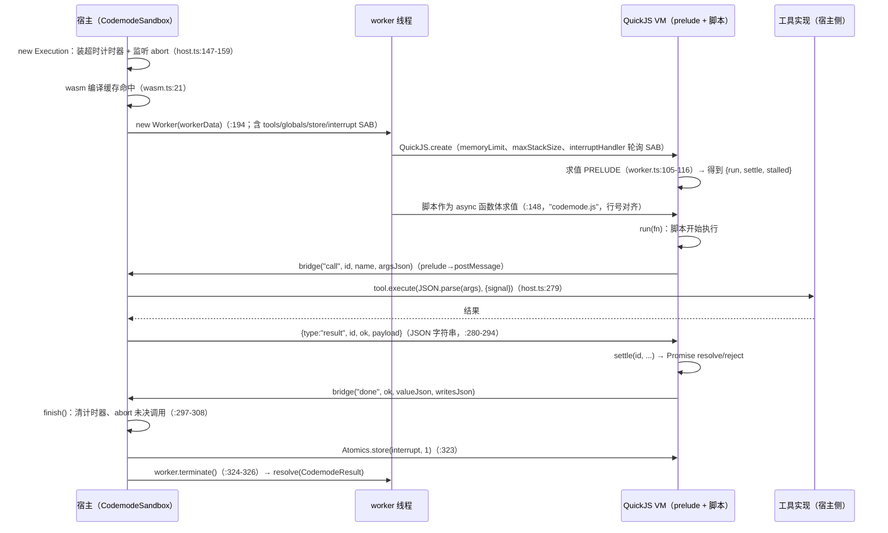

# pi-codemode（QuickJS-WASM 沙箱）

`packages/codemode`（包名 `@earendil-works/pi-codemode`，10 个源文件、约 1800 行）是 pi 的**代码执行沙箱**：模型写 JavaScript，脚本里通过 `tools.<name>(args)` 调用注入的工具；**嵌套调用的结果不进 LLM 上下文**，只有脚本输出与返回值回注。与 pi 完全解耦（零 Pi 依赖，唯一运行时依赖 `quickjs-wasi`），集成层在 coding-agent 的 `extensions/codemode/`。与 MCP 的联动（MCP 工具默认经沙箱调用）见 [MCP 客户端](mcp.md)。

[返回索引](../index.md) · 术语见 [glossary](../glossary.md) · 所属任务：T10（见 [roadmap](../../roadmap/tasks.md)）

## 一、定位与安全模型

一句话职责：**给「模型写脚本编排工具调用」提供一个能力极小的隔离执行环境**——脚本能做的事只有：调工具、输出文本/图片、读写一个 JSON 小仓库。没有 Node、文件系统、网络、定时器、模块加载。

安全模型的三层：

1. **进程内隔离靠 wasm**：每次执行起一个 `worker_threads` worker + 一个**全新 QuickJS VM**（独立 wasm 实例、独立线性内存），执行完即销毁（`host.ts:120-124` 注释：runaway 脚本包括纯微任务自旋都能被 `terminate()` 干掉，不会污染下一次执行）。
2. **能力面靠白名单**：VM 内没有任何宿主 API，只有一个 bridge 函数；`tools`/`globals` 全部由宿主显式注入，参数与返回值**都经过 JSON 序列化**（`protocol.ts:4-8` 注释：worker 从不自建结构化值）。
3. **资源上限靠三重闸门**：宿主超时计时器 + `SharedArrayBuffer` 中断标志（VM 轮询）+ worker terminate；内存上限（集成层 256MB，`execute.ts:56`）；store 与输出的字符配额（见流程 4）。

## 二、模块地图（宿主侧 vs VM 内）

| 文件 | 运行位置 | 职责 |
|------|---------|------|
| `src/runtime/host.ts`（416 行） | 宿主线程 | `CodemodeSandbox`（`:340`）工具表与默认配置；`Execution`（`:125`）单次执行：worker 生命周期、超时/中断/终止、桥接解码与防御（`BridgeError`，`:54`）、工具调用宿主端执行（`handleCall`，`:265`） |
| `src/runtime/worker.ts`（161 行） | worker 线程 | QuickJS VM 创建（`memoryLimit`/`maxStackSize`/中断轮询，`:54-62`）、bridge 函数（`:65`）、prelude 求值与脚本执行（`:105-156`）、stalled 检测驱动（`drain`，`:121`） |
| `src/runtime/prelude-source.ts`（512 行） | **字符串模板**（在 VM 内求值） | 全部脚本可见 API：`tools`/`ALL_TOOLS`/`text`/`image`/`exit`/`console`/`store`/`load`、`settle`/`run`/`stalled` 协议（`:457-506`）、四个容量常量（`:32-41`） |
| `src/runtime/protocol.ts`（51 行） | 双方 | 消息联合与守卫：`call`/`output`/`done`/`crash`（worker→host）与 `result`（host→worker） |
| `src/source.ts`（115 行） | 宿主 | `// @options:` 首行解析（`parseCodemodeSource`，`:100`）、`CODEMODE_SOURCE_GRAMMAR`（`:22`，给 grammar 约束采样用）、超时上限校验（`:16`） |
| `src/declarations.ts`（355 行） | 宿主 | 把工具 schema 渲染成 TypeScript 声明（`renderDeclarations`，`:105`；`schemaToType`，`:228`；`$ref` 展开上限 32 次，`:12`）、MCP 类型 preamble（`:18`）、`CallToolResult` 识别（`:166`） |
| `src/wasm.ts`（35 行） | 宿主 | `loadQuickJSWasm`（`:21`）：按路径缓存编译结果、失败可重试、支持打包注入 |
| `src/identifier.ts`（12 行） | 双方 | 工具名 → JS 标识符（`my-tool` → `my_tool`） |
| `src/types.ts`（138 行） | — | 全部公开类型（`CodemodeTool`/`CodemodeResult`/错误四态/选项） |
| `src/index.ts`（42 行） | — | 出口；另有 `./declarations`、`./source`、`./worker` 子路径（后者供打包宿主作为独立入口引入） |
| 集成层（coding-agent `extensions/codemode/`） | 宿主 | `tool.ts`（419 行，工具定义与描述渲染）、`execute.ts`（733 行，执行封装：store/模型/输出处理）、`execute.lazy.ts`（懒加载）、`index.ts`（48 行，注册）、`renderer.ts` |

## 三、核心数据结构

- **`CodemodeTool`**（`types.ts:14`）：`name`/`description`/`inputSchema`/`outputSchema`（仅用于渲染声明，**不做校验**，`:11` 注释）/`spread`（globals 专用：接收全部实参而不是第一个）/`signature`（globals 专用：手写 TS 签名）/`execute(args, { signal })`。返回必须 JSON 可序列化；抛错在脚本里变成同 message 的 `Error`。
- **`CodemodeResult`**（`types.ts:84`）：`ok: true` 时带 `value`/`output`/`calls`/`storeWrites`；失败带 `CodemodeError`；两种都保留已产生的 `output` 与 `calls`（`:83` 注释）。`execute()` **永不 reject**——脚本失败是数据不是异常。
- **错误四态**（`CodemodeErrorKind`，`types.ts:59-67`）：`script`（脚本抛出/解析失败，带原始 name/stack）、`timeout`、`aborted`、`sandbox`（wasm trap、worker 缺失等宿主侧故障）。
- **`CodemodeStoreWrites`**（`:77`）：`set`（key→值）+ `delete`（key 列表）；只有成功执行才上报。
- **`CodemodeSandboxOptions`**（`:94`）：`timeoutMs`（默认 300s，`host.ts:22`）、`memoryLimitBytes`、`wasm`/`workerUrl` 注入（打包宿主的两个接口，`:109-126` 注释说明 Bun 编译可执行文件的用法）。

## 四、关键运行流程

### 1. 一次 `execute()` 全链路

**为什么中断要「先标志、再 terminate」**：VM 的 `interruptHandler` 轮询 SharedArrayBuffer（`worker.ts:60`）；在 Bun 上纯 wasm 自旋的线程无法被 `terminate()` 打断，标志是让「忙循环」也能停下来的唯一手段（`protocol.ts:20-24` 注释）。

### 2. 桥接的信任边界（`BridgeError`）

宿主侧解码的 payload 是**由 VM 内代码生成的 JSON 字符串**（prelude 与脚本共享同一个 VM）：脚本可以篡改内建对象（例如 `Array.prototype.toJSON`）来伪造桥数据。`host.ts` 的每个解码点都做了结构校验（`:56-95`），任何越界都抛 `BridgeError`，Execution 把它变成带解释的 sandbox 错误："Sandbox bridge broken: … The script may have modified built-ins such as a prototype's toJSON."（`:207-210`）。**写自定义宿主扩展时不要绕过这些 `parse*` 函数直接信任 VM 传来的字符串。**

### 3. 中断与失败模型（四态）

| 触发 | 结果 | 机制 |
|------|------|------|
| 脚本抛出/语法错误 | `script`（带 name/message/stack） | prelude 的 `done(false, ...)` → `parseScriptError`（`:255-259`） |
| 超过 `timeoutMs` | `timeout` | 宿主计时器直接 `finish`（`:147-151`），随后 interrupt + terminate |
| 调用方 signal / `sandbox.close()` | `aborted` | `onAbort`（`:226-229`）/ `close` 对每个 in-flight 执行 abort（`:411-415`） |
| wasm trap / worker 异常退出 / bridge 破坏 | `sandbox` | `worker.on("error"/"exit")`（`:214-223`）、`crash` 消息（`:249-251`）、BridgeError 包装（`:202-212`） |

补充语义：

- **工具调用在结算时全部中止**：`finish` 遍历 pending 逐个 `controller.abort()`（`:304-307`）；已被 finish 抢先的调用记录保持 `cancelled`（`:287-289`）。
- **脚本挂死在不可能 settle 的 promise 上会被检测**：worker 每次 settle 后跑 `executePendingJobs()` 并调 `stalled()`（`worker.ts:121-124`）；prelude 的 `stalled`（`:499-506`）在「无 pending 宿主调用且未完成」时报出明确错误（"timers do not exist here"），避免脚本傻等。
- **postMessage 的解码异常不会悬空执行**：`worker.on("message")` 里 try/catch 兜底成 sandbox 错误（`:200-213`）。

### 4. VM 内的 API 面与配额（prelude）

脚本可见的一切都由 `PRELUDE_SOURCE`（字符串模板，`prelude-source.ts:46`）构建：`tools`（JS 标识符 + 原名双入口）、`ALL_TOOLS`、输出助手 `text`/`image`/`exit`、`console.*`、`store`/`load`，以及注入的 globals（`a.b` 形式聚成冻结命名空间对象，`:254-255`）。配额：

- `store`：单值 JSON ≤ 256Ki 字符、总量 ≤ 1Mi 字符（`:32-33`）；超限抛出带指引的 TypeError（`:304-315`）；`store(key, undefined)` 删除键。
- `output`：总字符 ≤ 16Mi、条目 ≤ 100k（`:40-41`）。
- 脚本值在宿主侧一律经 `JSON.parse` 还原（`:461-471`）；`done` 的返回值与 store writes 同样走桥接校验（`host.ts:64-95`）。
- 宿主侧限制：`registerTool` 重名抛错、global 名必须是标识符且不得占用保留名（`tools`/`ALL_TOOLS`/`console`/`text`/`image`/`exit`/`store`/`load`/`globalThis`，`host.ts:24-34`/`:356-368`）。

### 5. store 持久化与 session entry 衔接（集成层）

- 脚本的 `store()` 写入随**成功执行**以 `storeWrites` 返回；pi 把每次执行的 writes 追加为会话的 **`codemode-store` custom entry**（`execute.ts:502-507`，`CODEMODE_STORE_ENTRY_TYPE`，`tool.ts:53`）。
- 下一次执行前，从**当前分支**重放这些 entry 得到 `load()` 的初始快照（`readCodemodeStore`，`execute.ts:233-243`）——所以「每个分支看到的值是它自己路径上写过的」（`tool.ts:19-22` 注释）。
- 无 session 上下文（裸 `Agent` 或直接调用）时：不能调工具、store 为空、写入被丢弃（`execute.ts:412-415` 注释）。

### 6. 在 pi 里的集成（coding-agent `extensions/codemode/`）

- **注册**：`createCodemodeExtension`（`index.ts:31`）以 `defaultActive: false` 注册 `codemode` 工具——默认不开，用 `--tools`/`defaultTools`/`setActiveTools()` 激活，或由 MCP 扩展在「MCP 工具只能从脚本调用」时自动激活（`index.ts:4-6` 注释；联动逻辑见 [MCP 客户端](mcp.md)）。
- **模型可见的描述**（`createCodemodeDescription`，`tool.ts:248`）：helper 清单 + 找工具指引 + `models` 段 + 按 namespace 分组的工具声明；**deferred 工具永不列出**（描述在 MCP 服务器连接/变化时保持稳定，`:243-246` 注释）；工具段受 token 预算约束（默认 3000，`:156`），选择算法按组轮转、优先保证每个 namespace 都被代表（`selectCatalog`，`:222-239`）。两种呈现模式（`codemode.mode` 设置，`:330-341`）：`on` = 已声明工具的说明里追加「脚本怎么调它」；`only` = 请求省略 direct 工具的声明、全部走脚本。
- **工具声明与语法约束**：工具定义 `exposure: "model-only"`（脚本不能嵌套 codemode，`:391-392`）；`constrainedSampling` 用 `CODEMODE_SOURCE_GRAMMAR` 让能支持 grammar 的模型直接产出裸 JS（`:394-395`）。
- **懒加载**：工具定义通过 `loadCodemodeExecutor()`（`execute.lazy.ts`）延迟加载执行封装——**不跑脚本的会话不载入 sandbox 运行时**（`tool.ts:396-397`）。
- **执行封装**（`execute.ts:416`）：`ctx.tools` → sandbox 工具表；嵌套调用走 `ctx.executeTool()`（**与直接调用同一管线**：校验、`tool_call`/`tool_result` 钩子、权限一致，`:460-462`）；调用记录 `CodemodeNestedCall` 实时发布给 UI（`publish`，`:439`）；返回值规则：声明 `outputSchema` 的工具返回 `structuredContent`（含 MCP 的 `CallToolResult`），其余返回文本，失败 reject（`:404-410`）。
- **输出整形**：多个 text 项加 `==> text N/M <==` 标记（provider 会把相邻文本块无分隔拼接，`:256-260` 注释）、console 汇总进 `<console_output>` 块（`:277-279`）；超预算时头尾保留 + 全文落盘（`:373-396`）；`image()` 的图片由宿主保存到临时文件并把路径放在图片块前（脚本自己不能写文件，`:333-337` 注释）；`models.generateImages()` 产出但脚本没展示的图片会有提示（`:513-518`）。
- **`models.*` 命名空间**（`execute.ts:627-733`）：`getModelsOfType`/`getAvailableOfType`/`getModelOfType`/`classify`/`generateImages`；并发闸门 4（`:50`）；**模型按 provider/id 由注册表解析，脚本提供的 baseUrl/headers 一律不采用，凭证不可能被脚本拿走**（`:638-642` 注释；`toModelInfo` 也删掉 `headers`，`:90-95`）；classifier/image 的 context 形状在调用前逐一校验、错误信息带期望形状（`checkClassifierContext`/`checkImagesContext`，`:121-196`）。
- **发现 globals**（`:554-620`）：`searchTools`（BM25 排序）、`describeTool`、`describeNamespace`——给「工具没列在描述里」（deferred/MCP 大量工具）的脚本用。
- **打包边界**：集成层通过 `config.ts` 的 helper 拿 wasm 路径与 worker specifier（`execute.ts:486-487`；AGENTS.md 规定资产路径必须走 helpers），配合 `runtime-setup.ts` 的 `setEmbeddedQuickJSWasmPath` 支持 bun 二进制（见 [启动篇](coding-agent-startup.md)）。

## 五、对外接口与扩展点

- **独立使用**（不依赖 pi）：`new CodemodeSandbox({ tools, globals, timeoutMs, memoryLimitBytes, wasm, workerUrl })` → `execute(code, { signal, timeoutMs, store })` → `CodemodeResult`；`close()` 中止全部在飞执行。打包宿主按 `./worker` 子路径引入 worker 入口并注入 `workerUrl`。
- **声明渲染**（`./declarations` 子路径）：`renderDeclarations`/`renderToolSample`/`schemaToType`——把工具的 JSON Schema 渲染成给模型看的 TS 声明；接入 MCP 时用 `MCP_TYPESCRIPT_PREAMBLE` + `mcpStructuredContentSchema`。
- **源格式**（`./source` 子路径）：`parseCodemodeSource`（`@options` 首行）+ `CODEMODE_SOURCE_GRAMMAR`（grammar 约束采样的 Lark 文法）。`@options` 支持且仅支持 `max_output_tokens` 与 `timeout_ms`（`source.ts:13`）。
- **自定义宿主**：实现 `CodemodeTool`（含 globals 的 `spread`/`signature`）即可扩展脚本 API；工具名必须能映射为标识符。
- **测试**：`packages/codemode/test/sandbox.test.ts`（801 行）是行为规格——超时、abort、内存、桥接破坏、stalled、store 配额都有对应用例。

## 六、现状与陷阱

1. **`execute()` 永不 reject**：取消、超时、崩溃都以 `{ ok: false, error }` 返回。调用方若不检查 `ok` 会把失败当成功。`close()` 之后的 `execute` 才是真正 reject（`host.ts:395`）。
2. **超时的默认值有两层**：沙箱库默认 300s；**pi 集成层传 `Infinity`**（`execute.ts:484`，只受脚本 `@options: {"timeout_ms":…}` 与 abort 约束）。排查「脚本停不下来」时记住这两层。
3. **中断必须走 interrupt 标志**：自定义宿主若只 `terminate()` 可能停不掉 Bun 上纯 wasm 自旋的脚本；正确顺序是 `Atomics.store → terminate`（`host.ts:323-326`）。
4. **桥接是信任边界**：prelude 与脚本同 VM，脚本可篡改内建对象影响序列化；宿主侧解码防御不可绕过（见流程 2）。出现 "Sandbox bridge broken" 时优先怀疑脚本改了 prototype。
5. **嵌套结果不进 context 是设计而非缺陷**：`calls` 记录（含每调用的状态与耗时）只进工具 `details` 供 UI 渲染；脚本结束时仍 `running` 的调用一律标 `cancelled`（`:497-500`）。
6. **失败执行没有 store 写入**（`types.ts:76-77`）：部分完成的工作（已跑的嵌套调用）**不会回滚**，错误信息里明确列出（`formatCallSummary`，`:298-301`）。
7. **`outputSchema` 只用于渲染**：脚本侧不做参数/结果校验（`types.ts:11`）；真正校验发生在工具宿主侧（pi 集成里就是 `ctx.executeTool` 的管线）。
8. **配额超限是脚本错误带指引**：store 配额、非 JSON 可序列化的 store 值会抛带修复建议的 TypeError（prelude `:297-315`）；写脚本时把大对象留在变量里、只 store 小状态。
9. **图片与文件**：脚本无法写文件；`image()` 的输出由宿主落盘并把路径作为文本标签放在图片前——文本预算截断策略保证标签不被切掉（`execute.ts:524-526` 注释）。
10. **每执行一个新 worker 的成本**：约 20ms 级（含 VM 创建），且不共享状态——脚本间共享只能靠 `store` 或工具自身。别把 codemode 当长期进程用。

## 七、二次开发落点

| 需求 | 落点 |
|------|------|
| 给脚本加新助手（宿主函数） | `CodemodeSandbox` 的 `globals`（`spread`/`signature` 控制调用形态与声明渲染）；pi 集成里对应 `createDiscoveryGlobals`/`createModelGlobals` 模式（`execute.ts:554`/`:627`） |
| 改脚本可见的工具描述 | `createCodemodeDescription`（`tool.ts:248`）与 `prepareCodemodeLoadout`（`:342`）；预算/模式来自 `codemode` 设置 |
| 改沙箱限制 | `CodemodeSandboxOptions`（超时/内存）；集成层的 `CODEMODE_MEMORY_LIMIT_BYTES` 与默认输出预算（`execute.ts:50-56`/`:246`） |
| 新增 `@options` 字段 | `source.ts` 的 `SUPPORTED_FIELDS` + 解析校验；若是执行期语义还要在集成层消费 |
| 给非 pi 宿主嵌入 | 直接用 `CodemodeSandbox`；打包场景按 `types.ts:109-126` 注释注入 `wasm`/`workerUrl`（bun 用内嵌 specifier） |
| 改声明渲染格式 | `declarations.ts`（`renderToolSignature`/`schemaToType`）；MCP 相关走 `MCP_TYPESCRIPT_PREAMBLE` |
| 新 MCP 联动策略 | 集成层 `ensureDiscoveryActive`（[MCP 篇](mcp.md) 流程 7）决定何时激活 codemode |

## 八、相关文档

- `packages/coding-agent/docs/codemode.md`——面向模型/用户的参考（脚本 API、`models.*`、示例），也是工具描述里 `CODEMODE_DOCS_PATH` 指向的文档
- [packages/codemode/README.md](../../packages/codemode/README.md)——库用法（安全模型、上限、Bun 打包）
- 本套文档：[MCP 客户端](mcp.md)（默认经沙箱调用 MCP 工具）、[coding-agent 扩展与 SDK](coding-agent-extensions.md)（注册与 exposure 机制）、[agent 运行时](agent.md)（`ctx.executeTool` 的管线语义）、[启动与运行模式](coding-agent-startup.md)（bun 二进制的 wasm 注入）、[glossary](../glossary.md)、[architecture](../architecture.md)

---

[返回索引](../index.md) · 任务与进度：[roadmap](../../roadmap/README.md)
