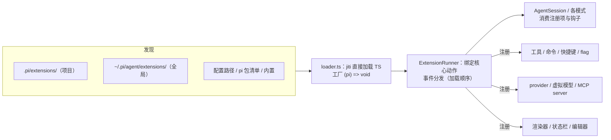

# coding-agent：扩展系统与 SDK

`packages/coding-agent` 的**扩展体系**（发现 → 加载 → 注册 → 执行）与 **SDK 面**。扩展是 pi 二次开发的第一落点：不改 pi 源码，用一段 TypeScript 就能加工具、命令、事件钩子、provider、UI 渲染器。前置阅读：[核心运行时](coding-agent-runtime.md)（扩展挂钩的那些流程）、[启动与运行模式](coding-agent-startup.md)（资源如何进入启动）。

[返回索引](../index.md) · 术语见 [glossary](../glossary.md) · 所属任务：T08（见 [roadmap](../../roadmap/tasks.md)）

## 一、定位

一句话职责：**把「pi 的可定制面」收敛成一个工厂函数 + 一个 `ExtensionAPI` 对象**——你导出一个 `(pi) => { ... }`，在里面注册一切；pi 负责加载、执行与生命周期隔离。



与上游文档的关系：`docs/extensions.md` 讲「怎么写扩展」（教程向）；本篇讲「扩展系统怎么运转」（源码向），两者互补。

## 二、目录结构与模块地图

| 路径 | 职责 |
|------|------|
| `core/extensions/types.ts`（2273 行） | **全部契约**：`ExtensionAPI`（`:1564`）、事件类型表、`ToolDefinition`、`ExtensionContext` 家族、runtime/actions 接口、`Extension`/`LoadExtensionsResult` |
| `core/extensions/loader.ts`（876 行） | 发现与加载：目录扫描（`discoverAndLoadExtensions`，`:828`）、jiti 加载（`loadExtensionModule`，`:559`）、API 构建与事务提交（`createExtensionAPI`，`:244`）、别名/虚拟模块解析（`getAliases`，`:69`） |
| `core/extensions/runner.ts`（1560 行） | `ExtensionRunner`（`:357`）：`bindCore` 绑定动作（`:410`）、上下文创建（`createContext`，`:877`）、全部 `emit*` 事件分发 |
| `core/extensions/index.ts`（223 行） | 系统出口：类型聚合 + loader/runner/wrapper 再导出 |
| `core/extensions/wrapper.ts`（29）/`virtual-modules.ts`（38） | `wrapRegisteredTool(s)`（注册表工具→AgentTool）；二进制模式的内嵌模块表 |
| `core/extensions/jiti-loader.ts` / `jiti-static-loader.ts`（3 行） | jiti 的两种装载形态（普通 / 内嵌） |
| `core/package-manager.ts`（2760 行） | `DefaultPackageManager`（`:812`）：资源发现路径、pi 包解析、安装/更新/卸载（npm/git/local） |
| `core/pi-manifest.ts`（35 行） | 读取 `package.json` 的 `pi` 字段（`readPiManifest`，`:17`） |
| `core/resource-loader.ts`（1283 行） | `DefaultResourceLoader`（`:311`）：把上述一切组装成一次 `reload` 的资源集 + 诊断 |
| `core/skills.ts`（514）/`core/prompt-templates.ts`（320） | Skill 与模板的加载、校验、渲染辅助 |
| `package-manager-cli.ts`（1141 行） | `pi install/remove/update/list` 子命令（`handlePackageCommand`，`:890`） |
| `src/extensions/` | 内置扩展：`index.ts`（`builtInExtensions`，`:7`）+ `mcp/`、`codemode/`、`llama/`、`tool-search/` |
| `src/index.ts`（494 行） | **SDK 公开导出面**（见第四节 8） |
| `src/modes/interactive/theme/theme.ts`（1160 行） | 主题系统（扩展可加载/定制） |
| `examples/` | `sdk/`（14 个示例）、`extensions/`（80 个样例，含 9 个子目录项目）、`plugins/`（pi 包样例） |

## 三、核心数据结构

### ExtensionAPI（`types.ts:1564`）

扩展唯一的接触面，四组能力：

1. **事件订阅**：约 40 个 `on(event, handler)`，按机制分组（详见下方事件表）。
2. **注册**：`registerTool`（`:1643`）、`registerCommand`（`:1652`）、`registerShortcut`（`:1655`）、`registerFlag`（`:1664`，CLI flag，`getFlag` 读值）、`registerMessageRenderer`/`registerEntryRenderer`/`registerMarkdownTransformer`/`registerToolRenderer`（`:1687-1696`）。
3. **动作**：`sendMessage`（`:1703`，注入自定义消息，可 `deliverAs` 排队）、`sendUserMessage`（`:1713`，总是触发一轮）、`appendEntry`（`:1719`，持久化扩展状态）、`setSessionName`/`setLabel`、`exec`（`:1735`，跑子进程）、会话/工具/模型操作（`getActiveTools`/`setActiveTools`/`setModel`/`setThinkingLevel`...，`:1737-1772`）。
4. **注册外部能力**：`registerProvider`（`:1830`，两种形态：`(name, config)` 或原生 pi-ai `Provider`；`config` 支持 baseUrl/apiKey 环境变量插值/自定义 `streamSimple`/OAuth/模型清单，见 `ProviderConfig` `:1903`）、`registerMcpServer`（`:1866`）、`registerVirtualModel`（`:1883`）、`events`（`EventBus`，扩展间通信，`:1889`）。

### 事件表（`types.ts:1569-1636`，按机制分类）

| 分类 | 事件 |
|------|------|
| 信任与资源 | `project_trust`、`resources_discover` |
| 会话生命周期 | `session_start`、`session_info_changed`、`session_before_switch/fork/compact/tree`（可取消/可改写）、`session_compact`、`session_compact_failed`、`session_shutdown`、`session_tree`、`mcp_servers_change` |
| 上下文 | `context`（只见到会话消息）、`context_with_system`（全转录，含系统提示） |
| provider 层 | `before_provider_request`（可改请求体）、`before_provider_headers`（原地改头）、`after_provider_response`、`provider_stream_event` |
| agent/轮 | `before_agent_start`（可改提示/工具/模型）、`agent_start`、`agent_end`、`agent_before_settle`（可继续）、`agent_settled`、`turn_start`、`turn_end` |
| 消息/工具 | `message_start/update/end`、`tool_execution_start/update/end` |
| 工具钩子 | `tool_call`（可 block）、`tool_result`（可改结果） |
| 其他 | `input`（可消费/改写用户输入）、`user_bash`（可接管 `!` 命令）、`model_select`、`thinking_level_select`、`ui_prompt_start/end`、`cache_warming_decision` |

### 上下文与注册产物

- `ExtensionContext`（`:325`）：每次事件派发构造——`ui`（`ExtensionUIContext`，`:149`）、`mode`（tui/rpc/json/print）、`hasUI`、`cwd`、只读 `sessionManager`、`modelRegistry`、当前 `model`/`thinkingLevel`/`scopedModels`、`signal`（所属运行的中止信号）。
- 派生上下文：`ExtensionToolContext`（`:383`，工具内 `executeTool()` 嵌套调用）、`ExtensionCommandContext`（`:401`，命令内 `newSession`/`fork`/`navigateTree`/`switchSession`/`reload`）、`ReplacedSessionContext`（`:442`，会话替换后传给 `withSession` 的新上下文）。
- `Extension`（`:2237`）：加载产物——工厂运行后，它的 handlers/tools/commands/flags/shortcuts/渲染器全部登记在这个对象上；`sourceInfo` 记录来源（显示用）。
- `ToolDefinition`（`:574`）与 `ToolExposure`（`:516`：`direct | model-only | codemode | deferred | hidden`）；`ToolLoadout`（`:547`）。注意**暴露与激活是两回事**：`codemode`/`deferred` 暴露的工具即使不 active 也能从 codemode 脚本调用（`:1747-1749` 注释）。
- `InlineExtension`（`:2019`）：内置/内联扩展形态，`replaceable`（被同名注册接管）与 `builtin`（以 `builtin:<name>` 资源身份加载、默认开、`-builtin:<name>` 可关）两个标志。

## 四、关键运行流程

### 1. 发现与加载（loader.ts）

**发现**（`discoverAndLoadExtensions`，`:828`）按序收集：① 项目 `.pi/extensions/` → ② 全局 `~/.pi/agent/extensions/` → ③ 配置路径（`--extension`/settings/pi 包清单）。

每个目录的扫描规则（`discoverExtensionsInDir`，`:791`，**只扫一层**）：

1. 直接文件 `*.ts`/`*.js` → 即扩展；
2. 子目录 `index.ts`/`index.js` → 即扩展；
3. 子目录 `package.json` 有 `pi.extensions` 字段 → 按清单加载多个入口（`resolveExtensionEntries`，`:749`）。

**加载**（`loadExtension`，`:634` → `loadExtensionModule`，`:559`）：用 **jiti 直接 import TypeScript**（免编译），工厂函数即默认导出。三种解析模式（`:571-575`）：编译二进制/内嵌 Node 用虚拟模块表；**源码运行**用 tsconfig paths；普通 dist 用别名表。别名表（`getAliases`，`:69`）把 `@earendil-works/pi-*`（以及旧的 `@mariozechner/*`）映射到本包实际入口——注意 **扩展里 `import "@earendil-works/pi-ai"` 拿到的是 compat 入口**（`:91-94` 注释，兼容旧全局 API；新 API 走 `pi-ai/providers/all` 子路径）。工厂按（cwd + generation）缓存（`:129-151`），`clearExtensionCache` 使缓存失效。

**构建与事务**（`initializeExtension`，`:613` + `createExtensionAPI`，`:244`）：`ExtensionAPI` 带状态机 `loading → active | failed`：`commit()`（`:532`）把加载期暂存的 flag 默认值与 provider/虚拟模型注册一次性生效；工厂抛错则 `discard()`（`:542`）退订并作废。**加载期调用动作方法（`sendMessage` 等）会直接抛 "runtime not initialized"**——此时 runtime 里还是 throwing stub（`createExtensionRuntime`，`:157`）。

### 2. Runner 绑定与事件分发（runner.ts）

- `ExtensionRunner`（`:357`）由 `AgentSession.bindExtensions`（见 [核心运行时](coding-agent-runtime.md)）创建并注入。`bindCore`（`:410`）把真实动作装进共享 `runtime`（所有扩展持有的 `pi` 引用同一对象），并**冲洗加载期排队的 provider/虚拟模型注册**（`:463-514`）；此后注册改为立即生效（`:516-543` 注释）。
- `bindCommandContext`（`:546`）注入会话控制动作（`waitForIdle`/`newSession`/`fork`/`navigateTree`/`switchSession`/`reload`）；`setUIContext`（`:565`）注入当前模式的 UI 实现（打印/RPC 模式下是 no-op 桩，`:329-354`）。
- **事件分发的统一模式**（`emitContext`，`:1298`、`emitBeforeProviderRequest`，`:1361`、`emitBeforeAgentStart`，`:1420` 等）：快照当前 handler 列表 → 按**扩展加载顺序**逐个 `await` → 每个 handler 独立 try/catch，失败经 `emitError`（`:742`）上报并**继续**后续 handler。载荷传递是链式的：前一个 handler 的返回值成为下一个的输入（如 `context` 事件逐层改写消息列表）。
- 三个特殊语义：
  - `emitToolCall`（`:1242`）：任一 handler 返回 `{ block: true }` **立即返回**（短路）；
  - `emitUserBash`（`:1262`）：取第一个有效结果；与别处不同，handler 抛错会 **rethrow**（`:1285`）；
  - `context` 两阶段（`:1293-1297` 注释）：先跑 `context`（只见会话消息，每个 handler 后 pi 恢复提示/工具声明），再跑 `context_with_system`（全转录，输出即最终）。后者删掉首条 system 消息会被报错提示（`:1336-1344`）。

### 3. 资源加载体系（skills / templates / themes / 包）

- **Skills**（`skills.ts`）：`SKILL.md`（frontmatter：`name`/`description`/`disable-model-invocation`，`:67`），命名按 Agent Skills 规范校验（小写连字符，`:92-111`）；支持 `.gitignore/.ignore/.fdignore` 忽略规则（`:47`）；`formatSkillsForPrompt`（`:358`）渲染进系统提示的 `skills` 段（见 [核心运行时](coding-agent-runtime.md) 的 system-prompt 部分）。
- **Prompt 模板**（`prompt-templates.ts`）：markdown + frontmatter；参数替换兼容 bash 风格——`$1`、`$@`、`$ARGUMENTS`、`${N:-default}`、`${@:N:L}`（`substituteArgs`，`:71`，注意**不递归替换**）。
- **发现与优先级**（`resource-loader.ts` + `package-manager.ts`）：所有资源（extensions/skills/prompts/themes）走同一套发现。优先级 rank（`package-manager.ts:192-198`）：**0 项目+settings → 1 项目自动发现 → 2 用户+settings → 3 用户自动发现 → 4 pi 包 → 5 内置**；合并策略 **first-wins**（`addResource`，`:2623`）——高优先级先占名。项目侧资源受 **projectTrusted 门控**（`:2478`/`:2514`），未信任项目的扩展不会加载；`DefaultResourceLoader.reload`（`:509`）两次过一遍：先跑信任探测，再正式解析。

### 4. Pi package（`pi` 字段与安装）

`package.json` 的 `pi` 字段（`pi-manifest.ts:17`）：

```json
{ "pi": { "extensions": ["src/index.ts"], "skills": ["skills/"], "prompts": ["prompts/"], "themes": ["themes/"] } }
```

值必须是字符串数组（支持 glob），字段非法则整个被忽略。安装产物落 `~/.pi/agent`（全局）或 `.pi/`（项目）：npm 包装进 `.pi/npm/node_modules`（`:2132`），git 源用 sha256 区分 ref（`:2179`），local 源直接引用。子命令（`package-manager-cli.ts:890`）：`install`（`installAndPersist`，`:981`）、`remove`/`uninstall`、`list`、`update`（分 `self`/扩展/模型目录三个目标，`:940`/`:1032-1048`）。`builtin:<name>` 前缀（package-manager `:974`）指内置扩展资源。细节机制、渐进式示例见 `docs/packages.md`。

### 5. 内置扩展（`src/extensions/`）

`builtInExtensions`（`extensions/index.ts:7`）四个：

| 扩展 | 激活条件 | 说明 |
|------|---------|------|
| `llama.cpp` | 常驻（不可替换） | 注册本地 llama.cpp provider（`llama/index.ts:42-44`）+ `/llama` 命令（仅 TUI，`:186`） |
| `codemode` | 工具默认 `defaultActive: false` | 注册 `codemode` 工具（QuickJS 沙箱，见 [codemode](codemode.md)）；MCP 需要时会自动激活（`mcp/index.ts:508-522`） |
| `tool-search` | 工具默认 `defaultActive: false` | 工具检索（给大量 MCP 工具的场景） |
| `mcp` | 常驻按需连接 | MCP 服务器管理（见 [MCP 客户端](mcp.md)）：`mcp.json` 优先于扩展 `registerMcpServer` 同名（`mcp/index.ts:283`），exposure 默认 `"codemode"`（`:136`），工具名 `mcp__<server>__<tool>` |

后三者标 `replaceable: true`：第三方扩展注册同名工具/命令时**接管内置实现**而不是冲突报错（`types.ts:2031-2036`）。设置里 `-builtin:mcp` 等模式可关闭（package-manager `:971-985`）。

### 6. 会话替换与 stale 上下文

扩展在命令里做 `newSession`/`fork`/`switchSession`/`reload` 后，旧 `pi` 与旧 `ctx` 即失效（`loader.ts:195-199` 的 invalidate 消息给出完整指引）：会话替换后的工作要放进 `withSession(ctx => ...)` 的回调、用新的 `ReplacedSessionContext`；`reload` 后不要再用旧 ctx。`runtime.assertActive` 在每个 API 入口检查。

### 7. 别名与打包边界（写扩展时的导入指南）

- 扩展导入 pi 包时**永远写包名**（`@earendil-works/pi-coding-agent` / `pi-tui` / `pi-agent-core`），由 loader 的别名表解析——不要相对路径穿透到 pi 源码。
- `typebox`（及旧的 `@sinclair/typebox`）也被别名到 pi 自带的副本，保证 schema 兼容。
- 编译二进制（bun SEA/NODE SEA）模式下别名表不可用，改用**虚拟模块表**（`virtual-modules.ts`）注入相同映射。

### 8. SDK 面（`src/index.ts` 的公开导出）

`src/index.ts`（494 行）就是 SDK 的完整契约，分八组：

1. **会话核心**：`AgentSession`/`AgentSessionEvent`/`PromptOptions`/`SessionStats`、`SessionManager` 及全部条目类型与 `buildSessionContext` 家族、`SettingsManager`、`ModelRuntime`/`ModelRegistry`、`ProjectTrustStore`、`createEventBus`。
2. **工厂（推荐入口）**：`createAgentSession`/`createAgentSessionFromServices`/`createAgentSessionRuntime`/`AgentSessionRuntime`（[核心运行时](coding-agent-runtime.md) 流程 1）。
3. **工具工厂**：`createReadTool`/`createBashTool`/`createEditTool`/...（自定义 cwd/操作实现的场景）、`createCodingTools`/`createReadOnlyTools`、`truncateHead/Tail/Line`、`withFileMutationQueue`、`generateUnifiedPatch`。
4. **扩展系统**：`ExtensionAPI` 及全部事件/上下文类型、`ExtensionRunner`、`discoverAndLoadExtensions`、`defineTool`、`wrapRegisteredTool(s)`、工具结果类型守卫（`isBashToolResult` 等）。
5. **内置扩展工厂**：`createMcpExtension`/`createCodemodeExtension`/`createToolSearchExtension`（SDK 会话要自己把它们加进扩展工厂列表，`:406` 注释）。
6. **运行模式**：`InteractiveMode`、`runPrintMode`、`runRpcMode`、`RpcClient` 与协议类型、`main`（`MainOptions.extensionFactories`，见 [启动篇](coding-agent-startup.md)）。
7. **UI 与主题（写扩展 UI 用）**：interactive 组件库（`Editor`/`SelectList`/`Footer`/`renderDiff` 等约 40 个）、主题工具（`getMarkdownTheme`/`initTheme`/`highlightCode`）。
8. **辅助**：compaction 工具函数（`compact`/`estimateTokens`/`findCutPoint`...）、skills 加载、`parseFrontmatter`、图片工具、shell 配置。

**示例索引**（`examples/`）：`sdk/01-minimal` … `sdk/14-codemode-mcp`——从最小会话到自定义 provider、扩展、压缩钩子、codemode+MCP 的渐进示例；`extensions/` 约 80 个样例（含 `plan-mode`、`subagent`、`doom-overlay`、`custom-provider-*`、`sandbox`、`gondolin` 等完整项目）；`plugins/pi-example-plugin/` 是 pi 包（插件）样例。写扩展时先在 `extensions/` 里找最近似样例。

## 五、对外接口与扩展点（速查）

| 想做的事 | 用什么 |
|----------|--------|
| 加一个工具 | `pi.registerTool({ name, description, parameters, execute, promptSnippet?, exposure? })`；渲染见 `registerToolRenderer`，示例 `examples/extensions/built-in-tool-renderer.ts` |
| 加斜杠命令/快捷键/CLI flag | `registerCommand`/`registerShortcut`/`registerFlag` + `getFlag` |
| 拦截/改写输入、bash、工具调用、工具结果、上下文、provider 请求 | 对应事件（`input`/`user_bash`/`tool_call`/`tool_result`/`context`/`before_provider_request`） |
| 权限/安全检查 | `tool_call` 返回 `{block: true}`（示例 `confirm-destructive.ts`、`dirty-repo-guard.ts`） |
| 接自己的模型服务 | `registerProvider(name, config)`（含 `streamSimple` 自定义实现或 OAuth） |
| 加一个「路由模型」 | `registerVirtualModel`（见 `docs/virtual-models.md`） |
| 在启动时注入自定义会话内容 | `before_agent_start`（返回 `message`）或 `sendMessage` |
| 跨扩展通信 | `pi.events`（EventBus） |
| 持久化扩展状态 | `appendEntry` / `sendMessage`（customType 区分） |
| 定制 UI | `ctx.ui.*`（对话框/状态/Widget/编辑器），TUI 之外的模式自动降级或 no-op |
| 分发为 pi 包 | `package.json` 的 `pi` 字段 + `pi install` |

## 六、现状与陷阱

1. **加载期的部分 API 不可用**：工厂内只能做「注册类」调用；`sendMessage`/`getSettings` 等动作在 `bindCore` 前会抛错（loader `:157-183` 的 stub 与 `:180` 注释）。注册类里 `registerProvider`/`registerVirtualModel` 是「排队，绑定后生效」——不是失败。
2. **`pi-ai` 的别名指向 compat 入口**（loader `:91-94`）：扩展里用旧全局 `stream()` 仍可用，但新代码应从 `@earendil-works/pi-ai/providers/all` 等子路径走。
3. **`replaceable` 会静默替换**：第三方扩展注册 `mcp`/`codemode`/`tool_search` 或 `/mcp` 命令时接管内置实现，不报冲突——排查「内置行为变了」先看有没有同名接管。
4. **`user_bash` 的异常语义与众不同**：它是唯一会 rethrow 的 emit（runner `:1285`），因为接管 `!` 命令意味着你承诺了执行；其他事件的 handler 失败只报错并继续。
5. **`context_with_system` 不许丢首条 system 消息**（runner `:1336-1344`）：prompt 与初始工具声明都在里面；要替换用 `getCurrentSystemMessage()` 重建。
6. **stale ctx 是使用错误而非 bug**（loader `:195-199`）：`newSession`/`fork`/`switchSession`/`reload` 后旧引用全废；用 `withSession` 的新 ctx 继续。
7. **事件读取会拿到副本**：runner 对消息列表 `structuredClone` 后交给 `context` handler（`:1300`），单 handler 的原地修改只有在与该 handler 快照比对后才被采纳（`:1310-1313`）——不要跨 handler 缓存消息对象。
8. **发现只扫一层**：`extensions/` 目录下嵌套的深层结构不会被自动发现，复杂包必须用 `package.json` 的 `pi.extensions` 显式声明（loader `:788-790` 注释）。
9. **资源 first-wins**：同名资源以最高优先级（项目 > 用户 > 包 > 内置）为准；`pi config` 的启用/禁用过滤在包资源之上（filter 空数组=全部禁用，package-manager `:2297`）。
10. **扩展工厂有缓存**：按 cwd + generation 缓存（loader `:551-557`），改扩展源码后在会话内 `/reload` 之外，新进程/换 cwd 才会重新加载。

## 七、二次开发落点

| 需求 | 落点 |
|------|------|
| 写第一个扩展 | 全局 `~/.pi/agent/extensions/foo.ts`（或项目 `.pi/extensions/`），默认导出 `(pi) => {...}`；对照 `examples/extensions/` |
| 读懂某个事件的确切载荷/返回语义 | `core/extensions/types.ts` 中对应 `*Event`/`*EventResult`；分发行为在 `runner.ts` 的 `emit*` |
| 改扩展系统的核心行为（如新事件） | 三处联动：`types.ts` 加事件与 handler 签名 → `runner.ts` 加 `emit*` → 调用点（多为 `agent-session.ts`/`sdk.ts`） |
| 改发现规则/新资源类型 | `loader.ts`（扩展发现）/`package-manager.ts`（包与资源解析）/`resource-loader.ts`（组装与优先级） |
| 改 pi 包格式 | `pi-manifest.ts` + `docs/packages.md`（格式是公开契约，改动要同步文档与 `pi config`） |
| 内置扩展开发 | `src/extensions/<name>/`，以 `InlineExtension`（`builtin: true`）注册进 `builtInExtensions` |
| SDK 应用 | 从 `createAgentSession` 起步（`examples/sdk/01-minimal`），需要自定义运行方式时看 `AgentSessionRuntime` 与 `main` |
| 主题开发 | `theme/theme.ts` + `docs/themes.md`；`pi config` 管理加载 |

## 八、相关文档

- [packages/coding-agent/docs/](../../packages/coding-agent/docs/) 下：`extensions.md`（写扩展教程）、`packages.md`（pi 包）、`skills.md`、`prompt-templates.md`、`themes.md`、`slash-commands.md`、`sdk.md`、`custom-provider.md`、`virtual-models.md`、`mcp.md`、`codemode.md`
- `examples/`（sdk 14 例 + extensions 80 例 + plugins 样例）——`examples/README.md` 有索引
- 本套文档：[coding-agent 核心运行时](coding-agent-runtime.md)（钩子挂载的流程）、[启动与运行模式](coding-agent-startup.md)（资源进入启动的方式）、[MCP 客户端](mcp.md)、[codemode](codemode.md)、[pi-tui](tui.md)（自定义 UI 的原语）、[glossary](../glossary.md)、[architecture](../architecture.md)

---

[返回索引](../index.md) · 任务与进度：[roadmap](../../roadmap/README.md)
