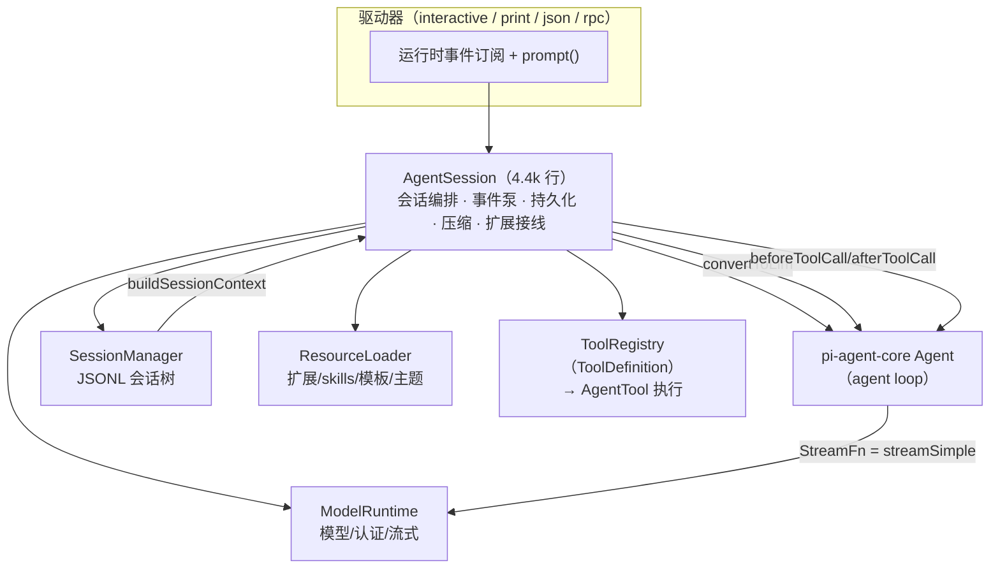
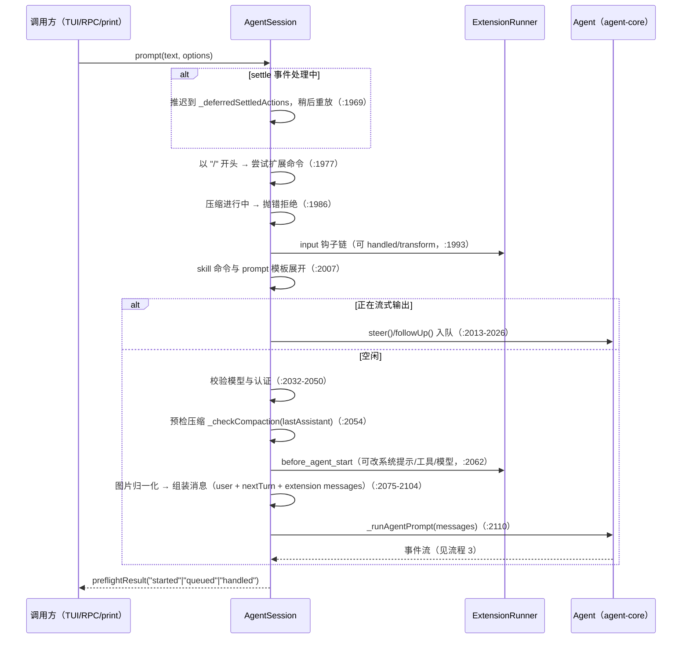

# coding-agent：核心运行时

`packages/coding-agent` 的内核：**`AgentSession` 会话编排 + JSONL 会话树 + 压缩 + 工具系统 + 模型层**。启动壳与运行模式见 [启动与运行模式](coding-agent-startup.md)；扩展系统见 [扩展与 SDK](coding-agent-extensions.md)；底层 agent 循环（本包消费的 `Agent` 类）见 [agent 运行时](agent.md)。

[返回索引](../index.md) · 术语见 [glossary](../glossary.md) · 所属任务：T07（见 [roadmap](../../roadmap/tasks.md)）

## 一、定位

一句话职责：**把 pi-agent-core 的内存态 `Agent` 变成一个可持续工作的产品**——每一条消息落盘、上下文超限时压缩、工具按定义注册执行、模型可切换可路由、扩展可在每个环节挂钩。

`AgentSession` 是**事件源也是状态权威**：所有模式（TUI/RPC/print）都只通过它的 `prompt()` 驱动、通过它的订阅收事件；`Agent` 负责跑循环，`AgentSession` 决定「什么该落盘、什么该压缩、什么该重试、通知谁」。

## 二、目录结构与模块地图

| 文件 | 职责 |
|------|------|
| `core/agent-session.ts`（4398 行） | **核心类 `AgentSession`**：prompt 管线、事件泵与持久化、压缩、重试、模型/思考切换、树导航、bash、扩展接线、统计与导出 |
| `core/agent-session-runtime.ts`（448 行） | `AgentSessionRuntime`（`:74`）：会话**重绑定中枢**（switch/new/fork/import 统一 teardown→重建）+ `createAgentSessionRuntime`（`:420`） |
| `core/agent-session-services.ts`（233 行） | `createAgentSessionServices`（`:135`）：cwd 绑定服务（ModelRuntime + SettingsManager + ResourceLoader）；`createAgentSessionFromServices`（`:214`） |
| `core/sdk.ts`（487 行） | `createAgentSession`（`:191`）：装配顺序的总编谱；默认 StreamFn 注入（`:46`） |
| `core/session-manager.ts`（2013 行） | `SessionManager`：JSONL 会话树的读写、投影（`buildSessionContext`）、分支/fork、列表发现 |
| `core/compaction/` | `compaction.ts`（1119：切点算法 + `compact()`）、`branch-summarization.ts`（382：分支摘要）、`utils.ts` |
| `core/tools/` | 8 个内置工具（`bash`/`edit`/`write`/`read`/`grep`/`find`/`ls`/`powershell`）+ 基建：`index.ts`（注册表与定义）、`tool-definition-wrapper.ts`、`file-mutation-queue.ts`、`truncate.ts`、`output-accumulator.ts`、`edit-diff.ts`、`renderers/` |
| `core/messages.ts`（196） | 自定义消息类型（`bashExecution`/`custom`/`branchSummary`/`compactionSummary`）+ `convertToLlm` 转换器 |
| `core/system-prompt.ts`（229） | 结构化系统提示的构建与差量（sections 机制） |
| `core/model-runtime.ts`（1034） | `ModelRuntime`（`:172`）：实现 pi-ai `Models` 契约 + 虚拟模型路由（`streamSimple`，`:716`）+ 动态模型目录 |
| `core/model-registry.ts`（244） | `ModelRegistry`（`:48`）：给扩展的同步 facade，逐方法转发 runtime |
| `core/model-resolver.ts`（783） | CLI 模型解析（`resolveCliModel`，`:406`）、作用域解析（`resolveModelScope`，`:364`）、初始模型选择（`findInitialModel`，`:622`） |
| `core/virtual-models.ts`（238） | 虚拟模型定义与会话记录（`getBranchSelection`，`:128`） |
| `core/auth-storage.ts`（506） | `AuthStorage`（`:327`，文件锁写）+ `ReadOnlyAuthStorage`（`:203`）+ 内存实现 |
| `core/settings-manager.ts`（1556） | `SettingsManager`（`:402`）：global（`~/.pi/agent/settings.json`）+ project（`.pi/settings.json`）两层，`create`（`:440`）/`inMemory`（`:489`） |
| `core/trust-manager.ts`（246）/`core/project-trust.ts`（96） | 信任存储（`ProjectTrustStore`，`:210`）与信任决策（`resolveProjectTrusted`，`:46`） |
| 运行保障 | `bash-executor.ts`（`:48` 执行 + 截断/落盘）、`event-bus.ts`（`:12` 扩展事件总线）、`cache-warmer.ts`（`CacheWarmer`，`:162`）、`usage-totals.ts`、`telemetry.ts`（安装遥测开关） |

## 三、核心数据结构

### AgentSessionEvent（`agent-session.ts:196`）

会话事件的完整联合 = **agent 事件**（除 `agent_end` 外原样透传，`tool_execution_*` 额外带可选 `parentToolCallId`）+ **会话层新增事件**：

- 生命周期：`agent_end`（加 `willRetry`）、`agent_settled`（run 真正结束、可再次 prompt）
- 队列与输入：`queue_update`、`session_info_changed`、`thinking_level_changed`
- 持久化：`entry_appended`（任何 entry 落盘，UI 以此增量渲染）
- 压缩：`compaction_start`/`compaction_end`（`reason: manual | threshold | overflow`）
- 重试：`auto_retry_start`/`auto_retry_end`、`summarization_retry_*`
- bash：`bash_execution_update`

### 会话条目（`session-manager.ts:183`）

`SessionEntry` 是 11 种条目的联合，全部带 `id`/`parentId`/`timestamp`（树结构）：

| 条目 | 行 | 说明 |
|------|----|------|
| `message` | `:64` | LLM 消息（`AgentMessage` 原样存） |
| `thinking_level_change` / `model_change` | `:69`/`:74` | 状态变更（投影时按序生效） |
| `usage` | `:80` | 模型用量（含 `kind: "cache_warm"`），不进上下文 |
| `compaction` | `:91` | 压缩摘要：`summary` + `firstKeptEntryId` + `tokensBefore` + **`systemMessage`（压缩边界的完整系统提示快照，`:103`）** |
| `branch_summary` | `:106` | 分支摘要（`fromId` = 被放弃分支的叶） |
| `custom` / `custom_message` | `:128`/`:159` | 扩展状态（不进上下文）/ 扩展注入消息（进上下文，`:153` 注释） |
| `context_edit` | `:175` | **append-only 的上下文编辑**：`targetId` 指向更早条目，`replacement` 替换内容或 `null` 省略（用于「撤下失败响应」等） |
| `label` / `session_info` | `:135`/`:142` | 书签 / 显示名 |

文件层：`SessionHeader`（`:43`，含 `version`——当前 `CURRENT_SESSION_VERSION = 3`，`:41`）+ 条目逐行 JSON。v1→v2 补 id/parentId、v2→v3 把 `hookMessage` 改为 `custom`（`:287`/`:316`），加载时自动迁移并重写文件。

### 投影（SessionProjection / SessionContext，`session-manager.ts:216`/`:223`）

`buildSessionContext()`（`:576`）是「**发给 LLM 的最终消息列表**」的唯一入口：沿当前 leaf 走根路径（`buildSessionPath`，`:390`）→ 压缩感知裁剪（`buildContextEntries`，`:476`：最新 compaction 之后的保留段 `firstKeptEntryId` 起算）→ 逐条转消息（`sessionEntryToContextMessages`，`:439`）→ 应用 `context_edit` → 汇总 `thinkingLevel`/`model`。`buildSessionProjection()` 保留每条消息的来源条目（`sourceEntry`），UI 与审计用它做归属。

### 其他关键类型

- `AgentSessionConfig`（`agent-session.ts:252`）：注入 Agent/SessionManager/SettingsManager/ResourceLoader/ModelRuntime，工具选择策略（`initialActiveToolNames`/`allowedToolNames`/`excludedToolNames`/`baseToolsOverride`）。
- `PromptOptions`（`:314`）：`images`、`streamingBehavior: "steer" | "followUp"`、`source`（交互/RPC/扩展）、`preflightResult`（RPC 模式的双段应答钩子）。
- `CompactionSettings`（`compaction.ts:120`）：默认 `enabled: true, reserveTokens: 16384, keepRecentTokens: 20000`（`:126`）。
- 自定义消息（`messages.ts`）：`BashExecutionMessage`（`:29`，`!` 命令，`excludeFromContext` 对应 `!!`）、`CustomMessage`（`:46`）等经 **declaration merging** 并入 `CustomAgentMessages`（`:70-77`）；`convertToLlm`（`:148`）把它们转成 `user` 消息（bash 输出渲染为 `` Ran `cmd` `` 代码块，`:82`）。

## 四、关键运行流程

### 1. 装配：从 `createAgentSession` 到 `AgentSession`

`sdk.ts`（`:191` 起）的装配顺序：

1. `ModelRuntime.create`（`:198`）→ 建 `SettingsManager` → `resourceLoader.reload()`（`:205`，扩展加载）→ 恢复会话模型（`getBranchSelection`，`:219`）→ `findInitialModel`（`:236`，按 CLI/设置/可用性选初始模型）→ thinking 级别钳制（`:277`）→ 工具选择链（`:280-294`，优先级：显式 > 设置默认 + `--tools` 修饰符）→ `CacheWarmer`（`:334`）→ `buildRequestOptions`（`:340`，超时/重试/header 变换）→ `new Agent({...})`（`:411`，见 [启动篇](coding-agent-startup.md) 的 `streamFn` 接线）→ `new AgentSession({ agent, sessionManager, ... })`（`:461`）。
2. `AgentSession` 构造函数（`agent-session.ts:485`）安装六组 agent 钩子（`:513-519`）：**事件订阅**（`_handleAgentEvent`，全部持久化/扩展/压缩的入口）、`beforeToolCall`/`afterToolCall`（`_installAgentToolHooks`，`:652-655`，转发给扩展 runner）、`prepareNextTurn` 刷新（上下文/模型热更新）、`prepareRequest` 投影（把 transcript 投影成 LLM 请求态）、边界钩子、隐藏工具声明投影。最后 `_buildRuntime` 建立工具注册表，没有显式工具列表时 `_restoreToolsFromTranscript`（`:525`）——**从会话记录恢复工具装载**。

### 2. `prompt()` 全流程（`agent-session.ts:1968`）

细节：`preflightResult` 在**受理确定后立刻**回调（RPC 模式以此发 response，`:2109`），之后所有结果走事件流；`before_agent_start` 处理器可以在此时改系统提示选项与模型（扩展驱动模型选择的官方机制，`:2059-2073` 注释）。

### 3. 事件泵与持久化（`_handleAgentEvent`，`agent-session.ts:1103`）

每个 agent 事件的固定顺序：**扩展先看 → 公开监听者 → 持久化**（`:1139-1141` 注释）。

- **持久化**（`:1144-1165`）：`message_end` 处按消息类型分流——`custom` 存为 `custom_message` 条目、system/user/assistant/toolResult 存为 `message` 条目；`_entryIdsByMessage`（WeakMap）维护消息对象→条目 id 的映射（消息在其他地方按对象查找条目时用）。bash/压缩摘要/分支摘要走各自的 append 路径。
- **队列显示同步**：`message_start`（user）时先把它从 steering/follow-up 显示队列移除再 emit `queue_update`（`:1119-1137`）——UI 先看到「队列出队」再看到消息本身。
- **重试计数**：assistant 成功响应立即清零 `_retryAttempt` 并 emit `auto_retry_end`（`:1174-1183`），防止多轮累加。
- **settle 语义**（`:1078-1100`）：`agent_end` 之后还有一次 `agent_settled`（等全部监听器与扩展钩子完成）；`_isEmittingAgentSettled` 期间的 `prompt()` 会被推迟执行（`_emitAgentSettled` 的 deferred 队列）。`waitForIdle()`（`:2446`）等待的正是这个状态。
- **post-run 决策**（`_handlePostAgentRun`，`:1853`）：run 结束后按序判断——可重试错误 → 自动重试（`_prepareRetry`）；否则 `_checkCompaction`（压缩/溢出恢复）；返回「是否 `agent.continue()`」以进入下一段。

### 4. JSONL 会话树（SessionManager）

**文件布局**：`~/.pi/agent/sessions/--<encoded-cwd>--/<ISO 时间戳>_<uuidv7>.jsonl`（`getDefaultSessionDirPath`，`:589`）。首行是 header，其余每行一个条目；append-only 意味着**任何修改都是追加新条目**（标题、标签、上下文编辑、新分支都不改旧行）。

**树与叶指针**：`leafId` 指向当前末条；`appendXxx()` 追加为叶的子节点并前移叶（`_appendEntry`，`:1191`）；`branch(fromId)`（`:1579`）只移动叶指针，下次 appending 自然形成新分支——**历史不可修改**（`:1516-1519` 注释）。`getTree()`（`:1529`）返回防御性拷贝（含标签解析），供 TUI 的树视图。

**惰性建文件**（`:1166-1189`）：只有出现了 user/assistant 消息才真正创建文件（首次 `_persist` 用 `wx` 独占创建并全量写出，之后改为 append）——「打开又关闭 pi 不留文件」。从用户消息开始算（而不是第一条 assistant 回复），保证首轮失败时 prompt 也已落盘（`:1160-1165` 注释，关联历史 bug #10000）。

**fork 家族**：`forkFrom`（`:1815`，跨项目复制历史到新 header 指向源文件）、`createBranchedSession`（`:1632`，把根→指定叶的单路径抽成新会话，且**重链 label 条目**避免孤儿子树，`:1639-1668`）、`navigateTree`（见流程 8）。

**列表发现**：`list`（`:1900`）/`listAll`（`:1921`）用带并发上限的 map（信息加载 10、目录扫描 64，`:891-892`），只读 header 做快速发现（`readSessionHeader` 带 1MiB 扫描上限，`:607`），逐步 `onProgress` 发布部分结果（节流 10/100 条，`:893-894`）。

### 5. 压缩（compaction）

**三种触发**（`_checkCompaction` 的文档注释，`agent-session.ts:2931-2946`）：

1. **overflow + 重试**：上下文溢出错误或可恢复的 `length` 截断 → 省略失败响应（`_omitRecoveryAttempt` 追加 `context_edit(null)`）→ 压缩 → 重试本轮（**只允许一次**，`_overflowRecoveryAttempted` 闸门，`:3019-3046`）；
2. **overflow 不重试**：响应完整但超窗 → 压缩、保留响应；
3. **threshold 不重试**：有效用量或估算值越过阈值 → 压缩。

手动压缩（`/compact`、RPC、扩展）走 `compact()`（`:2764`）：先 `abort()` 当前 run → `prepareCompaction` → `session_before_compact` 钩子（可取消或提供自定义摘要，`:2792-2812`）→ 默认路径 `_runDefaultCompaction`（解析摘要用模型/认证后在锁内调用 `compact()` 底层函数）→ `sessionManager.appendCompaction(...)`（`:2847`）→ `session_compact` 钩子 → `compaction_end` 事件。事件对 `compaction_start/end` 在成功与失败路径都发出。

**切点算法**（`compaction.ts`）：`prepareCompaction`（`:872`，基于投影的 `findProjectedCutPoint`，`:802`）从最新往回累计 token 估算，到 `keepRecentTokens` 停；切点可以是 user 或 assistant 消息（**从不在 tool result**，`:436-445` 注释）；切在轮中被拆出的前半部分生成**轮前缀摘要**（`generateTurnPrefixSummary`，`:1076`）。上下文用量核算：`calculateContextTokens`（`:140`，优先 `totalTokens`）、`estimateTokens`（`:298`）、阈值判断 `shouldCompact`（`:267`）。摘要消息注入格式见 `messages.ts:11-24`（`
` 包裹的前后缀常量）。

**压缩边界快照**：`appendCompaction` 会把**当前完整系统提示**快照进条目（`session-manager.ts:1270-1283`）——投影恢复时该边界同时也是一条 system 消息（`:461-464`），保证压缩后的提示与工具声明精确复原。

### 6. 工具系统（双层 + 三件基建）

**双层结构**：`ToolDefinition`（coding-agent 内部注册表形态，带 UI 渲染/来源信息）与 `AgentTool`（agent-core 执行契约）互转——`tools/index.ts` 的 `createToolDefinition`（`:118`）/`createTool`（`:141`），`tool-definition-wrapper.ts` 的 `wrapToolDefinition`（`:8`）/`createToolDefinitionFromAgentTool`（`:46`）。内置工厂：`createCodingTools`（`:195`，默认 read/bash/edit/write + 可选 grep/find/ls）、`createReadOnlyTools`（`:204`）、`allToolNames`（`:96`）。`renderers/`（`createAllToolRenderers`，`index.ts:32`）**把渲染从工具实现拆分**——纯渲染进程可不加载工具实现（省约 17MB）。

**默认激活**：构造时 `initialActiveToolNames` 未给则默认 `[read, bash, edit, write]`（`agent-session.ts:267` 注释），`_restoreToolsFromTranscript` 从会话恢复装载；`grep`/`find`/`ls` 默认关闭（`--tools` 打开）。

**三件基建**：

- `file-mutation-queue.ts`（`withFileMutationQueue`，`:32`）：**按 realpath 串行同文件写**、异文件并行；文件不存在时回退 resolve 路径（符号链接可能命中不同 key，注释提示）。所有写工具（edit/write）经过它。
- `truncate.ts`：输出截断策略——行 2000 / 字节 50KB 先到先截（`:11-12`）；`truncateHead`（`:78`，首行超限返回空 + `firstLineExceedsLimit`）、`truncateTail`（`:168`，允许单行部分截断）、`truncateLine`（`:268`，grep 行 500 字符）、`truncateMiddle`（`:292`）。
- `output-accumulator.ts`（`OutputAccumulator`，`:35`）：流式输出的滚动尾缓冲（上限约 2×maxBytes，`:60`），超限落临时文件；`readFullOutput`（`:149`）头尾各半、中间省略。注意 `snapshot()` 前未 `finish()` 会丢尾部 chunk。

**嵌套工具调用**：工具内通过 `ctx.executeTool()` 调其他工具，走 agent 的 `runToolCall` 管线（权限/hook 一致，见 [agent 运行时](agent.md)）；调用记录与用量由 `nested-tool-calls.ts` 收拢并写入 tool result 的 `nestedCalls`（`agent-session.ts:1104-1116`）。

### 7. 模型层（ModelRuntime 为核心）

- **`ModelRuntime`**（`model-runtime.ts:172`）实现 pi-ai 的 `Models` 契约（[pi-ai](ai.md)），并且是 coding-agent 的模型中枢：`streamSimple`（`:716`）里先做**虚拟模型路由**（direct 语义、maxTokens 取小、跨 provider 不转发凭证，`:730-734`），解析为物理模型后递归走真实流；`resolveModel`（`:996`）校验已注册与凭证。动态模型目录经 `refresh`（`:841`）刷新；扩展注册 provider 走 `registerProvider`（`:921`）。
- **`streamFn` 接线**：`sdk.ts:420-431` 的 `streamFn` 包一层后调 `modelRuntime.streamSimple`——这就是 [agent 运行时](agent.md) 里 `StreamFn` 注入点的生产实现（附 cache warmer 触发）。
- **虚拟模型**（`virtual-models.ts`）：命名组合（如 `direct` 语义），选中状态存为 `model_change` 条目；未注册时回退物理模型（`getBranchSelection`，`:128` 注释）。`AgentSession._recordSelection`（`agent-session.ts:628`）在分支暗示了别的选择时补记。
- **解析**：`resolveCliModel`（`model-resolver.ts:406`，支持 `provider/model` 与 `:thinking` 简写，未认证也可解析）、`resolveModelScope`（`:364`，`--models` 的 glob/模糊）、`findInitialModel`（`:622`）/`restoreModelFromSession`（`:714`）。
- **认证**：`AuthStorage`（`auth-storage.ts:327`）实现 pi-ai 的 `CredentialStore`——文件后端带 proper-lockfile 写锁（`:49`），`create` 共享读取状态去重，`ReadOnlyAuthStorage`（`:203`）对 `modify/delete` 直接 throw（`pi auth` 的 `--no-refresh` 用）。
- **扩展 facade**：`ModelRegistry`（`model-registry.ts:48`）把 runtime 方法逐层转发给扩展，保证扩展不直接触碰内部。

### 8. 树导航与 fork（`navigateTree`，`agent-session.ts:3964`）

前置检查（流式中/压缩中直接拒绝，`:3968-3975`）→ 收集「旧叶→公共祖先」之间要摘要的条目（`collectEntriesForBranchSummary`，`:3995`）→ `session_before_tree` 钩子（可取消、可提供摘要、可改指令与标签，`:4025-4048`）→ （可选）LLM 生成分支摘要（`branch-summarization.ts`）→ `branchWithSummary`（`session-manager.ts:1600`：移动叶指针 + 追加 `branch_summary` 条目；摘要以 user 消息形式参与上下文）→ 事件与编辑器文本回填。RPC 的 `fork`/`clone` 命令与 TUI 的树视图都走它（`clone` = 在叶上原地 fork）。

### 9. 自动重试与溢出恢复（post-run 环）

`_handlePostAgentRun`（`:1853`）在每轮 run 结束后按序：可重试错误（`_isRetryableError`，**上下文溢出不算**，交给压缩，`:3707-3710` 注释）→ `_prepareRetry`（退避后 `agent.continue()`，`_failedResponse` 作为路由的 `failed` 载荷）→ `_checkCompaction` → 队列非空则继续 run。重试期间发 `auto_retry_start/end` 事件；用户 `abort` 或 `abortRetry()`（`:3807`）中断。

### 10. bash 执行与 `!` 命令

`executeBash`（`:3841`）→ `bash-executor.ts:48`：ANSI/二进制字符清理、滚动缓冲 2×50KB、超限落盘、`truncateTail`；abort 时仍返回已有输出（`:124`）。结果经 `recordBashResult`（`:3879`）以 `BashExecutionMessage` 进会话（`!` 进上下文、`!!` 设 `excludeFromContext`）；运行中 `bash_execution_update` 事件流式推给 UI。RPC 的 `bash` 命令先过 `extensionRunner.emitUserBash` 钩子（扩展可接管，见 [启动篇](coding-agent-startup.md)）。

## 五、对外接口与扩展点

- **驱动器接口**：`prompt`/`steer`/`followUp`/`abort`/`waitForIdle`/`clearQueue`；`setModel`/`cycleModel`/`setThinkingLevel`/`cycleThinkingLevel`；`compact`/`abortCompaction`/`setAutoCompactionEnabled`；`navigateTree`/`getTree`（经 SessionManager）；`reload`（`:3660`，重载资源与扩展）；`dispose`（`:1393`）。
- **观测**：`subscribe`（`:1369`，`AgentSessionEvent` 流）；`getSessionStats`（`:4183`）、`getContextUsage`（`:4237`，上下文占用条）、`getLastAssistantText`（`:4347`）、`cacheWarmingStatus`/`setCacheWarmingMode`（`:1431`/`:1436`）。
- **导出**：`exportToHtml`（`:4288`，自包含 HTML 会话导出）、`exportToJsonl`（`:4314`）、`summarizeForBugReport`（`:4322`）。
- **扩展接线**：`bindExtensions`（`:3258`，把 UI 上下文/命令动作/错误监听注入 runner）；`extensionRunner` getter（`:4395`）；`hasExtensionHandlers`（`:4388`）。所有钩子事件在 [扩展与 SDK](coding-agent-extensions.md) 详列。
- **工具层扩展**：`customTools`（SDK 注入）、`baseToolsOverride`（自定运行时）、扩展 `registerTool`（进同一 `ToolDefinition` 注册表）。

## 六、现状与陷阱

1. **single-writer 事件顺序是契约**：`_handleAgentEvent` 固定「扩展 → 监听者 → 持久化」（`agent-session.ts:1139-1141`）。依赖「事件到时条目已落盘」的自定义监听器会踩坑——落盘顺序在最后。
2. **`prompt()` 在 `agent_settled` 发射期间被推迟**（`:1969-1971`）而不是拒绝；但**压缩进行中直接抛错**（`:1986`）。RPC 客户端要按错误语义区分「稍后重试」与「等待压缩」。
3. **压缩只自动重试一次**（`_overflowRecoveryAttempted`，`:3019-3038`）：第二次溢出直接失败并提示换模型/减上下文。失败响应会先被 `context_edit(null)` 省略再压缩（`:3043`）——这是 append-only 设计下「撤下消息」的实现方式。
4. **会话文件是 append-only，回改走 `context_edit`**：不要试图修改历史行；标题、标签、上下文替换、撤回全部是追加条目。`getEntries()` 每次返回浅拷贝，热路径（footer 每帧）用 `getEntryCount`/`getSessionName` 特化方法（`session-manager.ts:1318-1329` 注释）。
5. **首次落盘有延迟**（`_hasConversation` 闸门，`:1166`）：只有出现 user/assistant 消息才建文件。调试「会话文件哪去了」先看这个条件；这也是为什么 setup 条目（模型/思考/系统提示）可能只存在于内存。
6. **`truncate`/`output-accumulator` 的截断是全链路行为**：工具输出先经 accumulator 尾缓冲、再经 truncate 策略，完整输出落盘并给路径提示（`messages.ts:94-96`）。写依赖全量输出的工具时要用 `readFullOutput` 而不是输出文本。
7. **`file-mutation-queue` 按 realpath 串行**：符号链接指向同一文件时若在创建前解析会命中不同 key（注释提示）；跨进程并发写同一文件不在保护范围内。
8. **`navigateTree` 会等待、可能调 LLM**：摘要生成用当前模型（需要认证，`:3985-3987`），并占用 `_branchSummaryAbortController`；流式/压缩中调用直接抛错。
9. **虚拟模型≠物理模型**：事件里的 `message.provider/model` 是物理模型；分支选择的恢复语义靠 `model_change` 记录（`_recordSelection` 的注释解释了为什么不能只看响应，`:621-637`）。统计数据用 `_limitsModel()`（虚拟选中时取路由后的物理模型）核算上限。
10. **`ModelRuntime` 是服务级单例语义**：由 `createAgentSessionServices` 创建、`AgentSessionRuntime` 在会话切换时**重建整套服务**（teardown→apply→rebind，`agent-session-runtime.ts:167-187`）；teardown 先 `abort` 把中断轮次落进旧会话。创建失败**没有回滚**（旧会话已销毁）——扩展在 `session_shutdown` 前读状态要留意。

## 七、二次开发落点

| 需求 | 落点 |
|------|------|
| 嵌入 SDK 使用会话 | `createAgentSession`（`sdk.ts:191`）+ `subscribe`；用法见 `docs/sdk.md` 与 [扩展与 SDK](coding-agent-extensions.md) |
| 新增内置工具 | `core/tools/<name>.ts` + `tools/index.ts` 注册 + 默认激活清单；契约是 `ToolDefinition`（渲染/来源）与 `AgentTool`（执行） |
| 改压缩策略/阈值 | `settings.json` 的 compaction 设置；算法在 `compaction/compaction.ts`（切点 `findCutPoint`、估算 `estimateTokens`）；扩展拦截用 `session_before_compact` |
| 改系统提示结构 | `system-prompt.ts` 的 sections 机制（`buildSystemPromptSections`/`diffSystemPromptSections`）；提示更新以 `SystemMessage.sections` 差量进入转录（[pi-ai](ai.md) 的 system 消息重放） |
| 自定义消息类型进上下文 | `messages.ts` 的 declaration merging + `convertToLlm` 分支；持久化用 `appendCustomMessageEntry` |
| 改会话格式/新增条目类型 | `session-manager.ts`：加条目接口进 `SessionEntry` 联合 + 投影分支（`sessionEntryToContextMessages`）+ 必要时 bump `CURRENT_SESSION_VERSION` 并写迁移 |
| 自定义模型解析/路由 | `model-resolver.ts`（CLI 层）或 `ModelRuntime.streamSimple` 路由（虚拟模型）；扩展侧用 `registerProvider`/`registerVirtualModel` |
| 改重试/退避 | `_isRetryableError`/`_prepareRetry` 与 `settings` 的重试设置；事件 `auto_retry_*` 是观测点 |
| 会话导出/分享 | `exportToHtml`/`exportToJsonl`；TUI 的 `/share` 在 `modes/interactive/session-share.ts` |

## 八、相关文档

- [packages/coding-agent/docs/](../../packages/coding-agent/docs/) 下：`how-pi-works.md`、`sessions.md`、`session-format.md`、`compaction.md`、`models.md`、`providers.md`、`virtual-models.md`、`settings.md`、`security.md`、`environment-variables.md`
- 本套文档：[启动与运行模式](coding-agent-startup.md)（模式如何驱动本篇的接口）、[coding-agent 扩展与 SDK](coding-agent-extensions.md)、[agent 运行时](agent.md)（`Agent` 与钩子的底层语义）、[pi-ai](ai.md)（`Models` 契约/事件流/认证）、[关键数据流时序图](../data-flows.md)（T17）、[glossary](../glossary.md)、[architecture](../architecture.md)

---

[返回索引](../index.md) · 任务与进度：[roadmap](../../roadmap/README.md)
