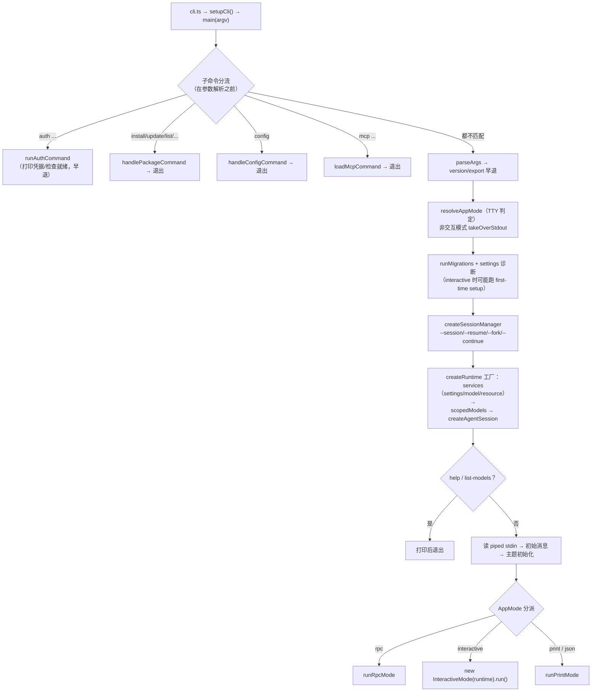

# coding-agent：启动与运行模式

本篇讲 coding-agent 的**外壳**：从进程入口到进入某个运行模式的完整路径，以及四种模式（interactive / print / json / rpc）各自的架构。会话内部的运转（`AgentSession`、工具、压缩）见 [核心运行时](coding-agent-runtime.md)；扩展加载见 [扩展与 SDK](coding-agent-extensions.md)。

[返回索引](../index.md) · 术语见 [glossary](../glossary.md) · 所属任务：T06（见 [roadmap](../../roadmap/tasks.md)）

## 一、定位

一句话职责：**把 `argv` 翻译成一次会话运行**——解析参数、跑迁移、装配运行时（settings/模型/资源）、选会话、决定模式，然后把控制权交给对应模式的驱动器。`main.ts` 顶部注释自己概括得很准："This file handles CLI argument parsing and translates them into createAgentSession() options. The SDK does the heavy lifting."（`packages/coding-agent/src/main.ts:1-6`）

三个进程入口，同一套 `main()`：

| 入口 | 文件 | 用途 |
|------|------|------|
| 默认 bin | `src/cli.ts` → `main(process.argv.slice(2))` | 日常 CLI / npm 安装 |
| RPC 专用 | `src/rpc-entry.ts`（`package.json` exports `./rpc-entry`） | 预置 `--mode rpc`，供 IDE/宿主进程内嵌 |
| bun 二进制 | `src/bun/cli.ts` → `sandbox-env-setup` + `runtime-setup` → `../cli.ts` | standalone 发行版（内嵌 wasm 等运行时资产） |

## 二、目录结构与模块地图

| 路径 | 职责 |
|------|------|
| `src/cli.ts`（6 行） | bin 入口：`setupCli()` + `main(argv)` |
| `src/cli/setup.ts`（13 行） | 进程标题、`PI_CODING_AGENT`/`AI_AGENT` 环境标记、静音进程警告、初始化 HTTP dispatcher |
| `src/main.ts`（999 行） | **总调度器**：子命令分流、参数解析、迁移、运行时装配、模式分派 |
| `src/cli/args.ts`（479 行） | `parseArgs`（含未知 flag 收集给扩展）+ `printHelp`（帮助全文） |
| `src/cli/startup-ui.ts`（253 行） | 启动期轻量 TUI：首次设置、通用选择器/输入框（`createStartupTui`） |
| `src/cli/session-picker.ts`（55 行） | `--resume` 的会话选择器 |
| `src/cli/auth-command.ts`（126）/`auth-check.ts`（73）/`credential-print.ts`（87） | `pi auth` 子命令：打印凭据、检查 provider 就绪 |
| `src/cli/file-processor.ts`（88）/`initial-message.ts`（43） | `@file` 参数读取；stdin/文件/消息组合成初始 prompt |
| `src/cli/list-models.ts`、`project-trust.ts`、`config-selector.ts` | `--list-models`；信任提示上下文；`pi config` 的 TUI |
| `src/cli/experimental/` | `PI_EXPERIMENTAL` 门控的实验子命令（`command.ts` + `commands/`） |
| `src/modes/print-mode.ts`（169）/`json-event.ts`（61） | 单发执行（text/json 输出）与事件→JSON 的转换 |
| `src/modes/rpc/`（`rpc-mode.ts` 819 / `rpc-types.ts` 303 / `rpc-client.ts` 617 / `jsonl.ts` 58） | RPC 模式服务端、协议类型、官方 Node 客户端、严格 JSONL 分帧 |
| `src/modes/interactive/`（`interactive-mode.ts` 7109 行 + `components/` ~40 个 + `theme/` + `assets/`） | 交互模式主类与全部 TUI 组件 |
| `src/rpc-entry.ts`（13 行） | RPC 独立入口 |
| `src/bun/`（`cli.ts`/`runtime-setup.ts`/`sandbox-env-setup.ts`/`restore-sandbox-env.ts`） | 二进制发行入口链 |
| `src/config.ts`（656 行） | **资产路径 helpers**（AGENTS.md 规定：包内资产必须走这里的 helper，不许直接 `__dirname`）+ 安装方式侦测/自更新命令 |
| `src/migrations.ts`（315 行） | 启动时一次性数据迁移 |
| `src/package-manager-cli.ts` | `pi install/update/uninstall/list` 子命令（机制细节见 [扩展与 SDK](coding-agent-extensions.md)） |

## 三、核心数据结构

- **`Args`**（`cli/args.ts:13`）：解析结果。关键字段：`messages`/`fileArgs`（位置参数与 `@file`）、`mode`（`text|json|rpc`，`:11`）、`print`、会话选择组（`continue`/`resume`/`session`/`sessionId`/`fork`）、模型与思考（`provider`/`model`/`thinking`/`models`）、工具与资源开关（`tools`/`excludeTools`/`noExtensions`/`skills`...）、`unknownFlags: Map`（收集未知 `--flag` 交给扩展）、`diagnostics`（解析期的错误/警告，`main` 决定是否退出）。
- **`AppMode`**（`core/project-trust.ts` 定义，`"interactive" | "print" | "json" | "rpc"`）：运行模式的最终判定结果，贯穿 `main`。
- **RPC 协议类型**（`modes/rpc/rpc-types.ts`）：
  - `RpcCommand`（`:20-74`）：33 种命令，按注释分组——prompting（`prompt`/`steer`/`follow_up`/`abort`/`clear_queue`/`new_session`）、state、model、thinking、queue modes、compaction、retry、bash、session、messages、commands；均可带可选 `id` 用于响应关联。
  - `RpcResponse`（`:116-245`）：`{ type: "response", command, success: true, data }` 或 `{ success: false, error }`。
  - `RpcExtensionUIRequest`/`RpcExtensionUIResponse`（`:252-297`）：扩展 UI 子协议（select/confirm/input/editor/notify/setStatus/setWidget/setTitle/set_editor_text）。
  - `RpcSessionState`（`:96`）：`get_state` 的完整快照（模型、思考级别、流式/压缩状态、队列模式、会话文件/ID/名字、消息计数）。
- **`JsonAgentSessionEvent`**（`modes/json-event.ts:18`）：JSON/RPC 输出的事件形态——`message_update` 事件**剥掉累计的 `partial` 快照**（客户端用 `message_start` + delta 重建；`toolcall_start` 额外补 `id`/`toolName`，`:46-61`）。
- **`InteractiveModeOptions`**（`modes/interactive/interactive-mode.ts:430` 起）：迁移警告、启动诊断、初始消息/图片、`tuiMode`、主题，以及可注入的 `terminal`（测试用）。

## 四、关键运行流程

### 1. 启动时序（`main`，`main.ts:573`）

分工细节：

- **子命令分流在最前**（`main.ts:582-618`）：`auth`/`install`/`update`/`list`/`config`/`mcp` 各自解析自己的参数（不走主 `parseArgs`），命中即退出。`--version`（`:632`）与 `--export`（`:637`）也在装配运行时**之前**早退。
- **模式判定**（`resolveAppMode`，`:112-123`）只依赖三个输入：`--mode` 显式值、`--print`、stdin/stdout 是否 TTY。判定后非交互模式调用 `takeOverStdout()`（`:652-655`，`--help`/`--list-models` 这类纯元数据命令豁免，`:129-131`）。
- **迁移与设置**（`:666-677`）：`runMigrations(cwd)` 返回迁移结果与弃用警告（见流程 8）；首次设置（主题/遥测选择）只在 interactive 且官方发行版时出现（`startup-ui.ts:124-148`）。
- **会话选择 → 运行时装配**：`createSessionManager`（`:358-449`）按 `--no-session` / `--fork` / `--session` / `--resume` / `--continue` / `--session-id` 的优先级选文件；随后 `createRuntime` 工厂（`:730-861`）创建 cwd 绑定的服务（settings、模型运行时、资源加载器）、解析项目信任、解析 `--models` 作用域、调 `createAgentSessionFromServices`（`:839`）；最后 `createAgentSessionRuntime`（`:863`）把运行时固定到「会话首次选定的 cwd」。跨项目会话若 cwd 缺失会交互式询问是否 fork（`:694-706`）。
- **stdin 降级**（`:892-898`）：非 RPC 模式读取 piped stdin 作为初始 prompt；若此时模式还是 interactive，会**降级为 print**（有管道输入说明不是交互式会话）。
- **最终分派**（`:948-998`）：rpc → `runRpcMode(runtime)`；interactive → `new InteractiveMode(runtime, {...}).run()`；否则 `runPrintMode(runtime, { mode: text|json, ... })`。RPC 模式在分派前先启动一次后台模型目录刷新（`:939-946`）；`PI_STARTUP_BENCHMARK=1` 只允许 interactive（`:932-936`，跑完 `init()` 即退出，用于启动耗时基准）。

### 2. 四模式对比

| 模式 | 触发条件（`resolveAppMode` + `main`） | 输入 | 输出 | 生命周期 |
|------|--------------------------------------|------|------|----------|
| interactive | 默认（stdin/stdout 均为 TTY） | 键盘 + 初始消息 | 全屏 TUI | 常驻直到退出 |
| print | `-p`、或 stdin/stdout 任一非 TTY、或 interactive 检测到 piped stdin | argv / stdin / `@file` | 最后一条 assistant 文本（`print-mode.ts:139-155`） | 单发后退出，退出码带成功/失败（`:145-147`） |
| json | `--mode json` | 同上 | JSONL 事件流（首行是 session header，`print-mode.ts:122-127`） | 同上 |
| rpc | `--mode rpc` 或 `rpc-entry` | stdin 上的 JSON 命令 | stdout 上的响应 + 事件 JSONL | 常驻（`return new Promise(() => {})`，`rpc-mode.ts:818`），stdin EOF / SIGTERM / 扩展请求可关闭 |

`--print` 有一个解析细节：`-p` 后紧跟的非 flag 参数会被**吃成消息**（`args.ts:177-183`），因此 `pi -p "问题"` 与 `pi "问题" -p` 等价；要传以 `-` 开头的消息用 `--`。

### 3. print / json 模式（`runPrintMode`，`print-mode.ts:33`）

1. `rebindSession`（`:74-119`）：`session.bindExtensions({ mode: "print"|"json", commandContextActions })` 把扩展所需的会话操作（新会话/fork/树导航/切换）接上；然后订阅会话事件——json 模式把每个事件经 `toJsonEvent` 写成一行 stdout（`:108-112`）。
2. **背压**：json 模式下额外挂一个 agent 层订阅，每个事件后 `await waitForRawStdoutBackpressure()`（`:113-118`）——消费端慢时反压到 agent 循环，避免输出暴涨。
3. 依次 `session.prompt`：初始消息（可能含 `@file` 文本与图片）→ `messages` 数组。
4. text 模式取最后一条 assistant 消息输出 text 块；`stopReason` 为 error/aborted 时写 stderr 并返回退出码 1（`:139-155`）。
5. 信号：SIGTERM/SIGHUP 上杀子进程、dispose 运行时、按信号返回 143/129（`:50-66`）；`finally` 里 dispose 并 `flushRawStdout`（`:162-168`）。
6. 输出都走 `core/output-guard.ts` 的 `writeRawStdout`/`flushRawStdout`（配合 `main` 的 `takeOverStdout`，把 stdout 从库的随意写入中隔离出来，保证 JSONL 纯净）。

### 4. RPC 模式（`runRpcMode`，`rpc-mode.ts:54`）

协议：**JSONL over stdio**（服务端视角：stdin=命令，stdout=响应+事件）。分帧用自研 `jsonl.ts`——**严格 LF 分帧**，刻意不用 Node readline（readline 会按 U+2028/U+2029 等额外分隔符切分，那不是非严格 JSONL，`jsonl.ts:16-20` 注释）。

主循环（`:750-815`）：`attachJsonlLineReader`（`:808`）→ 每行 `handleInputLine`：

- JSON 解析失败 → 输出 `command: "parse"` 的错误响应（`:753-763`）；
- `type: "extension_ui_response"` 的行先分流，去 `pendingExtensionRequests` 里兑现对应 dialog 的 Promise（`:767-780`）；
- 其余按 `RpcCommand` 进 `handleCommand`（`:386`）；有响应就输出并 `await waitForRawStdoutBackpressure()`（`:785-788`）；随后检查扩展请求的 shutdown（`:789`、`:745-748`）。

会话事件（含全量 agent 事件与 `agent_settled`）经 `session.subscribe` 实时写成 JSONL（`:355-360`）；同样带背压订阅（`:361-363`）。

值得注意的三个设计：

- **`prompt` 是异步双段应答**：命令处理不等待本轮完成——先发 `prompt` 的 response（`preflightResult` 回调给出 `disposition`），之后的结果全部走事件流（`:394-414`）。客户端按 `id` 关联响应、按事件流消费结果。
- **扩展 UI 子协议**：扩展在 RPC 模式下没有 TUI，`createExtensionUIContext`（`:136-311`）把 UI 调用变成 `extension_ui_request` 输出 + 等待客户端 `extension_ui_response`（`createDialogPromise`，`:91-131`；带 `signal`/`timeout` 兜底默认值）。不支持的 UI 能力（自定义组件、主题切换等）显式 no-op 或返回错误。
- **`bash` 命令与用户 `!` 命令同源**：先经 `extensionRunner.emitUserBash` 钩子（扩展可接管执行），再落到 `session.executeBash`（`:561-582`）。

关闭路径：stdin `end`（`:802-805`）、SIGTERM/SIGHUP（`:366-380`）、扩展 `shutdownHandler` 置位后在 `agent_settled` 事件时关（`:345-347`）；关闭流程（`:726-743`）清 handler、dispose 运行时、`process.stdin.pause()`，SIGTERM 之外的信号会 `flushRawStdout` 后再退出。

**官方客户端**：`rpc-client.ts` 的 `RpcClient`（`:56`）spawn 一个 `pi` 子进程，把每个命令封装成 async 方法（`prompt`/`steer`/`setModel`/`compact`/`bash`/`exportHtml`...，`:198-376`），事件通过 `onEvent` 暴露（`:172`），请求-响应用自增 `requestId` 关联（`:62`）。做 IDE 集成的第一落点就是它。

**与「CBOR C/S 体系」的区分**（重要）：RPC 模式是 JSONL、stdio、单会话子进程控制；实验性的 `protocol/client/server` 是 CBOR 分帧、Unix socket、多会话多 attachment 的另一套远程体系（见 [远程会话 C/S 体系](remote-sessions.md) 与 [architecture](../architecture.md) 第五节）。

### 5. Interactive 模式架构（`interactive-mode.ts`）

主类 `InteractiveMode`（`:451`）持有：`runtimeHost`（会话运行时宿主）、`renderer: TuiMainScreen | TuiAltScreen`（`:453`，两种 renderer 可切换，`switchTuiMode` `:890`）、以及按职责划分的组件容器——`chatContainer`（对话流）、`pendingMessagesContainer`（排队消息）、`statusContainer`（状态行）、`editorContainer`（输入编辑器 + 补全）、`footerContainer`、`loadedResourcesContainer`（启动时的资源清单）等（`:456-474`）。

- **生命周期**：`run()`（`:1146`）先 `init()`（`:943`）挂载 TUI 与组件树，然后并行启动后台任务——模型目录刷新（`:1152`，退出前给 15s 上限）、新版本检查（`:1159`）、扩展包更新检查（`:1166`）、tmux 键盘设置检查（`:1181`），最后显示启动诊断并把初始消息投给会话。
- **事件驱动**：`subscribeToAgent`（`:3400`）订阅会话事件，`handleEvent`（`:3406`）是总处理器：footer 失效、OSC 7501 程序状态上报（`programStatus`）、按事件类型更新组件（`agent_start` 清 pending 工具、`turn_start` 起工作指示器、`queue_update` 刷新排队显示、`entry_appended` 追加自定义 entry 等，`:3414` 起）。每个事件处理完请求重绘。**这里也是 T07 的接引点**：事件→组件的映射逻辑全部在这个文件里。
- **组件库**（`components/`，~40 个）：聊天展示类（`assistant-message`、`diff`、`bash-execution`、`compaction-summary-message`...）、对话框类（`login-dialog`、`extension-selector/input/editor`、`first-time-setup`）、输入类（`custom-editor`、`editor`）、`footer`、`session-selector`、`model-selector` 等；主题系统在 `theme/`（含 `system-theme` 与终端颜色探测的接线）。
- **输入**：编辑器提交 → `onInputCallback` 或 `pendingUserInputs` 队列（`:3391-3396`）。

### 6. 子命令一览（早退路径）

| 命令 | 实现 | 说明 |
|------|------|------|
| `pi install/remove/uninstall/update/list` | `package-manager-cli.ts`（`main.ts:597`） | 扩展包管理与自更新；`pi update` 在 Windows 有 exit 特例（`:599-604`，Node fetch teardown bug） |
| `pi config` | `handleConfigCommand`（`main.ts:610`） | TUI 里启用/禁用包资源 |
| `pi mcp ...` | `loadMcpCommand`（`main.ts:614`，懒加载） | MCP 服务器检查、OAuth 登录/登出 |
| `pi auth print-api-key/print-bearer-token/check` | `runAuthCommand`（`main.ts:133`） | 打印凭据给外部客户端或检查就绪；退出码 0=ready / 1=not_ready / 2=invalid（`:202`） |
| `pi <experimental 子命令>` | `cli/experimental/` | `PI_EXPERIMENTAL` 门控 |

### 7. bun 发行链（`src/bun/`）

`bun/cli.ts` 依次 import 三个模块再进主入口（`:1-4`）：

1. `sandbox-env-setup.ts` → `restoreSandboxEnv()`（在任何读环境变量的模块求值**之前**恢复沙箱环境）；
2. `runtime-setup.ts`：注册 Bun 专属 OAuth flows（`registerBunOAuthFlows`）、设置 Bedrock provider 模块、把 `quickjs-wasi/quickjs.wasm` 的路径注入 config（`setEmbeddedQuickJSWasmPath`，Bun 编译时把 wasm 内嵌进可执行文件，import 求值为可读路径）；
3. 回到 `../cli.ts` 走标准启动。

`config.ts` 的 `isBunBinary`（`:21`）与 `detectInstallMethod()`（`:79`）据此区分发行方式（影响自更新命令提示等）。

### 8. 启动迁移（`migrations.ts`）

`runMigrations(cwd)`（`:305`）在 `main.ts:666` 执行，全部是**一次性、幂等、失败静默**的数据迁移：

1. `migrateAuthToAuthJson`（`:21`）：把旧 `oauth.json` 与 `settings.json` 里的 `apiKeys` 归并进 `auth.json`（原文件改名 `.migrated` 或删除字段）；
2. `migrateSessionsFromAgentRoot`（`:84`）：修复 v0.30.0 的已知 bug——会话被写进 `~/.pi/agent/` 根目录而非 `sessions/<encoded-cwd>/`，按 header 中的 cwd 搬回正确位置；
3. `migrateToolsToBin`（`:177`）：`tools/` 下的 fd/rg 二进制移到 `bin/`；
4. `migrateKeybindingsConfigFile`（`:157`）：键位配置文件格式迁移；
5. `migrateExtensionSystem`（`:257`）：`commands/` 改名 `prompts/`；发现弃用的 `hooks/`/自定义 `tools/` 目录时收集警告，interactive 模式下 `showDeprecationWarnings`（`:277`）打印指引并等按键继续。

## 五、对外接口与扩展点

- **进程入口**：三个 bin（见「定位」）；另有导出的 `main(args, options?)`（`main.ts:573`）与 `MainOptions.extensionFactories`（`:569`）——**可以把 CLI 当库启动**，注入内联扩展工厂（本仓库的调试入口 `pi-test.sh` 与嵌入式场景用它）。
- **RPC 客户端**：`RpcClient`（`rpc-client.ts:56`）+ 协议类型（`rpc-mode.ts:42-48` re-export）；`jsonl.ts` 的 `serializeJsonLine`/`attachJsonlLineReader` 可直接复用来写自定义客户端。
- **扩展 CLI flag**：`parseArgs` 把未知 `--flag` 收进 `unknownFlags`（`args.ts:247-262`），`main` 透传给资源加载器（`main.ts:754`），扩展声明的 flag 会出现在 `--help` 的 "Extension CLI Flags" 段（`printHelp`，`args.ts:273-283`）。
- **启动期 UI**：`createStartupTui`/`showStartupSelector`/`showStartupInput`（`startup-ui.ts:85/150/221`）是给「主 TUI 还没装上」的场景用的轻量引导界面。
- **InteractiveMode 可注入 `terminal`**（`interactive-mode.ts:447-448`），测试时用 `VirtualTerminal`（[pi-tui](tui.md) 的测试设施）。
- 相关环境变量：`PI_OFFLINE`、`PI_STARTUP_BENCHMARK`、`PI_EXPERIMENTAL`，以及 [pi-tui](tui.md) 的 `PI_TUI_*` 系列。

## 六、现状与陷阱

1. **子命令与主参数解析是两层**：`auth`/`install`/`config`/`mcp` 在 `parseArgs` **之前**分流（`main.ts:582-618`），它们只认自己的参数。给主 CLI 加参数时不要误以为子命令也能用。
2. **`takeOverStdout` 是输出纯净性的保险**：非交互（且非纯元数据命令）模式下 stdout 被输出守卫接管（`main.ts:652-655`），只有 `writeRawStdout` 能写出。任何第三方库直接 `console.log` 不会污染 JSONL——但也意味着你在这些模式里必须用守卫的 API 输出。
3. **模式判定分散在三处**：`resolveAppMode`（显式开关/TTY，`main.ts:112`）→ piped stdin 把 interactive 降级 print（`:895-897`）→ `-p` 的"吃下一个参数"行为（`args.ts:177-183`）。排查"为什么进了这个模式"要按这个顺序看。
4. **RPC 的 `prompt` 响应先于结果**：response 只表示受理（带 disposition），结果在事件流里（`rpc-mode.ts:394-414`）。按顺序"发一条等一条"的简单客户端要按 `id` 关联，别等 response 就当完成。
5. **JSON 事件刻意不含 `partial`**：`message_update` 去掉累计快照以省带宽（`json-event.ts:40-61`），客户端须用 `message_start` + delta 自建状态；`toolcall_start` 事件里额外给了 `id`/`toolName` 帮助重建。
6. **JSONL 分帧只管 LF**：`jsonl.ts` 不用 readline（`:16-20`），消息内可以安全包含 U+2028/U+2029。自己实现客户端时不要用会按 Unicode 行分隔符切分的读取器。
7. **`--resume` 的会话选择器是"轻量 TUI"**：它用 `startup-ui.ts` 的最小主题栈在主 TUI 之前运行，结束后 `stopThemeWatcher`（`main.ts:427-429`）。写类似的前置 UI 时不要引完整 interactive 栈。
8. **first-time setup 的条件很窄**（`startup-ui.ts:124-148`）：官方发行版 + `PI_EXPERIMENTAL=1` + 未覆盖 agent 目录 + `settings.json` 不存在。它写主题与遥测选择后 `flush()`。
9. **迁移静默失败是特性**（`migrations.ts`）：损坏的旧文件会被跳过而不是中断启动；但弃用目录警告会**阻塞等按键**（`:288-296`）——自动化场景注意 `PI_OFFLINE` 之外的这类交互点。
10. **Windows 特例**：`pi update` 成功路径不用 `process.exit(0)`（Node 的 fetch teardown 断言，`main.ts:599-604`）；启动时的 npm 包版本检查可能覆盖控制台标题，interactive 模式会恢复（`interactive-mode.ts:1172-1178`）。

## 七、二次开发落点

| 需求 | 落点 |
|------|------|
| 加 CLI 参数/flag | `cli/args.ts` 的 `parseArgs` + 在 `main.ts` 消费 + `printHelp` 补文档；临时开关优先考虑扩展 flag（`unknownFlags` 通道） |
| 加子命令 | 参照 `handlePackageCommand`/`handleConfigCommand` 的分流模式（注意运行在参数解析之前）；实验性命令放 `cli/experimental/` |
| 把 pi 作为库启动 | `import { main }` + `MainOptions.extensionFactories`（`main.ts:569-573`） |
| 写 RPC 客户端（非 Node） | 读 `rpc-types.ts` 的命令/响应/事件联合 + 按 LF 分帧；参考 `rpc-client.ts` 的 id 关联与事件分发 |
| 改单发输出格式 | `modes/print-mode.ts`（文本输出、退出码）与 `modes/json-event.ts`（事件瘦身规则） |
| 改启动引导/首屏 | `cli/startup-ui.ts`（轻量 TUI）+ `interactive-mode.ts` 的 `showStartupNoticesIfNeeded`（`:843`）/启动展开状态 |
| 加一次性数据迁移 | `migrations.ts` 的 `runMigrations` 链，保持幂等与失败静默 |
| 加二进制发行资产 | `src/bun/runtime-setup.ts` 的注入模式（如 QuickJS wasm）+ `config.ts` 的 `setEmbedded*Path` |

## 八、相关文档

- [packages/coding-agent/docs/](../../packages/coding-agent/docs/) 下：`cli.md`（CLI 用法）、`json.md`（JSON 事件流格式）、`rpc.md`、`rpc-commands.md`、`rpc-extension-ui.md`、`cli-integration.md`、`usage.md`、`keybindings.md`
- 本套文档：[coding-agent 核心运行时](coding-agent-runtime.md)（`AgentSession` 与事件源）、[coding-agent 扩展与 SDK](coding-agent-extensions.md)（扩展如何拿到这些入口）、[pi-tui](tui.md)（renderer 与组件）、[远程会话 C/S 体系](remote-sessions.md)（与 RPC 模式的对照）、[关键数据流时序图](../data-flows.md)（T17，将把本篇的启动链画进端到端时序）、[glossary](../glossary.md)、[architecture](../architecture.md)

---

[返回索引](../index.md) · 任务与进度：[roadmap](../../roadmap/README.md)
