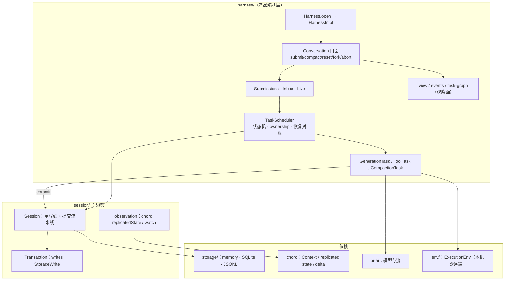

# durable（持久化 agent 运行时）

> **状态声明：Experimental。** durable 不在 pi 的默认运行路径上——coding-agent 只在 `src/experimental/durable/`（`PI_EXPERIMENTAL` 门控）集成它。它与 [agent 包](agent.md) 是**概念平行演化**：hook 命名（before/afterTool）、`terminate` 语义一致，但 durable **不依赖 agent 包**，也不被 agent 包依赖；`AgentTool.replay` 在 agent 包里定义了没人消费，到这里才真正生效。生产路径的会话存储是 coding-agent 自己的 JSONL 会话树，**不是** durable。

`packages/durable`（包名 `@earendil-works/pi-durable`，67 个源文件、约 2 万行）回答一个问题：**如果 agent 必须「先持久化、再做、崩溃可恢复」，架构应该长什么样？** 它的答案是：一切经 Storage 提交后才可见的 Session 提交管线 + task 状态机 + 可插拔存储后端 + Chord 复制状态观察面。底座是 [chord](chord.md)（replicated state / delta / Context），模型调用走 [pi-ai](ai.md)。

[返回索引](../index.md) · 术语见 [glossary](../glossary.md) · 所属任务：T12（见 [roadmap](../../roadmap/tasks.md)）

## 一、定位

一句话职责：**把 agent 的每一步副作用都变成一条持久的、可恢复的提交**——转录（entry）、任务（task 状态机）、文档（document）三类记录先落盘再对外可见，进程崩溃后重开存储即可续跑。



## 二、目录结构与模块地图

| 路径 | 职责 |
|------|------|
| `src/types.ts`（1107 行） | **全部持久化契约**：品牌化 `Id`/`Seq`、四类记录（Conversation/Entry/Task/Submission）、document 语义、`Tx`/`Session`/`Storage` 接口、`CommitPublication`、watch/observer 契约 |
| `src/session/session.ts`（569 行） | `SessionImpl`（`:59`）：**单写线**（`#enqueue`，`:530`）+ 提交流水线（`#runCommit`，`:405`）+ 文档 tracker 缓存 + 提交发布；`createSession`（`:49`） |
| `src/session/transaction.ts`（1042 行） | `Transaction`：全部写入种类的实现、`settleSuccess/settleFailure` 组装 `StorageWrite[]`、`adopt(seq)` 把已提交 delta 应用到内存 tracker |
| `src/session/observation.ts`（301 行） | `CommittedStateSource`/`CommittedWatch`：把文档提交流包装成 chord 的 `ReplicatedStateSource`/watch（含 100 帧溢出塌缩） |
| `src/session/forks.ts`（97） | fork 记录构造 |
| `src/documents.ts`（208 行） | `defineDoc`/`defineDocFamily`（`:39`/`:60`）：scope/history/fork/version 语义；地址解析（`resolveAddress`，`:109`）、兼容性校验（`checkRecordScope` `:168`/`checkRecordVersion` `:179`）、迁移物化（`:193-208`） |
| `src/entries.ts`（34 行） | 六个内置 entry kind：`pi.user`/`pi.assistant`/`pi.system`/`pi.tool-result`/`pi.reset`/`pi.compaction`（`:15-34`） |
| `src/harness/harness.ts`（437 行） | `Harness.open`（`:411`）与 `HarnessImpl`（`:166`）：任务调度器/提交受理/视图的装配，`ConversationImpl` 门面（`:83`），会话创建钩子（建五个内置文档，`:357-364`） |
| `src/harness/scheduler.ts`（1435 行） | **TaskScheduler**：任务状态机、ownership 树、恢复对账、abort 级联、invocation 生命周期 |
| `src/harness/generation.ts`（681 行） | 内置 `pi.generation` 任务：phase 机、占位式提示（防 prompt cache 失效）、partial 节流提交、overflow 压缩重试、工具轮 |
| `src/harness/tool.ts`（509 行） | 内置 `pi.tool` 任务：**intent 先提交再执行**、replay 策略、interrupted 结果、hooks |
| `src/harness/compaction.ts`（453 行） | 压缩任务（manual/水位/overflow 三入口） |
| `src/harness/submissions.ts`（207）/`inbox.ts`（132）/`live.ts`（175） | 输入受理（requestId 去重与生命周期）、inbox 边界（steer/followUp 的注入语义）、`pi.live` 运行槽位 |
| `src/harness/context.ts`（293）/`prompt.ts`（158） | `ContextView`（活动窗口的派生规则）、提示 sections 渲染/回放 |
| `src/harness/events.ts`（425）/`view.ts`（244）/`task-graph.ts`（222） | 观察面：事件流（delta 化 + 溢出退化 snapshot）、结构视图、任务图 |
| `src/harness/agent.ts`（266）/`registry.ts`（114）/`define.ts`（44）/`provider.ts`（39）/`usage.ts`（72）/`output.ts`（341） | `pi.agent` 文档与 Agent 合成、任务注册表（不可变快照 + 内置三任务）、扩展定义糖、会话身份（UUIDv7）、用量文档、工具输出缓冲 |
| `src/harness/types.ts`（679 行） | harness 公共契约（Submission/Agent/Registry/ToolRegistration/Settings/ContextView + 三个 Hooks 接口） |
| `src/storage/memory.ts`（864）/`sqlite/`（migrations 125 + storage 934 + node/cloudflare）/`jsonl/`（storage 845 + node） | 四种存储后端 |
| `src/env/index.ts`（327）/`env/node.ts`（1226） | `ExecutionEnv` 契约与 Node 实现（与 [pi-env](env.md) 衔接——T13） |
| `src/tools/`（read/write/edit/bash + edit-diff + `file-mutation-queue.ts` + image） | durable 自带的 CodingTools（按 `env.id\0canonicalPath` 串行同文件写，`:33`） |
| `src/testing/`（storage-conformance 1662 + env-conformance 511 + benchmark） | 后端一致性测试套件 |
| `docs/spec.md`（4747 行） | **行为规范**：§1 不变式（`:63-78`）、§4 事务与存储、§5.2「效果三明治」（`:1872`）、§10 存储契约、§12 footguns、§13 非目标——写/改 durable 前必读 |
| `test/examples/00..31` | 32 个渐进示例（从 conversation 到 recovery/reload，见「二次开发落点」） |

## 三、核心数据结构

### 品牌化 ID 与 Seq

`Id<Kind>`/`Seq` 都是品牌化的 number（`types.ts:20-36`）；`ROOT_CONVERSATION_ID = 1`（`:39`）。**全局 ID 由存储的 `mintId()` 发放**（`:1022`，跨表唯一），Seq 是「一次原子提交」的严格递增序号（允许有间隙）。

### 四类记录（`CommitChange`，`types.ts:754`）

| 记录 | 行 | 要点 |
|------|----|------|
| `ConversationRecord` | `:286` | 不可变身份：fork 来源（`parent` + 具体 entry）与创建者归属（`owner`：任务子树 abort/idle 都走它） |
| `EntryRecord` | `:317` | 不可变转录事件，**模型面与应用面分离**：`model?: Message[]`（进上下文）+ `data?: JsonValue`（给视图/扩展）；`head` 开启新活动窗口、`edits` 是 `ContextEdit`（omit/replace，`:301`）；`byTaskId` 归因 |
| `TaskRecord` | `:549` | 任务状态机的完整快照（见下） |
| `SubmissionRecord` | `:363` | 一次被受理输入的持久生命周期：`queued → placed → done/unanswered`（input 与 write 两种类型），带 conversation 作用域的 `requestId` 供宿主去重（`:359`） |

### 任务的五态与结果（`types.ts:486-520` / `:449`）

`pending`（可调度）→ `running`（被一次内存 invocation 预定）→ `waiting`（park 在 `on: TaskId[]` + `policy: failFast | allSettled` 上）→ `completing`（结果已定、等 owned 工作清空）→ `terminal`。结果 `TaskOutcome<R>`：`completed / failed / aborted / orphaned / faulted`（`:449-483`）。`abortRequested` 是持久化的中止标记（`:537`），**run 型提交前会检查它**。

### 文档（`defineDoc`，`documents.ts:39`）

- **scope**：`session`（全局）/ `conversation`（绑定会话）/ `task`（绑定任务，`:56-60`）。
- conversation 文档额外声明 **history**（`latest` 只留当前 / `rewindable` 支持 as-of 读，`:49-53`）与 **fork**（`current`/`initial`/`asOf`）语义。
- `version` + 可选 `migrate`（读取时物化迁移，`documents.ts:198-208`）；`checkpointWhen(value, ops, info)` 让一次普通变更**升格为完整 base** 存盘（防 delta 链过长，`:76-77`）。
- 存储内容两种形态（`DocumentContent`，`types.ts:680`）：`base`（完整 JSON）或 `delta`（chord `Op[]`）。

### 三个核心契约

- **`Tx`**（`types.ts:766-861`）：一次提交回调内的全部能力——表读（conversation/entry/task/scan*/`submissionByRequest`）、创建（`createConversation`/`forkConversation`/`appendEntry`/`createTask`/`createSubmission`）、状态迁移（`settleSubmission`/`placeSubmission`）、全部文档操作（`doc` 六种重载拿 `Draft`、`retireDoc`）。**表读与创建结果是可信不可变值，可与提交监听者共享**（`:762-765`）。
- **`Session`**（`:921`）：`commit`/`close`/`subscribeCommits`/`subscribeClose` + 三类文档读（`snapshot`/`snapshotAsOf`）、`documentState`（→ chord `AttachedReplicatedState`）、`watchDoc`。
- **`Storage`**（`:1015`）：`commit(writes) → Seq`、`mintId`、表与文档的全部读/扫（cursor 分页）、`close`。**分工声明**（`:1007-1014`）：Session 负责语义有效性与串行化；存储负责原子性、全局 ID、不可变记录、文档一致性。

## 四、关键运行流程

### 1. 提交管线（`session.ts:405-445`）——一切写入的骨架

```
commit(cb) → #enqueue（单写线串行，:530）
 → #runCommit：new Transaction → await cb(tx)
 → 失败：#settleFailure（:417，seal 并 abort 全部 change）
 → 成功：#settleSuccess（:420）→ 组装 StorageWrite[]
 → writes 为空：丢弃，直接返回（不产生 commit）
 → storage.commit(writes)（:428，**承接后调用方取消不再中断结算**——用 withoutAbortSignal）
 → tx.adopt(seq)（:437）→ #publish（:443）
```

三条不变式：

- **先提交、后可见**：`publish` 只发已 adopt 的变更；监听者同步运行且必须不抛错、不阻塞、不调 Session API（`:926-929`）。
- **失败语义分两层**：`StorageRejected` 之外的提交错误 → **Session 被 poison**（`:432`：内存与持久可能已分叉，必须重开）；adoption 失败（存储已提交）→ 同样 poison（`:438-442`）。`#assertHealthy` 在每次入队任务前检查（`:544-550`）。
- **adopt 是零读取的指针交换**：所有校验与 conflict 在 assemble 期完成（transaction.ts `#assemble`，`:755`）；`adopt`（`:699`）只做：补 `createdAt`/`retiredAt = seq`（`:703-704`）、对 loaded 且有 ops 的文档 `tracker.adopt(prepared)`（`:709`，无 ops 则 `prepared.abort()`）、更新 `storedVersion`/`deltasSinceBase`（`:712-716`）、install/evict 文档缓存（`:717-731`，retire 发布 `{value:null}`）。**adopt 之后不再抛错**。
- **事务内的写入规则**（transaction.ts）：首次表写入之后再读表 → `ReadAfterWrite` 错误（`:921-929`）；`settleSuccess` 时仍有未决操作 → abort 并抛错（`:676-680`）；`#assemble` 校验 fork 源写保护（`:762`）、owner 必须存活（`:855`，terminal/completing/aborting 的任务不能建子任务）、terminal 任务级联 retire 其全部文档（`:774-805`）。

### 2. 崩溃恢复与 resume（`Harness.open`，`harness.ts:411`）

1. 校验注册表包含全部内置任务（`pi.generation`/`pi.tool`/`pi.compaction`，`:420-424`）——缺了就拒开。
2. `new HarnessImpl` + `openTasks()`（`:427` → scheduler `open`，scheduler `:239-264`）：扫描 LIVE 四态任务（pending/running/waiting/completing）落内存表；**`running → pending`，保留 checkpoint 原样重放该 phase**（`:252-253`）；`waiting + failFast` 登记；置 `#cascadePending` 让 reconcile 修补崩溃残留（`:262`）。
3. **reconcile**（`:527-540`）：补推 abort 标记、重算 failFast 等待、撤回被取消 owner 下排队的输入、finalize 卡在 completing 的任务。
4. 打开失败 → `close(withoutAbortSignal(context))` 后重抛（`:429-434`）。

**两次崩溃之间的去重靠两件东西**：任务的 `memos`（first-writer-wins 的小值，`types.ts:553`）与 `checkpointWhen` 升格（把「无持久进展」挡在 fault 之前）。示例 `13-recovery`（ticker 先 memo 后效果）演示了完整流程。

### 3. 任务调度（scheduler.ts，实现级）

- **状态转换全部在 Session 写线上由串行 callback 完成**（`:159-173` 类注释）——调度器从不并发写。
- **调度**（`#reserve`，`:771-814`）：跳过已有 invocation / 被等待 / completing 的任务；`mode = abortRequested ? "abort" : "run"`（`:784`）；blocked reason 三种：`missing_task`/`task_too_old`/`migration_failed`（`:57`）；pending→running 的落盘先于执行（`:793-800`）；blocked + abort → 直接 orphaned（`:788-791`）。
- **每个 phase 前的决策**（`#decide`，`:951-984`）：abortRequested → 结束；上一 phase 抛错 → `faulted`；**checkpoint 与旧值 `jsonEqual`（没有持久进展）→ faulted**（`:963-966`——「Phase 必须 commit 变化或终态」是硬契约）；有进展 → 刷新 registry 快照，若任务定义被替换且可调度 → **写回 pending 重新调度**（`:968-973`，支持运行中换实现）。
- **waiting 校验**（`#validateWait`，`:1075-1097`）：不能等自己或祖先；failFast 的等待对象必须是自己的 owned 子树。
- **terminal 降级**：终止提交时若其下仍有 ordinary owned work 存活 → 降级为 `completing`（`:1063-1065`），等 `#finalize`（`:565-582`）在 owned 清空后写 terminal；faulted/orphaned 在 finalize 里跑 `#settleOutcome`（`:577-579`）。
- **abort 级联**（`:282-304`/`:723-732`/`:376-381`）：abort 先打 `abortRequested` 标记；abort 型 invocation 必须等 ordinary owned work 消失（`:821`，因此级联**自底向上**）；`#belowCancelled` 向上找带 cancel intent 的 owner；新标记出现时 `#observe` 立刻 abort 运行中的 invocation 并置 cascadePending。
- **failFast**（`:530-538`）：任一成员 failed → 标记其余成员；allSettled 只等 `on` 里存活的部分（`:820-824`）。
- **提交栅栏**（`#gated`，`:1288-1310`）：run 型 invocation 的每次提交前**重读任务**，带 abort 标记的拒绝提交。

### 4. 一次问答的完整链路（generation + tool）

以 `Conversation.submit()` 为起点（submissions `admitSubmission`，`:148-207`）：

1. **受理**：`requestId` 幂等（同型返旧 id、异型抛错，`:155-163`）；会话空闲 → place/startRun，busy → 进 `pi.inbox`；abort 只能撤 queued（`:90-103`）。
2. **generation.prepare**（`:125-183`）：按 `prompt.ts` 的 `planSystemEntries`（`:66-93`）**差量化系统提示**——无后续 `pi.system` 时写整条 baseline 并把旧条目以 `edits=omit` 撤下（防 prompt cache 失效的关键做法）；append 位置式 `pi.system`；cutoff = 最新 entry（`:166-170`）。同时按需做 threshold 压缩（水位入口，`:152-172`）。
3. **request**：经 pi-ai 流式调用；**partial 节流提交**（`:364-416`）：间隔 `progress.partialIntervalMs`（默认 100ms，`agent.ts:34-36`），且同时只有一个 commit 在飞。
4. **写 AssistantEntry** → **tools phase**（`:233-251`）：`startToolRound`（`:545-591`）一次提交建好 tool 任务（sequential 只启第一个），generation wait `on=tools, allSettled`（`:589`）。
5. **每个 tool 任务**（tool.ts `call`，`:55-92`）：解析→prepare→validate→`beforeTool` 钩子（可 block/改参，`:67-77`）→再校验→**单次提交写 intent** `{phase:"execute", arguments, replay: tool.replay ?? "unsafe"}`（`:85-90`）→才执行（`:94-111`）。**崩溃恢复时的判定点**（`:98`）：存储与现值都为 `"safe"` 才重跑；否则**给模型合成 `interrupted` 结果**（`:107-110`，并记录取消意图）。`afterTool` 在结果最终化时跑（`:364-366`）。
6. **收尾**（`finishToolRound`，`:597-648`）：按 `pi.inbox` 的边界（`applyBoundary`，`inbox.ts:65-106`，先写后发）决定 final/postTools（steer 按模式、followUp 只在 final）；否则移交下一轮。
7. **overflow 恢复**（`:460-475`）：分类为 overflow → 建 `reason:"overflow"` 压缩任务 → 回 prepare；checkpoint 记录 `compacted+overflow`（`:471`），prepare 复核子结果（`:133-138`）。

### 5. 压缩（compaction.ts）

三个入口：手动（`Conversation.compact` → `createCompaction`，`:234-247`，非 background）、水位（generation prepare，`:156-172`）、overflow（generation，`:470`）。压缩结果是 `pi.compaction` entry（`head` = 第一个保留 entry），经 `admitSubmission` 以 write 提交入场（`:426-432`）或被 blocking 直接 append（`:434`）。

### 6. 观察面（view / events / watch）

- **文档观察**（`session.ts:473-501`）：`documentState`/`watchDoc` 把加载后的 tracker 包成 `CommittedStateSource`/`CommittedWatch` 并挂到提交流上；**定义版本变化的观察者收到的是根替换**（`observedOperations`，`:557-565`——形状不同，无法给 ops）。
- **`CommittedWatch`**（observation.ts:155）：串行投递、未激活时最多缓冲 **100 帧**（`:15`），溢出塌缩为单帧 `["r", 最新值]`（`:224-230`）；listener 抛错 → `listener_error` 结束（`:257`）；`null` → retired 结束。
- **`ConversationView`**（view.ts:26）：`{conversation, entries, docs}`，挂载 `pi.agent/live/inbox/provider/usage` 五个文档（`:48`），由 `CommitPublication` 推进（head marker 折叠 `:184-194`、文档按 incarnation/version 增量或 set `:205-209`）。
- **事件流**（events.ts）：`translate`（`:195-347`）把提交转成 coding-agent 风格事件；`messageChanges`（`:352-389`）出 delta，**路径不可解析（根或整 content 被换）时退化为整条 message**。
- **任务图**（task-graph.ts:19-41）：按四个活状态构建，terminal 删节点（`:163`）。

### 7. 存储后端

- **SQLite**（`storage/sqlite/migrations.ts`）：v1 起 8 张表——`durable_metadata`（next_id/next_seq 计数器）、`record_ids`（全局 ID 注册）、`conversations`（owner 列）、`entries`（head/commit_seq）、`tasks`（status/abort/background）、`submissions`（request_id/status）、`documents`（kind/family/key/scope/created_at/retired_at）、`document_revisions`（PK=(document_id,seq)，base|delta）。Cloudflare 后端复用同一 schema 跑在 DO 存储事务里。
- **JSONL**（`storage/jsonl/storage.ts`）：每行一个 **commit marker**（seq 严格递增，`:42`）；会话/entry/submission/retire/终态 task 内联，**非终态 task 与 document.create/change 的内容放 sidecar**（`doc-N.jsonl`/`task-N.jsonl`，`:100`），marker 只留指针（`:38-40`）。提交线性化点 = marker 追加（`:300`）；`recover`（`:551`）做 seq/ordinal 校验、截断撕裂尾行（`:799`）、缺确认记录判 corruption（`:779`）。**回收**（`planReclamations`，`:450`）：终态 task、retired current-only 文档删 sidecar，新 base 覆写；替换先写 `<file>.reclaim` 再 rename（`:516-531`）。append 失败 → poisoned，须重开（`:836`）。
- **memory**：与 JSONL 共享大部分语义（`prepareCommit` 校验+冻结+一次性 apply，`:267-280`；copy 解析为 `create(base)`，`:290`）。四条契约在 conformance 套件里统一验证（`testing/storage-conformance.ts`）。

## 五、对外接口与扩展点

- **Harness 入口**：`Harness.open(storage, options, context)`（`harness.ts:411`）；`options` 含 registry（可运行中热替换）、models、settings、`env`（构建 `ExecutionEnv` 的工厂，`:226`）、`now`、`onReport`、`conversationCreated` 钩子。
- **Conversation 门面**（`harness.ts:83-163`）：`submit`/`compact`/`reset`（写 `pi.reset`，`:110`）/`fork`/`abort`/`waitForIdle`/`commit`（自定义事务，自动带 conversation 作用域）/`agent`（解析后的 Agent）/`context`（ContextView）/`entries`/`viewState`/`watch`。
- **任务内 API**（`TaskRuntime`，`types.ts:170-229`）：`commit`（重读任务后提交，返回的 state 同批替换）、`memo`（跨崩溃去重）、`waitForTask`/`outcomes`、`conversation`（invocation 绑定句柄，`:375-406`——invocation 结束即全部操作 reject，但已受理的工作保持持久）、`context()`（ContextView）、`sleep`（走 Harness 时钟）、`report`。
- **定义扩展**：`defineTask`（phases + abort + migrate + hooks，`:233-256`）、`defineDoc`/`defineDocFamily`、`defineEntry`；`registry.createRegistry()` 注册（重名抛错，`registry.ts:26`）；`define.ts` 提供 `defineTool/section/hook/wrapTool/wrapSection` 恒等构造器；hook 运行器 `HookRunner.each`（`types.ts:158`：单个 handler 抛错继续、invocation 被取消才传播）。
- **执行环境**：`ExecutionEnv = FileSystem & Shell`（`env/index.ts:324`）：FileSystem 有 id/cwd/路径工具/文本与二进制读写/append/truncate/flush/rename/stat/listDir/watch/canonicalPath/exists/createDir/remove/临时目录（`:171`）；BinaryReader（`:96`）；FileWatcher（native|polling，`:129`）；Shell 是 `exec(string|string[], options, ctx)`（`:309`，支持 timeout/onOutput/spill/window）。**远端实现是 [pi-env](env.md)（T13）**。
- **自带 CodingTools**（`tools/`）：read/write/edit/bash（`:22`）+ 同文件写串行化（按 `env.id\0canonicalPath`，`file-mutation-queue.ts:33`，只保证本进程，不锁 bash）。
- **观察面 API**：`viewState`/`watch`（会话结构）、`taskGraph`/`watchTaskGraph`、`inspect`（调度状态 + 排队提交快照，`harness.ts:249`）、`usage`（聚合全部会话 `pi.usage`，`:286`）。
- **测试**：`testing/` 的 storage/env conformance 与 benchmark——**写新存储或新 env 后端时先接 conformance 套件**。

## 六、现状与陷阱

1. **Experimental，且是「平行实现」**：不要按生产代码的预期阅读它；与 [agent 包](agent.md) 的 hooks/terminate 语义一致是概念演化，不是调用关系。集成侧只有 coding-agent 的 `experimental/durable/`（装配在 `runtime.ts` 的 `openDurable`：模型/认证/SQLite/Harness/CodingTools/controller；TUI 渲染 viewState+taskGraph）。
2. **poison 语义**：提交经存储承接后再失败（adoption 失败等）会让 Session 不可用——**必须重开**（`session.ts:544-550`）。这不是 bug 而是「内存与持久可能分叉」的诚实表达。
3. **`replay` 默认 `"unsafe"`**（tool.ts `:85-90` 的 `tool.replay ?? "unsafe"`）：不声明 `safe` 的工具在崩溃恢复后**不会重跑**，模型拿到 `interrupted`。有副作用的工具要显式声明，且要真的幂等。
4. **Phase 必须产生持久进展**（scheduler `:963-966`）：phase handler 若不 commit 变化就返回 → 任务 faulted。这是「可恢复」的对价。
5. **`ReadAfterWrite`**（transaction.ts `:921-929`）：事务里先写表再读表直接抛错——排序你的读写。
6. **观察溢出会丢帧**：watch 100 帧溢出塌缩为最新快照（observation.ts `:15`/`:224-230`）；events 在路径不可解析时退化为整条消息。帧数策略，不是字节策略。
7. **fork 源不可写**（transaction `#assemble` `:762`）：fork 之后源会话被写保护（写它会抛错）——fork 出来的会话拥有独立未来。
8. **JSONL 后端的回收是显式的**：非终态任务与文档 delta 的 sidecar 会增长，靠 `planReclamations` 在提交时回收；`.reclaim` 文件是崩溃残留标记，遇到先跑 recover（`:551` 附近）。
9. **模型调用与 tool 执行全部经 `ExecutionEnv`**：写自定义工具时别直接用 Node fs（远端 env 跑不通）；输出要经 `output.ts` 的缓冲/截断/落盘路径（与 [codemode](codemode.md) 输出处理同思路）。
10. **`docs/spec.md` 是行为之源**：4747 行的规范（§1 不变式 `:63-78`、§12 footguns `:4596`）先于实现；改 durable 前先读对应章节，实现与规范冲突时以规范为准（并修实现或规范其一）。

## 七、二次开发落点

| 需求 | 落点 |
|------|------|
| 上手/验证 | `test/examples/00..31` 从 `00-conversation` 到 `31-reload-and-restart` 渐进；先跑 `06-harness` 与 `13-recovery` |
| 自定义任务 | `defineTask`（`types.ts:233`）+ `createRegistry().register`；参考 `generation.ts`/`tool.ts` 的 phase 拆法与 `runtime.commit` 用法 |
| 自定义文档 | `defineDoc`/`defineDocFamily`（scope/history/fork/version 语义）；`checkpointWhen` 控制 delta 链长度 |
| 新存储后端 | 实现 `Storage`（`types.ts:1015`）→ 接 `testing/storage-conformance.ts` → 参考 memory/jsonl 的回收与恢复模式 |
| 新执行环境（远端等） | 实现 `ExecutionEnv`（`env/index.ts:324`）→ 接 `testing/env-conformance.ts`；成品见 [pi-env](env.md) |
| 运行中换实现 | registry 快照热替换（scheduler `:968-973`）；示例 `10-registry-reload`、`31-reload-and-restart` |
| 子 agent / 会话树 | `Conversation.fork` 与任务的 `ownership: {kind:"task"}` 子会话；示例 `22/23/24` |
| 扩展钩子 | `TaskDefinition.hooks` + `HookRunner.each`；示例 `30-tool-override`、`11-extension-state` |

## 八、相关文档

- [packages/durable/README.md](../../packages/durable/README.md)——功能手册（含一次问答链路图）
- [packages/durable/docs/spec.md](../../packages/durable/docs/spec.md)——**行为规范**（本篇多处引用其章节）；另有 `pico-v5-*.md`（设计移交文档）
- 本套文档：[chord](chord.md)（底座：replicated state/delta/Context）、[pi-env](env.md)（`ExecutionEnv` 的远端实现，下一篇）、[pi-ai](ai.md)（模型调用与事件流）、[agent 运行时](agent.md)（平行演化的对照）、[glossary](../glossary.md)、[architecture](../architecture.md)（实验轨定位）

---

[返回索引](../index.md) · 任务与进度：[roadmap](../../roadmap/README.md)
