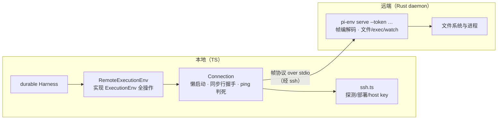

# pi-env（远端执行环境）

`packages/env`（包名 `@earendil-works/pi-env`）是 [durable](durable.md) 的**远端执行环境实现**：把 `ExecutionEnv`（文件系统 + Shell 抽象）搬到另一台机器上（通常经 SSH），而 durable worker、它的存储与凭证全部留在本地。由两半组成：**TypeScript 客户端**（约 2000 行）与部署到远端的 **Rust daemon `pi-env`**（约 4000 行）。

仓库内**没有消费者**——它是独立产品（durable 侧只依赖契约，作为对等实现的另一半见 [durable](durable.md) 的 `ExecutionEnv`）。

[返回索引](../index.md) · 术语见 [glossary](../glossary.md) · 所属任务：T13（见 [roadmap](../../roadmap/tasks.md)）

## 一、定位

一句话职责：**让 durable 的「本机文件与进程」变成「远端文件与进程」，而语义与本地 `NodeExecutionEnv` 逐条对齐**——客户端应用 Node 的路径/错误/结果规则，daemon 做系统调用，两者之间是一条自定义帧协议。



三层职责划分（`docs/semantics.md:8-19` 的分工表）：**路径解析、abort 检查点、错误码映射、读取尺寸、512KiB 写分块在客户端**；watch、系统调用、进程、spill、行扫描、UTF-8 解码（encoding_rs）在 daemon。

## 二、目录结构与模块地图

| 路径 | 职责 |
|------|------|
| `src/index.ts` | 出口：`Connection`/`RemoteError`/`isConnectionLost`/`RemoteInfo`、`RemoteExecutionEnv`、SSH 工具（`scanHostKey`/`acceptHostKey`/`forgetHostKey`/`deployDaemon`/`detectPlatform`/`packagedDaemon`/`connectSsh`/`sshConnection`）、`RemoteWatcher` |
| `src/connection.ts`（384 行） | `Connection`（`:168`）：懒启动、断线重启、**同步行握手**（`:327-342`）、帧编解码（`:322-384`）、ping/判死（`:288-294`）、`lost` 错误语义（`:108-115`） |
| `src/remote-env.ts`（939 行） | `RemoteExecutionEnv`（`:351`）：`ExecutionEnv` 全操作——路径解析（`:371-399`，Node 规则）、分块读（`readRange`，`:96-128`）、分块写（`:587-626`）、行读/目录读/二进制读句柄、`exec`（`:834-930`）、错误映射 |
| `src/ssh.ts`（530 行） | SSH 集成：`sshArguments` 硬化（`:77-120`）、host key 三件套（`scanHostKey` `:182`/`acceptHostKey` `:258`/`forgetHostKey` `:282`）、平台探测（`detectPlatform` `:329`）、**daemon 部署**（`deployDaemon` `:396-452`）、连接工厂（`sshConnection` `:510`/`connectSsh` `:523`） |
| `src/watch.ts`（158 行） | `RemoteWatcher`（`:23`）：daemon 内 watcher 的代理；断线重连后报 `overflow`（`:19-22` 注释） |
| `src/errors.ts`（34 行） | `toFileError`（`:9`）：daemon 错误码 → durable `FileError` 码的映射表（ENOENT→not_found 等，`:16-32`） |
| `daemon/src/main.rs`（516 行） | serve 主循环：**先写同步行**（`:441`）、每 5s PING（`:464-474`）、**静默 30s → kill_all + exit（`:469-472`，常量 `:34`）**、stdin EOF 必杀全部进程组（`:485`） |
| `daemon/src/frame.rs`（120 行） | 帧编解码（`read_frame` `:50-82`：length 9..=16MiB、jsonLength 越界断连、坏 JSON→回 EINVAL；`write_frame` `:84-99`，13 字节头） |
| `daemon/src/exec.rs`（483 行） | 进程执行：setsid 进程组（`sys/unix.rs:270-279`，kill `-pid`）、超时 + **退出后 100ms 宽限**（`:21`，`:375-378`）、输出 spill（`:130-188`，`tmp-` 目录下 `pi-output-<uuid>.log`）、结算优先级 timeout→aborted→spill 失败→status（`:456-477`） |
| `daemon/src/watch.rs`（778 行） | 原生监听（notify，仅触发 **50ms debounce 重扫**，`:21`）+ 轮询回退（`switch_to_polling` `:576-584`，发 `overflow` 事件）；覆盖建立发 `ready`（`:736`）；diff 出 change（`:416-429`/`:657-675`） |
| `daemon/src/window.rs`（269） | 输出合并与限速窗口：`skipped{bytes,newlines}`（`:167-203`） |
| `daemon/src/sys/`（unix 323 / windows 665） | 平台差异：unix 的 O_NONBLOCK\|O_NOFOLLOW 打开（`:110-126`）；Windows 的 **Job Object KILL_ON_JOB_CLOSE**（`:519-551`）、taskkill /T /F（`:554-563`）、参数引用与环境排序（`:419-499`）、`PATHEXT` 查找（拒绝 .bat，`:286-331`） |
| `daemon/src/` 其余 | `fs.rs`/`output.rs`/`scan.rs`/`decode.rs`/`errors.rs` |
| `docs/protocol.md` | **线协议 v1 规范**：Sync（`:6-10`）、Frames（`:12-43`）、Cancellation（`:45-50`）、Scheduling（`:52-58`）、Liveness（`:60-65`）、Operations（`:67-114`） |
| `docs/semantics.md` | 与 `NodeExecutionEnv` 的**等价性规范**（分工表 `:8-19`、必须一致 `:22-39`、命令语义 `:43-57`、watching `:61-65`） |
| `.github/workflows/env-daemons.yml` / `env.yml` | 8 平台构建矩阵（musl/android/darwin/msvc × x64/arm64，`:24-31`）；对等性测试（见「现状与陷阱」） |

## 三、核心数据结构

### 帧格式（`protocol.md:16-23`，客户端实现在 `connection.ts:97-105`）

```
u32 length（其后字节数，全大端）
u8  type
u32 id（无请求为 0）
u32 jsonLength
json（UTF-8）
payload（length - 9 - jsonLength 字节）
```

- 类型 1-6：`request / result / error / event / cancel / ping`（`connection.ts:5-10`）。
- 上限 **16MiB**（超限由**客户端负责切分**）；JSON 不可解析回 EINVAL；帧结构错直接断连（`protocol.md:25-26`）。

### `RemoteInfo`（`connection.ts:37-51`）

`hello` 返回远端机器信息：`protocol`/`version`/`os`/`arch`/`home`/`tmpdir`/`separator`/`cwd`/**`driveCwds`**（Windows 的 `=C:` 每盘工作目录）/`pid`。它是客户端路径解析与平台选择的依据。

### 错误模型

- `RemoteError`（`:22`）：daemon 结构化错误（`code`/`path`/任意 `fields`）；
- **`lost` 语义**（`:107-115`）：连接丢失/超时/重启期间的失败标 `fields.lost = true`——注释明说 **对变更类操作，结果未知**；`isConnectionLost()` 供调用方区分；
- 句柄的**会话绑定**：`Handle`（`remote-env.ts:131`）记录 daemon session id，请求带 `session` 校验（`connection.ts:190-197`）——断线重启后旧句柄的请求**直接失败**，不会打到没开过这个 handle 的新 daemon。

### 契约对照

`RemoteExecutionEnv` 实现的是 durable 的 `ExecutionEnv = FileSystem & Shell`（[durable](durable.md) 第五节）；watch 选项对齐 durable 的 `NodeWatchOptions`（`watch.ts:7-14`：`mode`/`pollIntervalMs` 默认 2000ms/`maxDirectories` 默认 10000）。

## 四、关键运行流程

### 1. 连接生命周期（懒启动）

`sshConnection()`（`ssh.ts:510`）返回的 `Connection` **不做任何事直到第一个请求**（`connection.ts:214-225` 的 `#connect`）：

1. 首次启动的 `command` 函数（`ssh.ts:483-499`）执行：**探测平台**（`detectPlatform`，只做一次）→ **验证/部署 daemon** → 组装 `ssh … <launchCommand>`。
2. `spawn` 后等 **同步行**：daemon 第一件事是写 `PI-ENV <token>\n`（daemon `main.rs:441`）；客户端**丢弃它之前的一切输出**（登录 shell 的 banner 会混进来——先记日志，见 `connection.ts:327-342`）。token 由客户端生成（`randomBytes(16)`）随 `serve --token` 传入；daemon 只回显，**校验发生在客户端逐字节比对同步行**。
3. 60s 启动超时（`START_TIMEOUT_MS`，`:17`）；启动失败**不记忆**——下一个请求重新探测/部署/启动。
4. **保活**：客户端每 5s 发 PING（`:288`）；30s 无任何字节 → 判定 `lost` 并 teardown（`:290-292`）。daemon 侧对称：自己每 5s ping，静默超 30s 或 stdin EOF → **杀掉它启动的一切进程组并退出**（`main.rs:464-485`）。
5. **断线语义**（`#teardown`，`:307-320`）：在飞请求全部 reject（`lost`）、子进程收尾；`close()` 主动关则用普通错误。daemon 被关闭时会自己清理进程组——「Stop the daemon; it kills everything it started.」（`:202`）。

### 2. 平台探测与 daemon 部署（`ssh.ts`）

- **探测**（`detectPlatform`，`:329-353`）：POSIX 探针（`uname -s/-m/-o` + `$HOME/$TMPDIR/$LD_PRELOAD`，`:289`）失败则走 PowerShell 探针（`:295`，`EncodedCommand` base64 UTF-16）；Git Bash 检测到 MINGW/MSYS/CYGWIN 时改用 PowerShell 复核；Android 识别为 `linux` 之外的 `android` 平台并给 Termux 警告（缺 `TMPDIR`、缺 `termux-exec`、建议 `termux-wake-lock`，`:317-326`）。不支持的架构/系统直接抛错。
- **部署**（`deployDaemon`，`:396-452`）：
  - 二进制路径按 **SHA-256 命名**：`~/.pi/mobile/tools/pi-env-<sha 前 32 位>`（Windows 加 `.exe`）（`:370-375`）——不同版本永不冲突。
  - 先查远端是否已有同内容（POSIX 用 sha256sum/shasum/openssl 三选一，`:377-389`；无哈希工具直接拒绝，`:407`）；已存在即复用。
  - 上传到临时文件 → **校验哈希通过后才 rename 就位**（POSIX `:441-445`；Windows 走 base64 分块 + `PI-ENV-END` 结束标记，因为 Windows sshd 可能不传 stdin 结束，`:415-431`）；随后清理旧版本文件（运行中的旧 daemon 文件句柄仍在，等它退出）。
- **启动命令**（`launchCommand`，`:466-475`）：POSIX 默认直接 exec 二进制；`loginShell: true` 时经 `"$SHELL" -lc` 让命令继承 `~/.profile` 环境；Windows 按探测到的 shell 用 `& '…'`（PowerShell）或加引号（cmd）。

### 3. SSH 硬化（`sshArguments`，`:77-120`）

每一次 ssh 调用都带全套防护：`-T`（无 TTY）、`-a`/`-x`（不转发 agent/X11）、`BatchMode=yes`（永不提示）、`ClearAllForwardings`、`ControlMaster=no`+`ControlPath=none`（不共享连接）、`RemoteCommand=none`+`PermitLocalCommand=no`（配置不可注入命令）、`SendEnv=-*`（不转发 locale 等）、`ServerAliveInterval=15`、`StrictHostKeyChecking=yes`（探测用 `accept-new`）、**`UserKnownHostsFile` 指向应用自己的文件** + `GlobalKnownHostsFile=none` + `HashKnownHosts=no`、**`HostKeyAlias` 固定别名**（不受别名/端口/跳板机影响）、`IdentitiesOnly=yes`。字段与路径都有注入检查（`:60-70`）。

**host key 流程**（明确的三步、从不自动信任变化）：

1. `scanHostKey`（`:182-207`）：临时 known-hosts 文件上 `accept-new` 连一次捕获对端 key（认证失败也记录 key），`ssh-keygen -lf` 给出指纹——注释强调**展示指纹不是认证**，要离线核对后再接受。
2. `acceptHostKey`（`:258-279`）：只接受该 alias 的普通 key 行；**同类型 key 已存在且不同 → `HostKeyChangedError`，必须先 forget**；写文件是「串行 + 临时文件 + rename」的原子操作（`:228-251`）。
3. `forgetHostKey`（`:282`）：按 alias 删除（更换 key 时的显式动作）。

ssh 输出还会被识别为 `HostKeyChangedError`/`HostKeyUnknownError`（`:161-168`）。

### 4. 文件操作映射（`remote-env.ts`）

- **路径规则在客户端**（`:371-399`）：按远端 OS 选 `posix`/`win32`；`~` 与 `file://` 展开；Windows 跨盘相对路径按远端 `=D:` 工作目录解析（`RemoteInfo.driveCwds`）。
- **分块流水线**：读 `READ_CHUNK=256KiB × 8` 并发（`:36-37`，`readRange` 短读续读语义，`:96-128`）；写 `WRITE_CHUNK=512KiB × 8`（`:39-40`），首次 `write` 请求创建父目录+打开+写首块，后续 `writeChunk` 到同一句柄；**中止检查逐块进行**（`writeFile` 每块前检查、`appendFile` 只在整段后检查——与 Node 行为一致，`:583-586`）。
- **大小规则**（`:41-44`）：已知尺寸按 512KiB、未知尺寸（FIFO/设备）按 64KiB 顺序读、`readFile` 上限 2GiB-1。
- **错误码映射**（`errors.ts:9-33`）：`ENOENT→not_found`、`EACCES/EPERM→permission_denied`、`ENOTDIR→not_directory`、`EISDIR→is_directory`、`EINVAL/SYMLINK/NOT_REGULAR→invalid`——逐条对齐 `NodeExecutionEnv`。
- **abort 检查点位置**是规范的一部分（`semantics.md:8-19` 分工表 + `#fileOp` 的 `"before"|"both"`，`:401-425`）：变更类操作在前后都查。

### 5. `exec` 链路（`:834-930` + daemon）

1. 超时校验（上限 `MAX_TIMEOUT_MS`，`:841-849`）→ cwd 解析 → env 组装（`inheritEnv` 合并 `shellEnv`，`:850-863`）。
2. 请求带 `signal`（abort → 发 `cancel` 帧；**请求仍以 daemon 的结果/错误结算**，`:231`）、`onStart`（记住 requestId 供 `cleanup()` 杀进程）、`onEvent`（输出流）。
3. daemon 侧（`exec.rs`）：**独立进程组**（setsid，POSIX）或 **Job Object**（Windows，`KILL_ON_JOB_CLOSE` 收拢整棵进程树）；超时后仍给 100ms 宽限收尾；输出超限 spill 落盘并回 `spillPath`；结算优先级 `timeout → aborted → spill 失败 → status`（`:456-477`），信号退出映射 `128+n`（`semantics.md:43-57`）。
4. **输出调度**（`protocol.md:52-58`）：`result/error/ping/watch 事件先于排队的命令输出`；无 window 时未发送输出超过 4MiB 会压住读取（背压）；有 window 时 `window.rs` 按字节/秒限速合并，产出 `skipped` 信息（`:167-203`）。
5. `cleanup()`（`:932-936`）：对全部在跑的命令发 **`mode:"kill"` 的 cancel（不置 aborted）**——与 `NodeExecutionEnv` 行为一致（注释 `:933`）。

### 6. watch（`watch.ts` + daemon `watch.rs`）

- 客户端 `RemoteWatcher`（`:23`）代理 daemon 内 watcher；**断线后重开并报 `overflow`**（`:19-22` 注释——断线期间的变更不可见）。
- daemon 侧：原生监听（notify）只做 **50ms debounce 触发重扫**，变更靠「目录快照 diff + 事件路径」得出（`semantics.md:61-65`）；覆盖建立发 `ready`；Windows 与不可靠文件系统直接轮询（`watch.rs:709-714`）；watch 耗尽/失败切轮询并报 `{kind:"change", overflow:true, mode:"polling"}`（`:576-584`）；macOS 有 500ms settle。

## 五、对外接口与扩展点

- **直接使用**：`connectSsh(options)`（探测+部署+返回连接，失败即 reject）或 `sshConnection(options)`（全懒）；再 `new RemoteExecutionEnv({ connection, id, cwd, shellPath?, shellEnv?, watch? })`。不依赖 durable 的宿主可用同样的 `Connection` 协议。
- **协议级**：`Connection.request(op, json, {payload, signal, onEvent, onStart, session})` → `{json, payload, session}`；`kill(id, session)` 杀单个 exec。
- **host key UI**：`scanHostKey` → 展示指纹 → `acceptHostKey`/`forgetHostKey`——这是宿主应用的安全交互落点。
- **扩展 daemon**：新增 op 是**四处联动**（`docs/protocol.md` 的 Operations 章 → daemon 分发与实现 → 客户端 `Connection`/`RemoteExecutionEnv`）——见「二次开发落点」。
- **打包/发布**：daemon 二进制作为**数据文件**随包分发（`package.json` 的 `files` 含 `bin`，无 `bin` 字段；`src/index.ts`/`ssh.ts` 按 `bin/pi-env-<platform>-<arch>/pi-env[.exe]` 定位，`packagedDaemon` `:356-359`）。checkout 里**没有** `bin/`——那是 CI 产物（`env-daemons.yml` 8 平台矩阵构建）。

## 六、现状与陷阱

1. **独立产品、仓内无消费者**：durable 侧只有契约（`packages/durable/src/env/index.ts`）；env 仅依赖 chord + durable 的类型。使用它的「宿主」需要自己组装（参考 `connectSsh` + `RemoteExecutionEnv`）。
2. **`lost` 对变更类操作是「结果未知」**：断线时在飞的写/exec 无法知道对端做到哪一步（`connection.ts:165-167` 注释）。调用方不能把 `lost` 当失败重试的充分依据——这正是 durable `replay` 策略存在的理由（见 [durable](durable.md) 流程 4）。
3. **token 校验是客户端行为**：daemon 只回显 token，客户端比对同步行前缀；同步行之前的输出一律丢弃且可记日志——所以在 ssh 链路上任何「回声注入」都会导致握手失败而不是误连。
4. **16MiB 帧是客户端责任**：协议定死上限，超限载荷由客户端切分（大文件读写天然走 256/512KiB 分块）；自己写客户端时别发大帧。
5. **host key 从不自动接受变化**：`HostKeyChangedError` 必须显式 `forgetHostKey` 后重扫——这是设计红线，别在宿主里加自动接受。
6. **`loginShell` 默认关**：默认不加载 `~/.profile`（与 `ssh` 直接执行一致）；依赖登录环境的命令要显式打开（代价是每次启动多一层 shell）。
7. **daemon 退出即清场**：stdin EOF、静默 30s、`close()` 都会触发 kill_all——远端不会有孤儿进程组；反过来，daemon 一死，所有 handle 与 watcher 全部失效（会话绑定语义）。
8. **watch 的 `overflow` 不是错误**：它表示「有变更没看到，自己重扫」；Windows/网络盘上 watch 永远是轮询模式。
9. **对等性用差分测试保障**：`env.yml` 在 5 个 OS 上跑 cargo fmt/clippy/test + durable 的 env 套件 + Windows OpenSSH 用例；`test/differential.test.ts` 让 `NodeExecutionEnv` 与 `RemoteExecutionEnv` 在各自临时根上执行 **60 种子 × 25 个随机操作**，normalize 掉根路径/mtime 差异后逐条 `toEqual`（失败只比 `error.code`）——改任何一侧的语义前先跑它。
10. **二进制不在 checkout 里**：本地开发要跑 E2E 需要 `PI_ENV_DAEMON` 指向发行二进制（`env.yml:119-126` 的做法）；单纯 `npm pack --dry-run` 只断言 `bin/pi-env-*/pi-env` 出现在包清单里（`:59-72`）。

## 七、二次开发落点

| 需求 | 落点 |
|------|------|
| 接远端环境（宿主侧） | `connectSsh`/`sshConnection` + `new RemoteExecutionEnv`；host key UI 用 scan/accept/forget |
| **新增一个 op**（端到端四处联动） | ① `docs/protocol.md` Operations 加规范；② daemon `main.rs` 分发 + 实现模块（fs/exec/watch）；③ 客户端 `Connection.request(op, …)` 调用；④ `RemoteExecutionEnv` 对应方法 + `semantics.md` 分工表更新；最后接对等性测试 |
| 支持新平台/新架构 | `env-daemons.yml` 构建矩阵加 target；`normalizeArch`（`ssh.ts:299-304`）与 `detectPlatform` 分支；`packagedDaemon` 命名约定不变 |
| 改 watch 行为 | daemon `watch.rs`（debounce/轮询/overflow）+ 客户端 `RemoteWatchOptions`（保持与 durable `NodeWatchOptions` 对齐） |
| 改输出调度/背压 | daemon `window.rs` + `protocol.md:52-58` 的调度规则；客户端只消费 `skipped` 元数据 |
| 换传输（非 SSH） | 实现一个新的 `ConnectionOptions.command`（或直接构造带自定义 IO 的 Connection）；协议与 daemon 不变 |

## 八、相关文档

- [packages/env/README.md](../../packages/env/README.md)（简短）· [docs/protocol.md](../../packages/env/docs/protocol.md)（线协议 v1 全文）· [docs/semantics.md](../../packages/env/docs/semantics.md)（等价性规范）
- 本套文档：[durable](durable.md)（`ExecutionEnv` 契约与使用方）、[chord](chord.md)（Context 依赖）、[architecture](../architecture.md)（实验轨定位）、[glossary](../glossary.md)（帧协议/ExecutionEnv 条目）

---

[返回索引](../index.md) · 任务与进度：[roadmap](../../roadmap/README.md)
