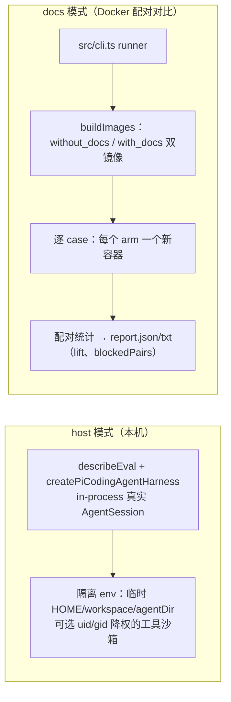

# pi-evals（评测工具）

`packages/evals`（包名 `@earendil-works/pi-evals`，**private、不发布**）是 pi 的**行为评测包**：用真实模型跑 coding-agent，量化它的表现。两种模式：**host evals**（本机 in-process）与 **docs evals**（Docker 双镜像对比，量化「文档带来的能力提升」）。它不进入任何运行时，是开发期基建。

[返回索引](../index.md) · 术语见 [glossary](../glossary.md) · 所属任务：T16（见 [roadmap](../../roadmap/tasks.md)）

## 一、定位

一句话职责：**回答「改了这个，agent 是变好了还是变坏了」**——host 模式跑单点行为断言；docs 模式做配对对照实验（同一批 case，给文档/不给文档各跑一遍，算 pass-rate lift）。



| 维度 | host evals | docs evals |
|------|-----------|-----------|
| 运行位置 | 本机 vitest（`pool: "forks"`, `maxWorkers: 1`） | 容器（每 arm 新容器） |
| 文件 | `evals/**/*.eval.ts`（排除 `.docs.`） | `evals/**/*.docs.eval.ts` |
| 隔离 | 临时 HOME/workspace/agentDir + 环境变量过滤 | Docker `--read-only` + tmpfs + 非特权 uid（65532） |
| 产物 | vitest-evals reporter + session JSONL 快照 | 每任务 `vitest.json` + 全局 `report.json/txt`、`protocol.json`、`observations.jsonl` |
| 用途 | 单点行为断言（冒烟、audit） | 配对对照实验（lift、flaky 检测） |

入口：根 `package.json` 的 `npm run eval --workspace=@earendil-works/pi-evals -- …`；需要 `PI_PROVIDER`/`PI_MODEL`（或 `--provider/--model`）与 `~/.pi/agent/auth.json` 里对应 provider 的凭据。

## 二、目录结构与模块地图

| 路径 | 职责 |
|------|------|
| `src/harness.ts`（537 行） | **两个 harness 工厂**与全部隔离逻辑：`createPiCodingAgentHarness`（`:471`）、`createPiDocumentationEvalHarness`（`:517`）、隔离环境（`:82`）、工具沙箱降权（`:154`）、真实会话运行（`:272`）、系统提示校验（`:257`） |
| `src/cli.ts`（192 行） | docs 对比 runner（可执行脚本）：参数解析（`:27`）、双镜像构建、双变体 case 发现与一致性校验、任务规划、逐任务容器执行、报告生成（`blockedPairs` 非空 → 退出码 1，`:192`） |
| `src/plan.ts`（59 行） | 变体常量（`:1`）、case 身份解析（`"<eval set> > <case>"` 约定，`:21`）、任务规划（**奇偶轮交替变体顺序**，`:53-54`） |
| `src/docker.ts`（175 行） | 镜像构建（`buildImages`，`:38`，tag 带仓库路径哈希前缀）、凭据文件校验（`:67`）、`docker run` 参数（`:91`：`--read-only`、tmpfs、沙箱 uid/gid=65532、auth.json 只读挂载）、发现与执行（`:137`/`:161`） |
| `src/report.ts`（483 行） | 观察记录与配对统计：`EvalObservation`、`summarizeEvalObservations`（`:359`）、lift/flags（`:36-58`：`no-lift`/`negative-delta`/`control-saturated`/`treatment-saturated`/**`flaky`**）、文本报告（`:436`） |
| `docker/entrypoint.ts`（152 行） | 容器内准备与断言（见流程 3）、把 vitest 的 `list`/`run` 转成发现/执行两种模式（`:132-143`） |
| `docker/install-runtime.mjs`（70）/`Dockerfile` | 镜像内安装 pi 运行时（消费方安装机制打包本地 tarball） |
| `evals/` | 评测套件：`smoke.eval.ts`（host，最小示例 `:5-18`）、`documentation-audit.eval.ts`（host）、`tui/custom-provider/openai-provider/extensions/models` 五个 `.docs.eval.ts`、`acme-server.ts`/`configured-runtime.ts`（fixture） |
| `vitest.evals.config.ts` | 两个 project：`docs` 与 `host`（`:11-33`），单文件串行、300s 超时；**容器内解析 `dist`、本机别名到 workspace 源码**（`:37-46`） |

## 三、核心数据结构

- **`PiCodingAgentInput`**（`harness.ts:43`）：`string | Array<{type:"prompt";content} | {type:"reload"}>`——一个 case 可以写「先问、再 `/reload`、再问」的多步剧本（`reload` 步直接调 `session.reload()`，`:375`）。
- **`PiCodingAgentHarnessOptions`**（`:50-59`）：`model`（含从 `PI_PROVIDER`/`PI_MODEL` 兜底的 `resolveModelSelection`，`:70`）、`noTools`/`tools`/`customTools`、`workspaceFiles`（注入 case 工作区文件，带路径逃逸校验，`:225-236`）、`transformSystemPrompt`、`expectedPiDocumentation`、可选的 `output` 函数（自定义产物）。
- **`EvalTask`**（`plan.ts:11`）：`evalSet + caseId + variant + model + runNumber`——配对统计的最小单元。
- **报告**（`report.ts`）：`EvalSetComparison`（`:43`：两变体的 pass rate、`blockedPairs`、`lift: number | null`、`flags`，`:47-51`）；`BlockedPair`（`:58`：配对失败的原因列表——**无法配对的样本不计入 lift**）；`EvalComparisonReport`（`:75`）。
- **产物文件**（每轮一个 `.eval/` 目录，`cli.ts:128`）：`protocol.json`（含 `protocolDigest`——case 集合/模型/镜像/任务的指纹，`:153-167`）、`expected-runs.json`、`observations.jsonl`（增量写，`:180-183`）、`report.json`/`report.txt`；单次运行的 session JSONL 以 artifact `piSessionJsonl` 随结果带回（`harness.ts:426`，常量 `report.ts:9`）。

## 四、关键运行流程

### 1. host eval：一次隔离运行（`runPiCodingAgent`，`harness.ts:272`）

```
mkdtemp(pi-eval-*)            → root = { workspace, home }
applyIsolatedEnvironment      → HOME/USERPROFILE/PI_CODING_AGENT_DIR 指向临时目录，
                                并**删除**进程里所有 PI_EVAL_* 变量（:82-100）
凭据：从真实 ~/.pi/agent/auth.json 复制所选 provider 的凭据进内存 store（:312-315）
createAgentSessionServices / createAgentSessionFromServices（:337-355）
断言：本会话只加载了预期的 inline 扩展（:357-363）
enterToolSandbox（可选）      → 见流程 2
逐步执行 input（prompt / reload），用 promptAgent 取 assistant 文本（stopReason 只接受 stop|toolUse，:238-255）
系统提示校验 verifySystemPrompt（:413/257）
产物：transcript → events、systemPromptSha256、usage（tokens/工具数/成本，:396-412）
失败也带 partial run（attachHarnessRunToError，:456-464）
```

要点：

- **`transformSystemPrompt` 不另起炉灶**：它作为 `<inline:eval-system-prompt-transform>` 扩展挂在 `before_agent_start` 上强制替换提示（`:289-301`）——因此走的是**生产的提示替换路径**；被强制的提示不进 transcript，取用时用扩展侧回传的值（`:388-390` 注释）。
- **`promptAgent` 是严格断言器**（`:238-255`）：没有 assistant 消息、stop reason 异常、或 `stop` 却无文本 → 直接判失败。
- **降权沙箱**（`enterToolSandbox`，`:154-188`）：仅当设置了 `PI_EVAL_SANDBOX_UID`/`GID`（docs 模式必设）；要求 runner 以 **root 启动**，`chown` 整棵临时树、清空附加组、`setgid/setuid` 降权，并**先探测被降权进程能否读到 vitest 转换缓存里的评测源码**（读得到就报错，`:130-152`/`:177-187`）——防止"被测 agent 能读到考卷"。

### 2. 隔离环境的三重防漏

1. 文件系统：临时 `HOME`/`workspace`/`agentDir`，跑完整树 `rm -rf`（`:438`）；
2. 环境变量：`PI_EVAL_*` 全删（防套娃），凭据在沙箱模式下**从进程环境里摘掉**并在 finally 里恢复（`:328-335`/`:443-445`）；
3. 扩展面：断言只加载了预期 inline 扩展（用户目录里的真实扩展不会混进来）。

### 3. docs 对比：runner 六步（`src/cli.ts`）

1. **建双镜像**（`buildImages`，`docker.ts:38`）：同一 Dockerfile 的 `without_docs`/`with_docs` 两个 target，镜像 tag 带**仓库路径哈希**（多 checkout 不撞车）；两次 `image inspect` 必须得到不同 id（`cli.ts:132-133`）。
2. **双变体发现并要求 cohort 一致**：两个镜像分别用 `vitest list --json` 发现 case（`docker.ts:137`），`compareDiscovery`（`cli.ts:106-112`）比对「fullName + 文件」集合——**任何一边多/少 case 直接失败**（防止变体差异污染实验）。
3. **任务规划**（`createTaskPlan`，`plan.ts:39`）：每 case × 每个 run 数 × 两变体；**奇数轮先 without、偶数轮先 with**（`:53-54`）——抵消时间/顺序偏差。
4. **写协议指纹**：`protocol.json` + `protocolDigest`（sha256）——报告据此标识实验（`cli.ts:153-167`）。
5. **逐任务执行**（`runTask`，`docker.ts:161`）：**每个 arm 一个新容器**；用 `--testNamePattern` 精确锁定单个 case（`:163-164`）；容器失败也继续（观察记为 errored）。
6. **配对与报告**（`summarizeEvalObservations`，`report.ts:359`）：按 `(evalSet, caseId, model, runNumber)` 配对两变体 → 算 pass rate 与 **lift = treatment − control**（百分点），打 flags（含 `flaky`）；无法配对的进 `blockedPairs`（不计入 lift 但列出原因）；**存在 blocked pair → 退出码 1**（`cli.ts:192`）。

### 4. 容器内的准备与防作弊（`docker/entrypoint.ts`）

- 工作区断言（`assertWorkspace`，`:27`）：镜像内目录清单**精确匹配**；`without_docs` 镜像里 coding-agent 的 `README/CHANGELOG/docs/examples` **必须不存在**（`:48-52`），`with_docs` 必须存在且非空（`:55-62`）。
- **内部依赖的文档不可见**（`:35-47`）：除 coding-agent 外，所有 `node_modules/@earendil-works/*` 包不得带 `docs/examples/src/test/readme/changelog`——防「文档效应」被依赖包的文档稀释。
- 评测源码 root-only + 沙箱不可读（`assertRootOnly`/`assertSandboxCannotRead`，`:73-101`）：评测器与被测 agent 分权（沙箱 uid 65532）。
- 解析断言（`:102-105`）：容器内必须解析到 `dist/index.js`（防止 alias 回源码）。
- 凭据：只读挂载 `/run/pi-eval-secrets/auth.json` → 复制进临时 agentDir 并 `chown` 给沙箱用户（`:107-112`）。
- 运行：`--discover` 时 `vitest list` 输出 `discovered-tests.json`，否则 `vitest run` + vitest-evals reporter + json 输出到 `/artifacts`（`:132-143`）。

### 5. 变体机制（docs 模式的实验设计）

- `PI_EVAL_VARIANT` 二选一（`harness.ts:487`）；`without_docs` 变体用 `excludePiDocumentation`（`:494-506`）**从系统提示里精确切掉 `<docs>` 段**（找不到起止标记直接抛错）；`with_docs` 断言提示里有文档段（`verifySystemPrompt`，`:265-268`）。
- docs eval 工具面固定为 `DOCUMENTATION_EVAL_TOOLS = [read, write, edit, grep, find, ls]`（`:485`）——**排除 bash 与不受限网络**，让实验只测「读文档做事」。
- 门禁：`createPiDocumentationEvalHarness` 在非容器（`PI_EVAL_CONTAINER !== "1"`）或缺沙箱身份时**直接抛错**（`:526-528`）——docs eval 不允许在本机裸跑。

## 五、对外接口与扩展点

- **写一个 host eval**：`describeEval("套件名 > case 名", { harness: createPiCodingAgentHarness({...}) }, it => …)`——case 名必须用 `"<eval set> > <case>"` 格式（`plan.ts:28-31`）；最小示例见 `evals/smoke.eval.ts`；需要模型回答之外的结构化产物时用带 `output` 的版本（`:61-68`）。
- **写一个 docs eval**：同一个 harness 工厂换成 `createPiDocumentationEvalHarness`，文件命名 `*.docs.eval.ts`（runner 只认这个后缀，`cli.ts:125`）。
- **运行**：host 直接 `vitest --project host`（或 `npm run eval`）；docs 走 `src/cli.ts`（`node --experimental-strip-types src/cli.ts …`，支持 `--runs-per-variant` 与 `-t` 过滤透传）。
- **结果消费**：`report.txt` 人读；`report.json` 机读（含 flags）；`observations.jsonl` 可流式；每个 case 的 session JSONL 快照可回放分析。

## 六、现状与陷阱

1. **private 包，不进运行时**：`@earendil-works/pi-evals` 不发布；它消费 pi-coding-agent（容器内用 dist，本机用 workspace 源码别名，`vitest.evals.config.ts:37-46`）。
2. **需要真实模型与凭据**：`auth.json` 缺所选 provider 的条目会在建容器前失败（`docker.ts:67-89`）；`smoke.eval.ts` 断言 `usage.totalTokens > 0` 就是防"假跑"。
3. **成本与时长**：每 case 是完整 agent 会话（300s 超时/单文件串行）；docs 模式 `runs-per-variant` 翻倍成本——算 lift 的样本量不够时会出 `flaky`/饱和 flags，看 flag 再决定加重。
4. **blocked pair 是硬失败**：runner 以退出码 1 结束（`cli.ts:192`）——修掉原因（通常是容器失败或名称不匹配）再比较 lift，不要忽略。
5. **双镜像 cohort 不一致即失败**（`compareDiscovery`）：新增/改名 case 后两个变体必须同步生效——这也意味着**改 case 名是一次协议变更**（`protocolDigest` 随之变化）。
6. **防作弊断言会拦住"便捷写法"**：往 `without_docs` 镜像塞回文档、依赖包带 readme、alias 回源码，都会被 entrypoint 的精确清单/不可读断言拒绝——这是实验有效性的边界，不要绕过。
7. **降权沙箱要求 runner 以 root 启动**（容器内天然满足；本机裸设 `PI_EVAL_SANDBOX_UID` 会因非 root 报错，`harness.ts:165-167`）。
8. **`transformSystemPrompt` 走 `before_agent_start`**：它替换的是"提交给 provider 的提示"，与真实扩展路径一致；断言用的 `systemPromptSha256` 记录的是这个值（`:398`）——比较两次运行的提示差异时用它。

## 七、二次开发落点

| 需求 | 落点 |
|------|------|
| 加一个 host 行为评测 | `evals/` 下新建 `*.eval.ts`，`describeEval` + `createPiCodingAgentHarness`；参考 `smoke.eval.ts` / `documentation-audit.eval.ts` |
| 加一个「文档效果」评测 | 新建 `*.docs.eval.ts` + `createPiDocumentationEvalHarness`；跑 `src/cli.ts` 出配对报告 |
| 自定义 case 的初始工作区/工具面/模型 | harness options：`workspaceFiles`/`tools`/`noTools`/`customTools`/`model`；多步剧本用数组 input（含 `reload`） |
| 改隔离强度 | `applyIsolatedEnvironment`/`enterToolSandbox`（`harness.ts`）+ `dockerArgs`（`docker.ts:91`）+ entrypoint 断言 |
| 改统计口径（lift/flags/blocked） | `report.ts` 的 `summarizeEvalObservations`/`EvalSetComparison`；输出格式在 `formatEvalComparisonReport` |
| 改镜像组装 | `docker/Dockerfile` + `docker/install-runtime.mjs` + entrypoint 的清单断言（三者要同步改） |

## 八、相关文档

- [packages/evals/README.md](../../packages/evals/README.md)——文件约定、运行方式、变体与结果格式（六步流程的原始出处）
- 本套文档：[coding-agent 核心运行时](coding-agent-runtime.md)（host eval 驱动的 `AgentSession`/`createAgentSession*`）、[coding-agent 扩展与 SDK](coding-agent-extensions.md)（`before_agent_start` 与 inline 扩展——`transformSystemPrompt` 的实现路径）、[pi-ai](ai.md)（`InMemoryCredentialStore` 与 usage 结构）、[glossary](../glossary.md)（host eval/docs eval/lift 条目）

---

[返回索引](../index.md) · 任务与进度：[roadmap](../../roadmap/README.md)
