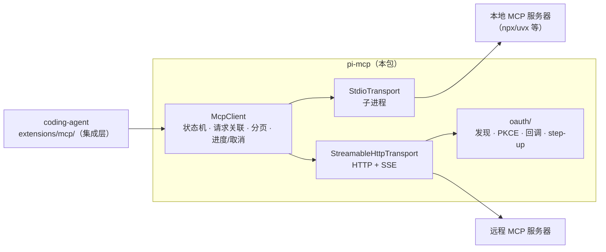
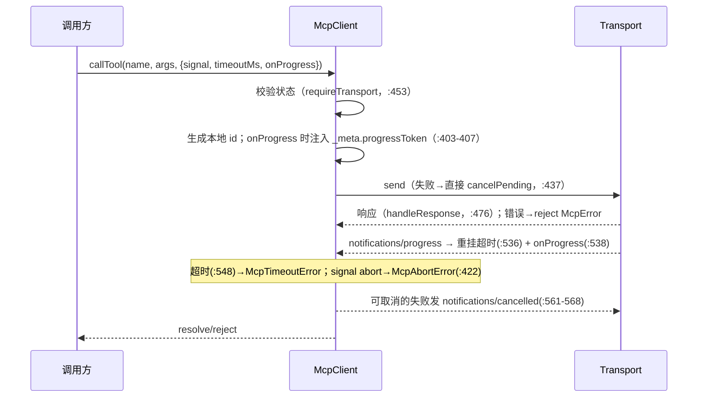

# pi-mcp（MCP 客户端）

`packages/mcp`（包名 `@earendil-works/pi-mcp`，18 个源文件、约 3200 行）是 pi 的 **Model Context Protocol 客户端**：独立实现（不依赖官方 SDK）、轻量（唯一运行时依赖 `cross-spawn`），被 coding-agent 的生产路径直接使用（内置 `mcp` 扩展）。集成层用法见 [coding-agent 扩展与 SDK](coding-agent-extensions.md)；MCP 服务器的工具如何进入模型上下文还与 [codemode](codemode.md) 联动。

[返回索引](../index.md) · 术语见 [glossary](../glossary.md) · 所属任务：T09（见 [roadmap](../../roadmap/tasks.md)）

## 一、定位

一句话职责：**把「连接一个 MCP 服务器、列出并调用它的工具/资源、处理它的认证与断线」做成一个与 pi 解耦的库**——pi 包里没有任何 `@earendil-works/pi-*` 依赖，coding-agent 通过 `extensions/mcp/` 把它接进来。



方向说明：pi-mcp 是**客户端为主**，同时实现有限的 server→client 请求（只注册了 `ping` 与 `roots/list` 两个 handler，`client.ts:173-179`）。它**不实现 MCP 服务端**。

## 二、目录结构与模块地图

| 路径 | 职责 |
|------|------|
| `src/client.ts`（615 行） | `McpClient`（`:153`）：状态机、initialize 握手与版本协商、请求关联/超时/进度/取消、分页列举、通知分发、关闭语义 |
| `src/protocol/jsonrpc.ts`（113 行） | JSON-RPC 2.0 消息类型与守卫（`isJsonRpc*`）、错误码表（`:37`）、错误类（`McpError`/`McpConnectionClosedError`/`McpTimeoutError`/`McpAbortError`，`:45-79`） |
| `src/protocol/types.ts`（131 行） | 协议版本常量与 MCP 类型（`Tool`/`Resource`/`ResourceTemplate`/capabilities/`InitializeResult` 等） |
| `src/protocol/content.ts`（117 行） | 内容块模型（text/image/audio/resource_link/embedded resource，`:63`）与 **`toLlmContent`**（`:111`，转成 pi-ai 的 text/image） |
| `src/transports/transport.ts`（55 行） | `McpTransport` 接口（`:9`）与 `TransportEvents` 监听簿记（`:20`，close 至多一次）；16MiB 消息上限（`:3`） |
| `src/transports/stdio.ts`（216 行） | `StdioTransport`（`:69`）：子进程 + 进程组信号、关闭协议、stdout 行分帧、stderr 环形缓冲 |
| `src/transports/streamable-http.ts`（505 行） | `StreamableHttpTransport`（`:188`）+ SSE 解析器（`consumeSseStream`，`:35`）+ 401/404 错误类（`:126-152`）+ GET 流重连（backoff/`Last-Event-ID`） |
| `src/auth-provider.ts`（20 行） | `AuthProvider`/`McpFetch`/`UnauthorizedContext`：传输层对认证的最小契约 |
| `src/oauth/`（约 1350 行） | OAuth 2.1：`flow.ts`（`:320` 步骤链、PKCE、step-up）、`discovery.ts`（WWW-Authenticate → 资源/授权服务器元数据）、`provider.ts`（`McpOAuthProvider`，状态持久化）、`callback.ts`（127.0.0.1 回调服务器）、`types.ts`（手写结构校验）、`errors.ts`、`index.ts` |
| `src/testing/`（52 行） | `InMemoryTransport` 与 `createInMemoryTransportPair`：零依赖测试对端 |
| `src/index.ts`（71 行） | 公开面；子路径 `./oauth`、`./testing` |

## 三、核心数据结构

### McpClient（`client.ts:153`）

- 构造选项（`McpClientOptions`，`:47`）：`name`/`version`/`title`（clientInfo）、`capabilities`、`protocolVersion`、`requestTimeoutMs`（默认 30s，`:38`）、`roots`（静态数组或函数）。
- 状态：`idle → connecting → connected → closed`（`:41`）。连接后暴露 `serverInfo`/`serverCapabilities`/`instructions`/`protocolVersion`（`:186-200`）。
- 内部表：`pending`（请求 id → 待决项）、`progressRequests`（进度 token → 请求 id）、`incoming`（**服务端发来的**请求 id → AbortController，用于 `notifications/cancelled` 中止我们正在执行的 handler，`:501`/`:544`）。
- 每次请求的待决项（`PendingRequest`，`:60`）记录超时、信号、`cancellable`（**`initialize` 不可取消**，规范要求，`:422`/`:429`）、进度回调与进度 token。

### 传输契约（`transports/transport.ts:9`）

```ts
interface McpTransport {
  start(): Promise<void>;
  send(message: JsonRpcMessage): Promise<void>;
  close(): Promise<void>;
  onMessage/onError/onClose(listener): () => void;
  setProtocolVersion?(version: string): void;   // HTTP 传输用（写入 MCP-Protocol-Version 头）
}
```

分层原则：**协议逻辑全在 client，transport 只管 framing 与 IO**。`TransportEvents`（`:20`）统一监听簿记，`emitClose` 至多一次。

### 内容模型与 `toLlmContent`（`protocol/content.ts`）

MCP 工具结果的 `content` 是五类内容块（text/image/audio/resource_link/embedded resource，`:63`）；`toLlmContent`（`:111`）的转换规则：

- text/image 原样透传；embedded 的文本资源变 text、图片资源（`image/*`）变 image；
- audio、resource_link、二进制资源 → 短文本占位（`[audio ... omitted]` 等，`:78-101`）；
- **content 为空但有 `structuredContent` 时，序列化为 JSON 文本**（`:113-115`，注释：服务端「应该但并非总是」把结构化结果镜像为文本）。

### 集成层配置（coding-agent `extensions/mcp/config.ts`）

`McpServerConfig`（stdio：command/args/env；HTTP：url/headers；`auth` 字段）来自 `mcp.json` 或扩展 `registerMcpServer`；`updateMcpServerConfig`（`:183`）写回时**把默认值（`enabled: true`、exposure `codemode`）删键**并保留原缩进。暴露方式 `McpExposure` 默认 `"codemode"`（`core/mcp-servers.ts:241`），别名 `codemode-deferred → codemode`（`:57`）。

## 四、关键运行流程

### 1. 连接与握手（`connect`，`client.ts:202`）

1. 状态机校验（仅 `idle` 可连接，`:203`）→ 挂上 transport 的 message/error/close 监听（`:206-211`）→ `transport.start()`。
2. 组装 capabilities：`options.capabilities` + 有 roots 时补 `capabilities.roots = {}`（`:215-216`）。
3. 发 `initialize`（协议版本取 `options.protocolVersion ?? LATEST_PROTOCOL_VERSION`，`:221`；`allowConnecting=true` 允许在 connecting 态发这条）→ `validateInitializeResult` 结构校验（`:72-85`）。
4. **版本协商**：服务端可以回它自己的版本；不在 `SUPPORTED_PROTOCOL_VERSIONS` 内则报错（`:233-235`）。当前支持：`2025-11-25`（最新）、`2025-06-18`、`2025-03-26`、`2024-11-05`（`protocol/types.ts:4-9`）。
5. 记录服务端信息 → `transport.setProtocolVersion?.(...)`（HTTP 传输据此写请求头）→ 发 `notifications/initialized` → 状态置 `connected`（`:240-242`）。任一步失败都会 `close()` 清理后重抛（`:244-247`）。

### 2. 请求生命周期（`requestInternal`，`client.ts:394`）



细节：

- **超时是「无进展才超时」**：进度通知会把计时器重置（`armTimeout`，`:548-553`），长任务只要持续报进度就不会被掐；超时/中止时若 `cancellable`，会向服务端发 `notifications/cancelled`（`:556-570`）。
- **关闭语义**（`markClosed`，`:591`）：幂等——拒绝全部 in-flight（`rejectPending`，`:579`）、中止我们正在为服务端处理的请求（`:595`）、只发射一次 close 事件。
- **通知与反向请求**：`onNotification` 订阅任意方法；服务端发来的请求若有注册 handler 则执行并回响应，否则回 `methodNotFound`（`:487-517`）。内置 handler 仅 `ping` 与 `roots/list`。

### 3. 分页列举与防御性校验

`listTools`/`listResources`/`listResourceTemplates`（`:294-333`）都走 `listAll`（`:355`）：循环 `nextCursor` 直到结束，**上限 1000 页**（`:39`），**重复 cursor 直接抛错**（防服务端死循环，`:368-369`）。每页经 `validateListPage`（`:92-107`）逐项校验，容错现实：

- `nextCursor` 为 `null`/`""` 视同结束（注释：部分服务端如此收尾，`:103-104`）；
- resource 缺 `name` 时用 `uri` 顶上（`:110-122`）；
- `CallToolResult` 的 `content` 缺失时补空数组（注释：只返回 `structuredContent` 的服务端与官方 SDK 行为一致，`:142-151`）。

### 4. stdio 传输（`transports/stdio.ts`）

- **进程管理**：POSIX 上用 `detached: true` 建**独立进程组**（`:101`），关闭/退出时对 `-pid` 发信号整组带走——这样 `npx`/`uvx` 这类包装器不会留下孤儿进程（`:29-37` 注释）；Windows 上改用 `taskkill /T /F`（`:19-27` 注释解释了为什么不能只杀 cmd.exe shim）。另有 `process.once("exit")` 钩子在宿主意外退出时补杀所有仍存活的进程组（`:43-53`）。
- **关闭协议**（`:152-179`）：先 `stdin.end()` 让服务端自行退出（500ms 宽限）→ 未退则 SIGTERM → 再等 `closeTimeoutMs`（默认 2s）→ SIGKILL；无论哪条路径，结束后都对进程组补一次 SIGTERM（清理服务端的子进程，`:171`）。
- **stdout 分帧**：按 `\n` 切行、容忍 `\r`；单条消息超过 16MiB 报错并丢弃；进程关闭时若缓冲区还有半截消息，发一条明确错误（`:119-121`）而不是静默。
- **stderr**：保留末尾 64KB 环形缓冲（`:209-215`），供集成层把最近日志附进错误信息；可 `onStderr` 实时转发或直接 inherit。

### 5. Streamable HTTP 传输（`transports/streamable-http.ts`）

- **SSE 解析器**（`consumeSseStream`，`:35`）：标准 `data:`/`event:`/`id:`/`retry:` 字段；对「大量短 data 行、无终止空行」的恶意/异常流有**累计字节上限**（`:42-44`/`:94` 注释）；`id` 含 `\0` 时忽略（`:77`）。
- **请求路径**：POST 发送；响应体若是 SSE 则 `consumeResponseStream`（`:366`）边读边分发；**流中途断开且服务端给过事件 id** 时，用 GET + `Last-Event-ID` 恢复（`:363-390` 注释与实现），指数退避（1s → 30s，默认 5 次，`:16-18`）。
- **错误语义**（`checkResponse`，`:323-329`）：`401 → McpAuthRequiredError`（触发 OAuth 流程）、`404 且已有 session → McpSessionExpiredError`（集成层据此换新 client 重连）；`mcp-session-id` 响应头被捕获（`:318`）。
- **GET 流**（`startGetStream`/`runGetStream`，`:406-439`）：初始化后默认打开服务端→客户端长连接，断线按同样退避重连，用 `lastEventId` 续传。

### 6. OAuth 步骤链（`oauth/`）

`runFlow`（`flow.ts:320`）的完整链：

1. **发现**（`discovery.ts`）：解析 `WWW-Authenticate` 头（`:39`）→ 拉受保护资源元数据（`/.well-known/oauth-protected-resource`，带路径回退，`:70`）→ 拉授权服务器元数据（3 个候选 URL + issuer 校验，`:119`）→ `discoverOAuthServerInfo`（`:148`）。
2. **客户端登记**：优先已存客户端信息，其次 CIMD，最后动态注册（DCR）（`flow.ts:360-372`）。
3. **已有 refresh token** 时直接刷新（`:400`）；否则进入授权：**PKCE**（WebCrypto，强制 S256，`:163`/`:170`）→ 生成授权 URL → 用户浏览器授权。
4. **回调**（`callback.ts`）：本地 127.0.0.1 随机端口监听（`:64`），`waitForCallback` 一次性接收、state 校验、5 分钟超时（`:93`）；集成层还支持「粘贴回调 URL」与回调服务器**竞速**（coding-agent `oauth.ts:419-441`）。
5. **换取 token** → 持久化（`McpOAuthProvider` 的状态存储，写串行、按 serverUrl 隔离，`provider.ts:157`/`:165`；集成层落 `mcp-auth.json` 并带跨进程刷新锁）。
6. **step-up**：运行中遇到权限不足（`insufficient_scope`）可发起增量授权（`stepUpScope`，`:314`）；`authorizeMcp`（`:429`）对 `invalid_client`/`invalid_grant` 清凭据重试一次；`adaptOAuthProvider`（`:451`）把 pi-mcp 的 provider 适配进 MCP SDK 风格的流，并合并并发 401。

### 7. 在 pi 中的接入（coding-agent `extensions/mcp/`）

- **启动**：`session_start` 读取合并 mcp.json + 扩展注册（**同名文件优先**，`index.ts:346-363`），逐台后台连接（`startConnection`，`:590`）；首个提示只为 `direct` 暴露的工具等待（`startupWaitMs` 默认 10s，`:93`/`:1153`）。
- **exposure 判定**（`index.ts:136-140` + `ensureDiscoveryActive`，`:500`）：默认 `codemode`——MCP 工具**默认经 codemode 脚本调用而非直接暴露**；按配置激活 codemode 或 tool_search 工具；顶层 `autoEnableCodemode: false` 时只告警不激活（`:526`）。`direct` 的最宽 exposure 由 resources 工具随被达服务器取（`resources.ts:479-492`）。
- **needs-auth 流转**（`runtime.ts:57` 状态机 + `index.ts`）：连接失败进 `needs-auth` 或 `failed`（`:437`）；进入时快照 token（`index.ts:539-548`），`turn_start` 检测到外部 `pi mcp login` 更新过 token 就自动重连（`:550`/`:1209`）；`signIn`（`:673`）成功后清 challenge 再重连。
- **重连与容错**（`runtime.ts`）：HTTP 瞬态错误按 `[250, 1000]ms` 重试（`:359`）；`withClient`（`:297`）惰性重连，只读请求失败重试一次；`McpSessionExpiredError` 换新 client 而**不关旧的**（避免误杀并行请求，`:307-313`）；stdio 退出走 `handleClientClose`（`:449`）置 `disconnected` 并把 stderr 末尾 2000 字附进错误，下次调用自动重开。
- **工具包装**（`tools.ts`）：命名 `mcp__<server>__<tool>`（`:84`，非法字符换 `_`，超 64 字符加 sha256 后 8 位）；声明用 MCP `inputSchema`，输出 schema 恒为 `CallToolResult`（`:107`）；结果超过 20KB 时中间截断并落临时文件（`:124`）。工具**无法注销**：服务器撤下的工具以 `hidden` 重注册（`index.ts:446-451`）。
- **资源工具**（`resources.ts`）：暴露 `list_mcp_resources`/`list_mcp_resource_templates`/`read_mcp_resource` 三个工具（`:194`），支持按服务器分页与「聚合全部」（allSettled + 错误汇总，`:239-250`）；过滤 `ui://` 的 MCP App（`:47`）。

## 五、对外接口与扩展点

- **包级出口**（`package.json` exports）：`.`（client + protocol + 两个 transport + 错误类，`index.ts:1-71`）、`./oauth`（OAuth 全家族）、`./testing`（内存传输）。
- **使用库**：`new McpClient({ name, version, roots?, ... })` → `connect(transport)` → `listTools`/`callTool`/`listResources`/`readResource`/`ping`；进度用 `onProgress`，取消用 `signal`，观测用 `onNotification`/`onError`/`onClose`。
- **自定义传输**：实现 `McpTransport`（5 个方法 + 可选 `setProtocolVersion`）即可接入任意 IO 层；参考 `InMemoryTransport`（`testing/`）与两个内置实现。
- **自定义认证**：传输层只依赖 `AuthProvider` 契约（`auth-provider.ts`）；`oauth/` 的 `adaptOAuthProvider`（`flow.ts:451`）可把你自己的授权实现接进来。
- **测试**：`createInMemoryTransportPair()`（`testing/in-memory.ts:45`）拿到一对互连传输——消息深拷贝 + `queueMicrotask` 投递，`emitError` 可注入故障；把一头给 `McpClient`、另一头写假服务端逻辑。

## 六、现状与陷阱

1. **明确的能力边界**：客户端只实现了 initialize、tools（list/call）、resources（list/templates/read）、ping、progress、cancellation 与通用通知订阅。**没有 sampling、elicitation、tasks、按资源的 subscribe 管理，也不实现服务端**——`ClientCapabilities` 里的相关字段只是类型占位（`protocol/types.ts:23-28`）。
2. **`initialize` 不可取消**（规范要求，`client.ts:422`/`:429`）：给它传 signal 只会拒绝本地等待，不会向服务端发 cancel。
3. **进度会续命超时**（`:536`）：依赖「服务端持续报进度」的长任务不会超时；服务端不报进度的慢调用会按 `timeoutMs` 掐断——调 `timeoutMs` 参数时留意。
4. **stdio 关闭的三段时序是有意为之**（stdin → SIGTERM → SIGKILL + 进程组补刀，`stdio.ts:164-178`）：自定义命令若忽略 stdin 关闭且不响应 SIGTERM，会被 SIGKILL；包装器（npx/uvx）靠进程组不被遗留。
5. **HTTP 的 404 有特殊含义**：只有「已有 session id」时的 404 才被判为 `McpSessionExpiredError`（`:327`）；裸 404（服务器路径错）是普通错误。session 过期换 client 由**集成层**决定（旧 client 故意不关，`runtime.ts:307-313`）。
6. **SSE 流的资源防护**：事件与累积缓冲都有字节上限（`streamable-http.ts:42-44`/`:94`）；如果自己写 SSE 解析，别漏掉「无终止空行」这条攻击面。
7. **内存传输的启动约束**（`in-memory.ts`）：双方都必须 `start()` 后才能 `send`，否则抛 `McpConnectionClosedError`；写测试服务端时先 start 对端。
8. **stderr 只保留尾部**（64KB，`stdio.ts:213`）：定位服务器启动崩溃要趁早取（集成层把末尾 2000 字放进错误就是为此）。
9. **exposure 默认 `codemode` 的影响面**：接一个 MCP 服务器后，模型默认**看不到原生工具**——工具经 `codemode` 脚本调用（或按配置切 `direct`/`toolExposure`）。排查「MCP 工具不出现」先看 exposure 与 `autoEnableCodemode`（`index.ts:500-526`）。
10. **重复 cursor 是硬错误**（`client.ts:368-369`）：服务端分页 bug 会直接失败而不是死循环——错误信息里带 cursor 值。

## 七、二次开发落点

| 需求 | 落点 |
|------|------|
| 接入一个新 MCP 服务器（不改代码） | `mcp.json`（项目 `.pi/mcp.json` 或全局）或扩展 `pi.registerMcpServer`；配置字段与覆盖规则见集成层 `config.ts` |
| 让 MCP 工具直接暴露给模型 | 服务器配置 `exposure: "direct"`（或 `toolExposure`）；默认 `codemode` 见上文陷阱 9 |
| 自定义传输（WebSocket、代理等） | 实现 `McpTransport`；对照 `streamable-http.ts` 的错误分类（401→auth、404→session expired） |
| 改协议/新写客户端 | `client.ts` 的请求管线 + `protocol/`；版本兼容表在 `protocol/types.ts:9` |
| 接自定义 OAuth 后端 | `oauth/flow.ts` 的 `adaptOAuthProvider`；凭据持久化契约见集成层 `oauth.ts` 的 credential store |
| 写 MCP 相关测试 | `@earendil-works/pi-mcp/testing` 的内存传输对端 |
| 应用侧嵌入（非 pi） | 直接用 `McpClient` + 任一 transport；`toLlmContent` 把结果转成 LLM 内容块 |

## 八、相关文档

- [packages/mcp/README.md](../../packages/mcp/README.md)——用户向说明（用法、支持面与不支持清单）
- coding-agent 侧：`docs/mcp.md`（用户文档）、[扩展与 SDK](coding-agent-extensions.md)（内置 `mcp` 扩展的注册与 replaceable 机制）、[codemode](codemode.md)（MCP 工具经沙箱执行的另一半）
- [agent 运行时](agent.md) 的 `examples/mcp-codemode/`：把 MCP 工具包成 `AgentTool` 的最小示例
- 本套文档：[glossary](../glossary.md)、[architecture](../architecture.md)、[关键数据流时序图](../data-flows.md)（T17）

---

[返回索引](../index.md) · 任务与进度：[roadmap](../../roadmap/README.md)
