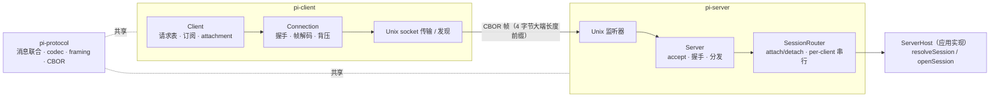

# 远程会话 C/S 体系（protocol / client / server）

三个包合成一套**实验性的「远程 pi session」客户端-服务器体系**：CBOR 二进制信封跑在有序字节流上，server 托管多个 durable Session，一个 Session 可被多个客户端以不同 **attachment** 附着。`protocol` 定义协议与编解码，`client`/`server` 是两端，全部消费方在 coding-agent 的 `experimental/`。

> **与「RPC 模式」不是一套东西。** JSONL over stdio 的 RPC 是成熟的生产特性（[启动与运行模式](coding-agent-startup.md) 流程 4）；本套是并行的新一代远程机制（实验、CBOR、多会话多客户端）。对比表见「现状与陷阱」。

[返回索引](../index.md) · 术语见 [glossary](../glossary.md) · 所属任务：T14（见 [roadmap](../../roadmap/tasks.md)）

## 一、定位

一句话职责：**给「多客户端连一个 pi server、每个客户端附着到某个持久会话」提供传输无关的协议与两端实现**——协议层只管路由、编解码与订阅语义；业务调用（service call）的载荷对它是**不透明的**（Chord 的 `ServiceCall`，[chord](chord.md) 拥有其语法）。



消费与门控：消费方全在 `packages/coding-agent/src/experimental/`（`PI_EXPERIMENTAL=1` + `server|client` 子命令门控，`core/experimental.ts:1-3`、`experimental/commands.ts:86`）；`packages/client` 经 `src/client/index.ts` 一行 re-export。三个包都是 coding-agent 的 **devDependencies**。

## 二、目录结构与模块地图

### pi-protocol（869 行）

| 文件 | 职责 |
|------|------|
| `src/protocol.ts`（110 行） | **协议常量与消息联合**：`PROTOCOL_VERSION = 8`（`:5`）、`ServerId`（UUIDv4 正则 `:12-19`）、客户端消息（hello/request/cancel，`:62`）、服务端消息（hello/hello_error/response/service_update/attachment，`:98-104`）；全部 schema 是 **strict object**（拒绝未知属性，`:9-10`） |
| `src/codec.ts`（141 行） | 消息级校验 + 增量解码器（`ClientMessageDecoder` `:106`/`ServerMessageDecoder` `:123`）；解码器 **fail-stop**（一次失败永久失败，`:79-91`）；`isSupportedProtocolVersion` 是**严格相等**（`:139-141`） |
| `src/framing.ts`（151 行） | 4 字节大端长度前缀分帧；`FrameDecoder`（`:44`）64KiB 块式组装（`:3`）、超限即 fail（`:77`）、流尾截断帧报错（`:135`）；默认上限 16MiB（`:6`） |
| `src/cbor/encoder.ts`（216）/`decoder.ts`（168）/`options.ts`（52） | **自研 CBOR 编解码**（不引第三方库）；限制常量：16MiB / 1,000,000 容器元素 / 深度 64（可配至 512）（`options.ts:6-8`） |

### pi-client（1135 行）

| 文件 | 职责 |
|------|------|
| `src/client.ts`（479 行） | `Client`（`:62`）：请求-响应关联（`#pendingRequests` + 自增 id，`:238`）、取消（`:252-269`）、服务订阅的生命周期（`:172-236`）、attachment 状态（`:398-415`）、`createClientServiceTransport`（`:448`）——把 Client 适配成 Chord 的 `RemoteServiceTransport` |
| `src/connection.ts`（245 行） | `Connection`（`:41`）：代次化（generation `id`）的连接生命周期 `disconnected→connecting→connected`；握手校验（首个服务端消息必须是 hello 且 serverId 匹配，`:163-181`）；**send 失败即断线**（`:112-117`） |
| `src/unix.ts`（299 行） | Unix socket 传输工厂（`createUnixTransportFactory`，`:88`）与**服务器发现**（`discoverUnixServers`，`:37`：扫目录 `*.sock`、socket 名即 serverId、16 并发探测、以握手校验 serverId、按 id 排序，`:84`） |
| `src/transport.ts`（18）/`errors.ts`（34）/`types.ts`（32）/`promise.ts`（16） | `ByteTransport` 契约（handler 式）；`ServerError`/`DisconnectedError`/`ClientDisposedError`；`ClientOptions`/`ConnectionState` |

### pi-server（1958 行）

| 文件 | 职责 |
|------|------|
| `src/server.ts`（576 行） | `Server`（`:46`）：accept 与握手（5s 超时，`:147-153`）、消息分发（`:223`）、**每连接一个 Chord 增量编码器表**（`serviceStateEncoders`）、订阅的"响应先于更新"纪律（`:358-382`）、协议错误封口（`failProtocol`，`:474`） |
| `src/session-router.ts`（312 行） | `SessionRouter`（`:34`）：attach/detach/removeSession、attachmentId 生成、**per-client 操作串行化**（`runForClient`，`:146`）、stale 目标拒绝（`requireAttachment`，`:224`）、断开时等待已受理调用 settle（`:238`） |
| `src/types.ts`（68 行） | **`ServerHost` 契约**（`:63`）：`serverServices`（server 级服务宿主）+ `resolveSession` + `openSession`；`RoutedSessionHandle`（`:55`，`terminated` 承诺 `:58`）、`RoutedSessionAttachment`（`:22`）、`RoutedServerPresentation`（`:33`） |
| `src/transports/unix/listener.ts`（421）/`preset.ts`（27） | Unix socket 监听与连接管理；预设工厂 |
| `src/testing/`（host 204 / client 183 / server 28） | 内存测试主机（`createTestServer`/`TestHarness`/`ProtocolTestClient`）——写协议测试的现成设施 |
| `src/listener.ts`（8）/`connection.ts`（37）/`errors.ts`（57） | 监听抽象；按连接的字节 IO；`SessionNotFoundError`/`ServerDrainingError`/`SessionNotAttachedError`/`WrongServerError` |

## 三、核心数据结构

### 消息联合（`protocol.ts`）

```ts
// 客户端 → 服务端
| { type: "hello"; version: number }                       // 必须首帧
| { type: "request"; id; target; call }                    // call 是不透明 JSON（Chord 语法）
| { type: "cancel"; id; target }
// 服务端 → 客户端
| { type: "hello"; version: 8; serverId }
| { type: "hello_error"; error }
| { type: "response"; id; ok: true; result? } | { …; ok: false; error }
| { type: "service_update"; subscriptionId; update }       // 订阅增量
| { type: "attachment"; attachment: SessionTarget | null } // 带外路由变更
```

### 三级路由（`RpcTarget`，`protocol.ts:36-47`）

- **server 级**：`{ serverId }`——一条连接只服务一个逻辑 server，serverId 在每次调用里重申；
- **session 级**：`{ serverId, sessionId, attachmentId }`——**attachmentId 是围栏**：断开重连或重新 attach 后旧 id 的调用被拒绝（`SessionNotAttachedError`），不会误打到新会话状态。

### 帧与限制

`4 字节大端长度 || CBOR 载荷`，默认上限 16MiB（`framing.ts:6`）；CBOR 侧另有 1M 元素/深度 64 的限制（`cbor/options.ts:6-8`）。编解码器是**自研**的（不依赖第三方 CBOR 库），解码器 fail-stop。

### `ServerHost`（`server/types.ts:63`）——应用侧唯一要实现的契约

- `serverServices.attachClient(presentation)` → server 级服务端点（每个客户端一个）；
- `resolveSession(sessionId)` → 会话元数据（不做启动）；
- `openSession(metadata)` → `RoutedSessionHandle`：`attachClient()` 取该客户端的 live 能力（`RoutedSessionAttachment.invokeService`）、`terminated` 承诺（意外终止时报错）、`close()`。

## 四、关键运行流程

### 1. 握手（`server.ts:262` / `connection.ts:67`）

1. 连接建立：客户端连上后**先发 hello**（`connection.ts:135-137`）；服务端 5s 握手超时（`:147-153`）。
2. 首帧必须是 hello（`dispatchMessage`，`:224-237`）→ **版本校验**：不匹配回 `hello_error{code:"version"}` 并封口（`:263-269`）。版本是严格相等（当前 8）——不做兼容协商。
3. 通过后 `host.serverServices.attachClient(...)`（`:272-281`）——把三个路由动作（attach/detach/prepareSessionRemoval）交给应用的 server 服务宿主；成功则回 `ServerHello{serverId}` 并进入 ready（`:287-295`）。
4. 客户端校验 hello 的 serverId 与自己要连的一致（`connection.ts:174-181`）——**连错服务器直接断线**，这也是 Unix 发现时「以握手校验 serverId」的实现。

### 2. 请求-响应与取消（`server.ts:306` / `client.ts:238`）

- 客户端：`id = request-<n>` 入表 → 编码（`parseServiceCall` 先做 Chord 语法校验）→ 发送；`signal` abort → 本地 reject + 发 `cancel` 帧（`:252-269`）。
- 服务端：重复 id 拒绝（`:307-315`）；解析 call（不合法回 `invalid_request`，`:316-327`）→ 建 **AbortController** 挂在连接上 → 按 target 分派：server 级走 `serverServices.invokeService`，session 级走 `SessionRouter.executeServiceCall`（`:351-357`）。
- `cancel` 帧按 id + target 匹配（`sameTarget`，`:547-553`）后 abort 对应 controller（`:298-304`）；被取消的响应回 `code:"cancelled"`（`:396-398`）。
- 错误封口（`toProtocolError`，`:512-521`）：应用错误原样带出，未知异常统一为 **sanitized `internal_error`**（不泄漏堆栈）。
- **响应发出之后再失败** = 协议流已错位 → 服务端主动断连（`:387-390`）。
- 客户端侧：没有匹配请求的响应 → fail 整个连接（`:333-337`）；send 失败同样按断线处理（背压/写失败 **即断线**，`connection.ts:102-118`）。

### 3. 服务订阅（快照 + 增量 + 每订阅独立编码器）

**服务端**（`:338-382`）：处理 `subscribe` 控制调用时——

1. 把结果（快照）用 **新装的 `createServiceStateEncoder`** 编码（`:358-364`），并把编码器存进该连接的 `serviceStateEncoders[subscriptionId]`；
2. **先发 response（含快照），再把此前缓冲的 pending updates 按序 flush**，之后 `subscriptionReady`——「响应先于更新」是硬纪律，保证客户端拿到基线后收到的第一条更新已经可以直接应用（`:368-382`）；
3. 之后每次 `publish` 经 `sendServiceUpdate`（`:438-450`）用**该订阅的编码器**编码 update（path 字典是每订阅独立的，见 [chord](chord.md)）；`unsubscribe` 删编码器（`:365-367`）。

**客户端**（`client.ts:172-236`）：订阅请求的 `transform`（`:197-204`）在响应到达时解码快照、把此前排队的 wire updates 依次解码进 `queued`；`start()` 才投递（activate 语义，与 Chord 的 subscribe/activate 对齐）；投递走 `deliveryTail` 串行链（`:417-421`）；`dispose()` 发 unsubscribe 并等投递尾（`:221-235`）。

### 4. Attachment 流程（`session-router.ts`）

**attach**（`attachClientNow`，`:160-197`）：若当前 attachment 就是同一 session 直接返回（幂等）→ `acquire(sessionId)` → 释放旧 attachment → 生成新 `attachmentId`（UUID）→ `handle.attachClient()` 拿 live 能力 → **发布带外 `attachment` 消息**（`publishAttachment`，`:192-196`）。

**per-client 串行化**（`runForClient`，`:146-158`）：每个客户端的所有路由操作（attach/detach/服务调用）走一条 Promise 链——同一客户端的请求不会并发进入 router。

**stale 拒绝**（`requireAttachment`，`:224-232`）：调用目标里的 `attachmentId` 必须等于当前 attachment——旧 id 一律 `SessionNotAttachedError`。

**detach 的耐心语义**（`releaseAttachment`，`:234-252`）：先 `Promise.allSettled(attachment.operations)` **等已受理调用 settle**，再 `lease.release()`，最后清 attachment 并发布 `attachment: null`——客户端断线路径（`disconnect`，`:91-101`）同样走它，只是不发布。

**会话生命周期**：`acquire`（`:262-274`）对并发 open 去重（`openingSessions`）；`open`（`:276-300`）调 `host.resolveSession` + `host.openSession`，并挂 `handle.terminated` → `invalidate`（`:302-311`：清 hosted、释放全部 attachments）；`removeSession`（`:72-89`）先释放全部 attachments 再 `handle.close()`。server 关闭时 `closeInternal`（`:108-144`）等路由操作与 opening，再统一释放。

### 5. Unix 传输与发现（`client/unix.ts`）

- socket 命名约定：目录下 `<serverId>.sock`（`:16`/`:53-57`）；`discoverUnixServers`（`:37`）只收合法 UUIDv4 名的 socket、`lstat` 确认是 socket、**16 路并发**握手探测（`:17`/`:61-82`）——探测失败即整体失败（第一错优先），ENOENT 视为正常消失；结果按 serverId 排序。
- 传输上限：`maxPendingBytes` 默认 `DEFAULT_MAX_FRAME_LENGTH * 4`（`:95`）——**背压是断线而非阻塞**（写不进去就断）。
- Windows 不支持 Unix 传输（`:38`/`:99` 显式抛错）。

### 6. coding-agent 的集成层（`experimental/`）

- **`ServerHost` 三个方法的实现**（`experimental/server.ts:435-442`）：`serverServices` 来自 `services/server.ts` 的 `createExperimentalServerServices`（用 Chord provider 暴露 SessionDirectory/SessionManagement/PresentationPlugins，`:402-434`）；`resolveSession`（`:388-394`）只查 worker 在管表或磁盘 catalog，**不启动**；`openSession`（`:438-441`）交给 `workers.openSession` 复用已注册 worker / 等 pending 启动 / 新 launch。
- **worker = 独立子进程，一会话一进程**（`session-worker-manager.ts:465` 的 `spawnInternalProcess("session-worker")`，经 coordinator socket 通信，15s 启动超时 `:31`）；**一个 session 可有多个 attachment**（`WorkerRecord.attachmentIds` 是 Set，`:51`；每次 attach 生成新 attachmentId 并计 demand，`:209-212`；worker 侧按 `serverConnectionId+attachmentId` 记账）；server 被替换时只忘不杀（`:436-447`），回收走 `#stopWorker`（shutdown 消息 + 10s 后 SIGKILL，`:372-401`）。
- 客户端组装（`client-runtime.ts:53-183`）：解析路由（`--connect`/发现/必要时激活 server）→ 每路由一个 `Client`（unix 或 radius 中继传输）→ 挂 `createServerServiceSource`/`createSessionServiceSource`（`:154`/`:170`），attach 后 `whenAttached` 等待完成。

## 五、对外接口与扩展点

- **协议层**（复用做自定义承载）：`encodeClientMessage`/`encodeServerMessage`/解码器、`frame`/`FrameDecoder`、CBOR 编解码与限制选项——任何有序字节流都能跑这套帧。
- **客户端**：`Client`（`connect`/`request`/`serviceCatalogue`/`subscribeService`/`onAttachmentChange`/`onConnectionStateChange`）；`createClientServiceTransport`（`:448`）把 Client 接成 Chord 的 `RemoteServiceTransport` —— **接入 chord 服务体系的官方桥**。
- **服务端**：实现 `ServerHost` 三个方法即可托管任意 durable 会话；`src/testing/` 提供内存 host/client 用于协议测试。
- **传输**：`ByteTransportFactory`（客户端）与 `ServerListener`（服务端）是替换点——Unix 只是仓库内置实现，coding-agent 还有 radius WebSocket 中继（CBOR 帧头 18B）。
- **发现**：`discoverUnixServers` 的命名/探测约定可直接作为多 server 场景的路由入口。

## 六、现状与陷阱

1. **实验门控**：整条链只在 `PI_EXPERIMENTAL=1` 且有 `server`/`client` 子命令时可达；三包是 coding-agent 的 devDependencies。
2. **与 JSONL RPC 的关系**（不要混用排查）：
   | 维度 | RPC 模式（JSONL） | 本套（CBOR C/S） |
   |------|------------------|------------------|
   | 协议 | JSONL over stdio（人类可读） | CBOR 分帧（4 字节长度前缀），`PROTOCOL_VERSION=8` |
   | 拓扑 | 父进程控制一个 pi 子进程，单会话 | 多客户端连一个 server，多 session、多 attachment |
   | 入口 | `pi --mode rpc` / `./rpc-entry` | `experimental/` 的 `server`/`client` 子命令 |
   | 成熟度 | 生产、文档完备 | 实验、有 testing 设施与协议测试 |
3. **协议版本严格相等**（`codec.ts:139-141`）：两端 8↔8 才放行，没有兼容窗口——升级即同步升级。
4. **没有自动重连**：`Connection` 断开后状态归 `disconnected`，重连是显式 `reconnect()`（客户端侧），且**旧 attachmentId 全部失效**——这是围栏设计，不是缺陷（配合 `onAttachmentChange` 重新 attach）。
5. **响应到达前失败 = 断连**（服务端 `:387-390`）、**无匹配响应 = 断连**（客户端 `:333-337`）：协议流错位用「断开」表达，不给"带病运行"的机会。
6. **背压策略是断线**：客户端 send 失败、服务端 send 失败都关闭连接——慢消费者不会拖垮 server，但会丢连接（上层自己重连）。
7. **attach 是幂等的、detach 是耐心的**：同 session 重复 attach 直接返回；detach 会等待已受理调用 settle（`:238`）——应用侧不需要自己跟踪"在飞调用数"。
8. **CBOR 是自研的**：修改协议时注意 `cbor/options.ts` 的三个限制（16MiB/1M 元素/深度 64）与 `decodeCbor` 的 `fatal:true` 文本解码——非法 UTF-8 即失败。
9. **`ServerHost.resolveSession` 不得启动 worker**：只解析元数据；启动是 `openSession` 的职责（集成层注释语义，`experimental/server.ts:388-394`）——把两者混在一起会让 `removeSession`/关闭路径变重。

## 七、二次开发落点

| 需求 | 落点 |
|------|------|
| 写协议客户端（非 Node） | 读 `protocol.ts` 的消息联合 + `framing.ts`（4 字节大端）+ 任一 CBOR 库（按 `cbor/options.ts` 的限制设防）；握手顺序：client hello → server hello → request/response |
| 自定义承载/路由 | 客户端实现 `ByteTransportFactory`；服务端实现 `ServerListener`；参考 radius 中继与 Unix 实现 |
| 托管更多会话类型 | 实现 `ServerHost`（三方法）；参考 `experimental/server.ts` 的 worker 模型（一会话一子进程，多 attachment） |
| 改协议（加消息/字段） | `protocol.ts` schema（strict，记得同时改两端解码验证）→ `PROTOCOL_VERSION` 递增 → 更新 `codec` 的校验用例；版本严格相等意味着这是一次破坏性变更 |
| 接 Chord 服务体系 | 客户端用 `createClientServiceTransport`；服务端实现 `RoutedSessionAttachment.invokeService`（application 侧把 `ServiceCall` 交给 Chord provider） |
| 协议测试 | `packages/server/src/testing/` 的内存 host/client 对端 |

## 八、相关文档

- [packages/protocol/README.md](../../packages/protocol/README.md)、[packages/client/README.md](../../packages/client/README.md)、[packages/server/README.md](../../packages/server/README.md)——各包 README（含限制与示例）
- 本套文档：[启动与运行模式](coding-agent-startup.md)（JSONL RPC 的详情与对比）、[chord](chord.md)（`ServiceCall`/订阅语义/状态编码器的归宿）、[durable](durable.md)（被托管的持久会话）、[architecture](../architecture.md) 第五节（两条远程路径）、[glossary](../glossary.md)（envelope/attachment 等条目）

---

[返回索引](../index.md) · 任务与进度：[roadmap](../../roadmap/README.md)
