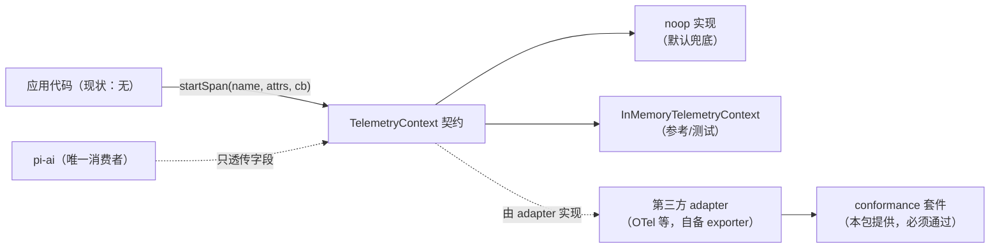

# pi-telemetry（遥测契约包）

`packages/telemetry`（包名 `@earendil-works/pi-telemetry`，6 个源文件、约 900 行）是一个**vendor-neutral 的遥测契约包**：定义回调式 `TelemetryContext`/`TelemetrySpan` 契约、schema 类型推导工具、noop 与内存两个参考实现、以及一套 adapter 一致性测试套件。**不含 exporter、不依赖任何后端。**

> **先澄清两个最容易混淆的点：**
> 1. **现状是「契约先行、消费端未落地」**：全仓（除本包自身与测试外）**没有任何 `startSpan` 调用点**（已 grep 实证）；唯一的消费者是 [pi-ai](ai.md)，且只是**类型透传**（`telemetryContext?` 字段）。README 中对「agent 拥有 schema」的描述是**目标形态而非现状**——本篇按源码实况标注。
> 2. **不要与「安装遥测」混淆**：coding-agent 另有一套完全无关的 install telemetry（`packages/coding-agent/src/core/telemetry.ts` 的 `isInstallTelemetryEnabled`，`PI_TELEMETRY` 环境变量 + `enableInstallTelemetry` 设置，统计匿名版本使用）。两者同名不同物。

[返回索引](../index.md) · 术语见 [glossary](../glossary.md) · 所属任务：T15（见 [roadmap](../../roadmap/tasks.md)）

## 一、定位

一句话职责：**把「应用想上报的遥测」抽象成一条与后端无关的契约**——应用侧只写 `startSpan(name, attrs, cb)`，export 到哪个系统（OTel、自建、内存）由 adapter 决定；契约包本身只管语义与一致性测试。



## 二、目录结构与模块地图

| 文件 | 职责 |
|------|------|
| `src/index.ts`（358 行） | 契约与类型层：`TelemetryContext`/`TelemetrySpan`（`:14-22`）、schema 定义类型（`:28-69`）、编译期推导类型（约 250 行高阶类型）、`defineTelemetrySchema`（`:72`，恒等函数）、`createTypedSpanStarter`（`:349`，运行时只做转发） |
| `src/noop.ts`（20 行） | `NOOP_TELEMETRY_CONTEXT`（`:20`）：**冻结的单一 span 复用**，嵌套 `startSpan` 也指向自己；同步回调、保真同步 throw（转 rejected promise）与异步 rejection（`:3-9`） |
| `src/memory.ts`（219 行） | `InMemoryTelemetryContext`（`:192`）：后端无关的参考实现——确定性 span ID（自增）、父链、属性合并、事件有序、结算（settle）状态、`getSpans()` 返回**脱离快照**（`:204-218`） |
| `src/testing/conformance.ts`（315 行） | 与测试框架无关的一致性用例集（`createTelemetryAdapterConformance`，`:61`），按组注册（`:65`） |
| `src/testing/types.ts` | `TelemetryAdapterFixture`（`:3`，`AsyncDisposable`：adapter 实例 + 规范化 `getSpans()`）、`TelemetryAdapterConformanceCase`（`:11`，`group`/`name`/`run`） |

## 三、核心数据结构

### 契约（`index.ts:14-22`）

```ts
interface TelemetryContext {
  startSpan<T>(options: { name; attributes? }, callback: (span) => T | Promise<T>): Promise<T>;
}
interface TelemetrySpan extends TelemetryContext {
  addEvent(name, attributes?): void;
  setAttributes(attributes): void;
  setStatus(status): void;
}   // 注意：没有公开的 end()——生命周期由 startSpan 的结算驱动
```

属性值只有**标量或标量数组**（`AttributeValue`，`:1`）；`undefined` 值被忽略。`status` 是 `{status:"ok"} | {status:"error", error?}`（`:12`）。

### schema 类型层（`index.ts:26-354`）

- `TelemetrySchemaDefinition`（`:66`）：`{version, spans}`；每个 span 声明 `parents`（`any`/`root_or_external`/指定 span 集合）、`startAttributes`（带 `required`）、`endAttributes`、`events`、`status.errorWhen`（`:52-64`）。属性元数据含 `sensitive`（仅标记）与 `cardinality`（`:28-32`）。
- 推导：`InferStartAttributes`/`InferEventAttributes`（required/optional 分离，`:122-144`）、`SchemaTelemetrySpan`（`:222`，把 `addEvent`/`setAttributes` 收窄到该 span 的词汇表）。
- `TypedSpanStarter`（`:318`）：把一个或多个 schema 的 span 词汇绑到指定的父 context；**跨 schema 重复 span 名在编译期报错**（`DuplicateTelemetrySpanNames`，`:281-297`，通过参数里的 `UniqueTelemetrySchemas` 约束生效）。
- **运行时零成本**：`defineTelemetrySchema` 是恒等函数；`createTypedSpanStarter` 的 `_schemas` 参数下划线标记未使用（注释明说 "Schema values are used only for type inference; no runtime schema validation"）。

### 记录快照（`memory.ts:11-25`）

`RecordedTelemetrySpan`：`id`（确定性自增）、`parentId`、`name`、`attributes`、`events`（有序）、`status`、`settled`、`endSequence?`——**不带时间戳**（设计取舍：内存参考实现专注语义而非时间，见「陷阱 4」）。

## 四、关键运行流程

### 1. `startSpan` 的结算语义（契约的核心）

**恰好调用一次** callback；以返回值/异常决定结算；成功不改 status（默认 `ok`），失败且**没有显式 setStatus** 时置为 error（自动错误来源）。

实现对照：

- **noop**：同步调用回调、冻结的 inert span；`setStatus`/`addEvent` 全是空操作——**任何在 noop 下的代码路径都不得依赖遥测副作用**。
- **memory**（`startInMemorySpan`，`:120-186`）：同步建 span 记录 → 回调（同步 throw 立即结算为失败）→ `Promise.resolve(result).then(成功结算, 失败结算)`（`:176-186`）；结算后 `addEvent/setAttributes/setStatus` **全部惰性**（`settled` 检查，`:142/:150/:158`）；**结算后再 `startSpan` 子 span 会退化为 noop**（`:126`）；记录过程中任何异常都被吞掉（"Recording is passive"，`:143-164`——遥测绝不能影响业务）。
- **显式 status 优先**（`settleSpan`，`:89-99`）：先 `setStatus` 过就保留（last-write-wins，`:157-165`），自动错误状态不覆盖显式值。
- 属性合并：`setAttributes` 逐键合并且忽略 `undefined`（`:63-69`）；数组值**复制**。

### 2. conformance 套件（adapter 的义务执行机构）

`createTelemetryAdapterConformance`（`:61`）用 fixture 协议（每个用例给一个**全新 adapter 实例** + 规范化 `getSpans()`）覆盖这些契约面（用例名即规范）：

- 成功/同步抛/异步 reject/`undefined` reject/不可读 error 各路径的结算与状态（`:73-123`）；
- 显式 status 优先于自动错误、last-write-wins（`:143-166`）；
- 事件有序（`:201-202`）、属性原子合并（`:207`）、结算后 inert（`:222-232`）；
- 父链与并发子 span（`:252-256`）；
- **对不可读/恶意 payload 的抑制**：不可读的 options、属性、status 不能让 adapter 抛错（`:276-304`）。

测试不依赖任何测试框架（`case.run()` 自己断言），因此可注册进 vitest/jest/自研 runner。

## 五、对外接口与扩展点

- **默认兜底**：任何需要遥测的 API 用 `NOOP_TELEMETRY_CONTEXT` 作为缺省值（pi-ai 的 `telemetryContext?` 即为可选项，不传就没有遥测）。
- **接入真实后端**：实现 `TelemetryContext`（`startSpan` 是唯一必须方法），建议包一层内存实现复用语义，并**通过 conformance 套件**再对外发布。
- **类型化上报**：`defineTelemetrySchema` 定义词汇 → `createTypedSpanStarter(ctx, schema)` 得到带收窄签名的 starter，子 span 由回调第二参数 `startChildSpan` 派生。
- **测试**：`InMemoryTelemetryContext` + `getSpans()` 快照——断言 order/status/events；`getSpans()` 返回值是脱离快照，改它不影响记录。

## 六、现状与陷阱

1. **零调用点（现状）**：全仓除本包自身/测试外没有 `startSpan`；pi 里唯一的接触面是 [pi-ai](ai.md) 的 `ProviderRequestOptions.telemetryContext?`（`packages/ai/src/types.ts:141`）在 `simple-options.ts:48` 的透传——**透传后没有任何 provider 消费它**。要真正接入，从 adapter 实现 + ai 侧消费两处同时动工。
2. **README 描述的是目标态**：README 声称 pi-agent-core 拥有 `AGENT_TELEMETRY_SCHEMAS` 等——全仓 grep 为零。阅读时以源码为准，本篇即为差异标注。
3. **与安装遥测同名不同物**：`PI_TELEMETRY` 环境变量属于 coding-agent 的 install telemetry（`core/telemetry.ts`），与本包无关；排查"遥测开关不生效"先分清是哪一个。
4. **参考实现不带时间戳**（`RecordedTelemetrySpan` 无时间字段）：`InMemoryTelemetryContext` 是为语义一致性设计的，不是 exporter；需要耗时请记录在事件/属性的业务语义里。
5. **结算后惰性是一致性的一部分**：adapter 若在结算后仍记录，会被 conformance 判失败（`:222-232` 用例）；反过来，**业务代码在结算后写遥测是静默丢弃而非报错**——别依赖终态 Span 上的迟到事件。
6. **noop 是冻结的共享实例**：嵌套/并发的 noop span 是同一个对象；`Object.freeze`（`noop.ts:17`）挡改写。依赖"每 span 独立对象"的代码在 noop 下不成立。
7. **schema 校验只在类型层**：schema 值运行时不做任何校验与剥离；发送到后端的属性**不自动脱敏**（`sensitive` 仅是元数据标记）——adapter 自己负责。

## 七、二次开发落点

| 需求 | 落点 |
|------|------|
| 接入 OTel/自建后端 | 实现 `TelemetryContext`（可包一层 `InMemoryTelemetryContext` 语义）→ 跑 `createTelemetryAdapterConformance` → 在应用组装点注入 |
| 定义业务 span 词汇 | `defineTelemetrySchema` + `createTypedSpanStarter`；跨模块复用 schema 时注意重复 span 名的编译期约束 |
| 让 pi 真正产生遥测 | 两处动工：① pi-ai provider/adapter 侧消费 `ProviderRequestOptions.telemetryContext`（目前仅透传）；② 宿主（coding-agent/durable）在请求组装点传入 context 并定义 schema |
| 测试自己的 adapter | `@earendil-works/pi-telemetry/testing` 的 fixture 协议 + 分组用例 |
| 改契约本身 | 注意向后兼容：签名变动会打断所有 adapter；新增应通过可选字段/新事件类型 |

## 八、相关文档

- [packages/telemetry/README.md](../../packages/telemetry/README.md)——详尽的契约与 API 表格（注意其中「目标形态」的表述，与本篇的现状标注对照阅读）
- 本套文档：[pi-ai](ai.md)（唯一消费者：`telemetryContext` 透传的位置）、[coding-agent 核心运行时](coding-agent-runtime.md)（install telemetry 与 `PI_TELEMETRY` 的设置面）、[glossary](../glossary.md)（TelemetryContext/conformance 条目）、[architecture](../architecture.md)

---

[返回索引](../index.md) · 任务与进度：[roadmap](../../roadmap/README.md)
