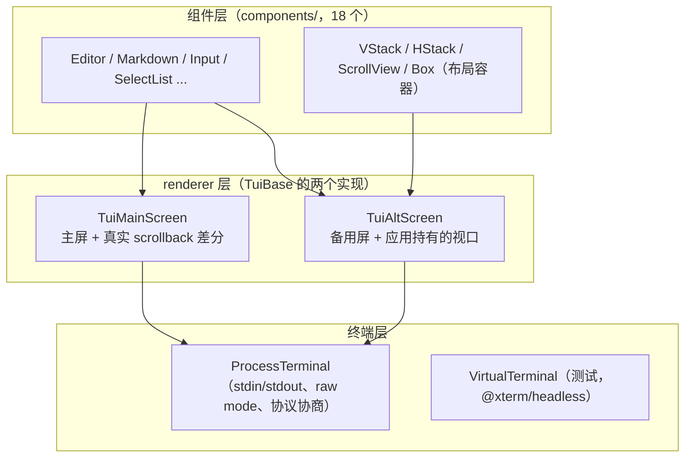
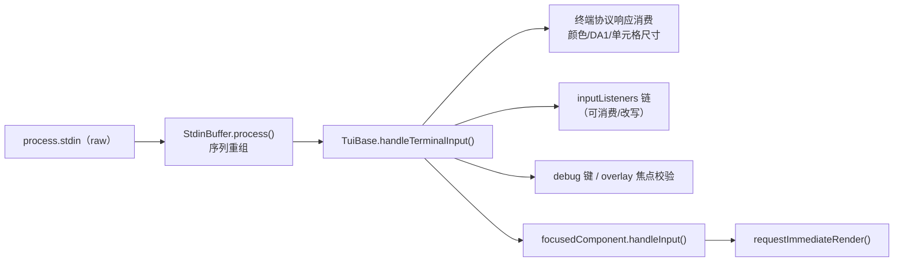

# pi-tui（终端 UI 框架）

`packages/tui`（包名 `@earendil-works/pi-tui`，约 1.9 万行、46 个源文件）是 pi 的终端 UI 框架：**差分渲染**（只重绘变化区域）+ **同步输出**（CSI 2026，帧原子化）+ 两种 renderer（主屏 / 备用屏视口）+ 组件库。它是 pi 中唯一被 coding-agent 大量消费的 UI 依赖（88 个源文件引用，集中在 `modes/interactive/` 与 `core/tools/renderers/`）。

[返回索引](../index.md) · 术语见 [glossary](../glossary.md) · 所属任务：T05（见 [roadmap](../../roadmap/tasks.md)）

## 一、定位

一句话职责：**把「组件树 → 字符串行数组 → 最小化的终端转义序列写入」这条管线做好**，其余（业务 UI、组件编排）都归使用方（coding-agent）。

外部依赖极少：`marked`（Markdown 组件）与 `get-east-asian-width`（东亚字符宽度）。输入侧直接处理 raw 终端的字节流（转义序列重组、Kitty 键盘协议协商），输出侧直接写 `process.stdout`（经 `Terminal` 抽象）。

三个层次：



使用格局（grep 实测）：coding-agent 的 `modes/interactive/interactive-mode.ts` **同时**使用两种 renderer（主屏模式为主，备用屏见其导入）；`cli/startup-ui.ts`、`cli/config-selector.ts` 用主屏；实验性的 `src/experimental/durable|vacation` 的 TUI 用备用屏。

## 二、目录结构与模块地图

### 核心（`src/`）

| 文件 | 职责 |
|------|------|
| `tui.ts`（1517 行） | 框架核心：`Component`/`Container`/`TUI` 接口、`TuiBase` 抽象基类（渲染调度、overlay 栈、焦点、输入分发、终端颜色查询） |
| `tui-main-screen.ts`（656 行） | 主屏 renderer：内容留在终端 scrollback，逐行差分 + 全量重绘条件 |
| `tui-alt-screen.ts`（1787 行） | 备用屏 renderer：全屏视口、布局系统、鼠标选区/复制/搜索/滚动条 |
| `terminal.ts`（609 行） | `Terminal` 接口 + `ProcessTerminal`：raw mode、Kitty 键盘协议协商、bracketed paste、光标/标题/进度（OSC 9;4）/程序状态（OSC 7501） |
| `stdin-buffer.ts`（444 行） | `StdinBuffer`：把分片到达的 stdin 字节重组成完整转义序列；bracketed paste 提取；ESC 超时 |
| `keys.ts`（1401 行） | 按键解析：`Key` 常量表、`parseKey`、`matchesKey`、Kitty 事件类型（press/repeat/release） |
| `keybindings.ts`（320 行） | 键位注册表：`Keybindings` 接口（语义 ID）、`TUI_KEYBINDINGS` 默认值、`KeybindingsManager`（用户覆盖 + 冲突检测） |
| `layout.ts`（449 行） | 备用屏布局：`LayoutBox` 树构建、绘制（clip/滚动条/图片裁剪）、命中测试 |
| `layout-node.ts`（51 行） | 布局协议：`LAYOUT_NODE` symbol，组件用它声明自己是 stack/scroll 节点 |
| `utils.ts`（1402 行） | 宽度与文本手术：`visibleWidth`、`truncateToWidth`、`wrapTextWithAnsi`、`sliceByColumn`、grapheme 处理、ANSI 提取 |
| `terminal-image.ts`（763 行） | 图片支持：Kitty/iTerm2 编码、能力探测（`detectCapabilities`）、PNG/JPEG/GIF/WebP 尺寸解析、图片元数据注册 |
| `colors.ts`（367）/`oklab.ts`（233）/`terminal-colors.ts`（91） | 颜色模型（RGB/索引色/OKLCH/OKHSL、混色）、OSC 10/11/4 颜色查询响应解析 |
| `program-status.ts`（53） | OSC 7501 程序状态上报 |
| `latex.ts`（1506）、`autocomplete.ts`（861）、`fuzzy.ts`、`word-navigation.ts`、`wheel-scroll.ts`、`undo-stack.ts`、`kill-ring.ts`、`alt-screen-search.ts`（327） | 支撑模块：LaTeX 渲染（给 Markdown 组件）、补全、模糊匹配、词移动、滚轮加速、undo/yank 数据结构、备用屏搜索 |
| `native-platform.ts`（65）/`native-module-path.ts`（31）/`native-modifiers.ts`（13） | 原生模块加载与降级（见流程 7） |

### 组件库（`src/components/`，18 个）

| 组件 | 行数 | 说明 |
|------|------|------|
| `editor.ts` | 2473 | 全功能多行编辑器：光标/选区滚屏/历史/undo/kil-ring/paste markers/autocomplete/提交回调，是编码器组件——`Editor` 类（`:297`）、`render`（`:521`）、`handleInput`（`:696`）、`handlePaste`（`:1260`） |
| `markdown.ts` | 1025 | Markdown 渲染（基于 `marked`，含 LaTeX） |
| `input.ts` / `select-list.ts` / `settings-list.ts` | 501/273/328 | 单行输入、列表选择、设置列表 |
| `scroll-view.ts` | 224 | 视口容器：`follow:"end"` 跟随流式输出、`primary` 主视口、overscroll、瞬态滚动条 |
| `stack.ts` + `v-stack.ts`/`h-stack.ts` | 154/33/44 | 约束布局容器：`basis/grow/shrink/minSize/maxSize/visible`，`align` |
| `box.ts` / `text.ts` / `truncated-text.ts` / `spacer.ts` | | 基础视觉组件 |
| `image.ts` | 167 | 终端图片组件（Kitty/iTerm2） |
| `loader.ts` / `cancellable-loader.ts` | | 加载指示 |
| `mouse-region.ts` | 33 | 局部鼠标事件区域 |
| `alt-screen-flash.ts` | 51 | 备用屏瞬时提示 |

### 原生与测试

- `native/<platform>/`：`build.sh` + `src/*.m|c` + `prebuilds/<platform>-<arch>/*.node`（已提交入库）。用途：剪贴板、修饰键状态、Windows VT 输入。
- `test/virtual-terminal.ts`：基于 `@xterm/headless` 的 `VirtualTerminal implements Terminal`（`:11`），测试用真实终端语义（ANSI 解析/回滚缓冲）验证输出。

## 三、核心数据结构

### Component 契约（`tui.ts:117`）

```ts
interface Component {
  render(width: number): string[];       // 每行不得超过 width（超宽是硬错误，见陷阱 2）
  handleInput?(data: string): void;      // 有焦点时的键盘输入（原始序列）
  handleMouse?(event: TuiMouseEvent): TuiMouseEventResult | undefined;
  wantsKeyRelease?: boolean;             // 是否接收 Kitty release 事件（默认 false，被过滤）
  invalidate(): void;                    // 缓存失效（主题切换等）
}
```

派生约定：`Container`（`:358`）拼装 `children` 的 render 结果并缓存每个 child 的高度用于鼠标命中（`mouseLayout`，`:360`）；`Focusable`（`:180`）组件在聚焦时于渲染输出中输出 `CURSOR_MARKER`（APC 序列 `\x1b_pi:c\x07`，`:196`），TUI 剥离它并把**硬件光标**定位过去（IME 候选框需要）。fake cursor 标记（`:199-207`）是纯软件光标（反视频渲染），用于「显示硬件光标时隐藏重复的软光标」。

### TUI 接口与 TuiBase（`tui.ts:464` / `:506`）

`TUI` 接口暴露 embedder 需要的全部能力：`start/stop`、`renderNow/requestRender`、`setFocus`、`showOverlay/hideOverlay`、`addInputListener`、终端颜色查询（`queryTerminalColors`，`:1494`）。`TuiBase` 实现通用部分，子类只需实现 `doRender()`（`:552`）与 `mode`：

- **渲染调度状态**：`renderRequested` + `renderTimer` + `MIN_RENDER_INTERVAL_MS = 16`（`:518`）——所有重绘请求被节流到 ~60fps。
- **Overlay 栈**：`overlayStack`（`:535`）+ 焦点恢复状态机（`:541`，`eligible`/`blocked`/`restore-overlay`——处理「overlay 被抢焦点后按顺序归还」）。
- **焦点**：`focusedComponent` + `Focusable.focused` 开关（`:649-657`）。
- **输入分发**：`handleTerminalInput`（`:1055`）。
- **`ViewportTUI`**（`:495`）：备用屏模式的能力品牌（`setLayoutRoot`），用 `isViewportTUI()`（`:502`）收窄。

### 布局协议（`layout-node.ts`）

```ts
type LayoutNode = StackLayoutNode | ScrollLayoutNode;
interface StackLayoutNode { type: "vstack" | "hstack"; entries: StackLayoutEntry[]; gap: number; align: ... }
interface ScrollLayoutNode { type: "scroll"; component: Component; state: ScrollLayoutState }
```

组件实现 `[LAYOUT_NODE]()` 方法声明自己是布局节点（`layout-node.ts:48` 的 `getLayoutNode` 读取）；没实现的组件按 `render()` 行数整体参与布局（`layout.ts:117-134`，行数超出分配高度时按 `CURSOR_MARKER` 所在行做 `lineOffset` 滚动窗口）。`StackLayoutEntry` 的 flex 式字段：`basis`（`"auto"` = 固有尺寸）、`grow`、`shrink`（默认 1）、`minSize`/`maxSize`、`visible(viewport)` 条件显示。

### Overlay 选项（`tui.ts:254`）

`OverlayOptions`：`width`/`maxHeight`（绝对值或 `"50%"` 百分比）、`anchor`（9 向，默认 center）、`row`/`col`（绝对或百分比）、`margin`、`offsetX/Y`、`visible(termWidth, termHeight)` 动态可见性、`nonCapturing`（不抢键盘焦点）。`showOverlay` 返回 `OverlayHandle`（`:309`）：`hide/setHidden/focus/unfocus/isFocused/getBounds`。

## 四、关键运行流程

### 1. 渲染调度（节流与优先级）

- `requestRender()`（`tui.ts:1001`）：`renderRequested` 去重 → `nextTick` 排队 → `scheduleRender()`（`:1035`）按「距上次渲染是否满 16ms」决定立即或 `setTimeout`，满帧后再补一轮。
- `requestImmediateRender()`（`:1012`）：**输入路径专用**——键盘输入延迟敏感，绕过节流（源码注释：Windows 上 `setTimeout(0)` 可能等满一个 tick）。`handleTerminalInput` 在把输入交给组件后调用它（`:1127-1129`）。
- `renderNow(force)`（`:993`）：直接渲染（可强制重置差分状态）；`force` 的 `requestRender(true)` 也走立即路径并重置。

### 2. 主屏差分渲染（`TuiMainScreen.doRender`，`tui-main-screen.ts:247`）

这是「内容留在 scrollback、帧变化最小化」的渲染器。一次 doRender 的决策链：

1. **渲染组件**：`render(width)` → fake cursor 解析 → overlay 合成（`compositeOverlays`，`tui.ts:1350`，先于差分比较）→ 提取光标位置（`extractCursorPosition`）→ 行 reset 规范化（`applyLineResets`，`tui.ts:1424`）。
2. **全量重绘条件**：首个渲染（`:332`，不清屏）、**宽度变化**（`:339`，换行全变）、**高度变化**（`:348`，Termux 例外——软键盘弹出会频繁改高度，全量重绘会让历史重播，故跳过）、`clearOnShrink` 且内容收缩（`:357`）、**首个变化行在上一视口上方**（`:452`，scrollback 里的行无法回改）、删除行导致视口上移或超高等边界（`:409`/`:420`）、Kitty 图片预清除会导致滚动（`:499`）。
3. **差分比较**（`:363-389`）：逐行比较 `previousLines` 找 `firstChanged`/`lastChanged`；追加行扩展；Kitty 图片的「保留行区块」整体扩展（`:210-231`）。
4. **增量写**（`:458-568`）：光标移动到 `firstChanged`（必要时先 `"\r\n"` 推滚让目标进入视口，`:472`），从 `firstChanged` 写到 `renderEnd = min(lastChanged, 末行)`——**不是写到文件尾**（防止 spinner 单行变化引发整屏重写）；每行 `\x1b[2K` 清除后写入；多余旧行清除并把光标移回。所有写入包在同步输出序列 `\x1b[?2026h ... \x1b[?2026l` 里（帧原子化，无撕裂）。
5. **视图跟踪**：`cursorRow`（内容末行）与 `hardwareCursorRow`（终端里光标的实际位置）分开跟踪；`previousViewportTop` 维护可见窗口起点；`maxLinesRendered` 是工作区高水位。
6. **写入分块**：`BoundedTerminalWriter`（`:18`）以 1MiB 为界分块写出，避免整帧拼成超长字符串触发 V8 字符串上限；分块点在 surrogate pair 边界对齐。
7. **超宽行保护**（`:518-544`）：某行可见宽度 > 终端宽度时，写出 crash log 并**抛错停止**（这是组件 bug 的兜底，错误信息提示用 `truncateToWidth`）。

硬件光标定位（IME）：`positionHardwareCursor`（`:624`）把光标移到 `CURSOR_MARKER` 的位置；`stop()` 时把光标推回内容末尾并换行（`beforeTerminalStop`，`:168`），保证退出后 shell 提示符位置正确。

### 3. 备用屏渲染（`TuiAltScreen.doRender`，`tui-alt-screen.ts:1680`）

全屏模式：终端进入备用屏（无 scrollback），视口完全由应用管理：

1. **布局求解**：`renderLayoutFrame(root, width, height)`（`layout.ts:379`）构建 `LayoutBox` 树并绘制成整屏 `lines`。
2. **附加层**（按序，`:1690-1696`）：fake cursor → 搜索高亮 → 「跳到底部」指示器 → overlay 合成 → 选区渲染 → flash 提示。
3. **行级差分**（`:1704-1771`）：`fullRedraw`（首次/宽高变化）才清屏；否则 `changedRows` 逐行比较，用绝对定位 `\x1b[${row+1};1H\x1b[2K` 只重写变化行。Kitty 图片有额外的重绘与排序策略（WezTerm 特例：图片放在最后画，`:1746-1765`）。
4. **交互**：鼠标滚轮（`WheelScrollAccelerator` 加速）、拖拽选择与自动滚屏、OSC 52 复制（`copySelection` 回调可替换为系统剪贴板）、OSC 8 超链接点击（`openUrl`）、滚动条拖拽/悬停/轨道点击、OSC 133 语义提示符间跳转、transcript 搜索（`alt-screen-search.ts`）。`TuiAltScreenOptions`（`:168`）是这些能力的开关表。

### 4. 布局求解与绘制（`layout.ts`）

- **测量**：`renderCached`（`:68`）按「组件 × 宽度」缓存 render 结果——同一宽度只渲一次；`measureHeight`/`measureWidth` 基于它。
- **尺寸分配**：vstack/hstack 取每项 `basis` 或固有尺寸 → `allocateStackSizes`（`stack.ts:135`）：总量少于可用空间按 `grow` 加权补足，多于则按 `shrink × 当前尺寸` 加权收缩，每步 clamp `minSize/maxSize`（`distribute`，`:95`）。
- **滚动节点**（`layout.ts:136-168`）：先以**上次的 scrollTop** 偏移布局 child（内容高度确定）→ `scrollView.updateLayout(contentHeight, viewportHeight)`（内容/视口尺寸同步、follow-end 或位置 clamp，`scroll-view.ts:189`）→ 把 child 平移回实际位置。
- **绘制**：`paintBox`（`:330`）逐 box 逐行：行宽裁剪、Kitty 图片按 clip 裁剪（`cropKittyImageLine`）、全宽 box 有「源行直用」快速路径（`:350`，避免每帧重建 ANSI 分段）、滚动条绘制（`paintScrollbar`，`:309`，thumb 高度按内容比例，`auto` 模式带隐藏延迟）。
- **命中测试**：`getLayoutBoxesAt`（`:415`）取覆盖点的最深/最高 layer 盒链，鼠标事件以此分发。

### 5. 输入管线（stdin → 组件）



- **终端层协商**（`ProcessTerminal.start`，`terminal.ts:193`）：raw mode + bracketed paste（`\x1b[?2004h`）→ `queryAndEnableKittyProtocol()`（`:288`）：请求 Kitty 键盘协议 flags 1+2+4（消歧义/事件类型/替代键），**以 DA1 响应为哨兵**判断终端是否支持（不支持则等不到 Kitty 响应、先收到 DA1 → 降级 `modifyOtherKeys`，`:402`）。协议协商响应本身经由 `StdinBuffer` 分析（支持跨 chunk 响应重组，`:333`）。Windows 上额外启用原生 VT input（`:420`），否则 Shift+Tab 等修饰键信息会丢。
- **序列重组**（`StdinBuffer`，`stdin-buffer.ts`）：`process()` 把字节流积累并切成完整序列——识别 CSI/OSC/DCS/APC/SS3 的终结条件（`:31-181`）、旧式/SGR 鼠标序列、**独立 ESC 超时**（`:388`：`buffer === ESC` 时用 escapeTimeout，否则用 sequenceTimeout）。两个超时来自 `resolveEscapeTimeoutMs()`（`terminal.ts:136`）：本地 10ms、SSH 环境 100ms、可用 `PI_TUI_ESC_TIMEOUT` 覆盖。特殊修复：WezTerm 的「ESC + Kitty CSI-u release」粘连帧会被正确拆成两个序列（`:219-232`）。bracketed paste 内容以 `"paste"` 事件单独发出，再由 `ProcessTerminal` 重新包回标记转发（`terminal.ts:260-264`）。
- **分发**（`TuiBase.handleTerminalInput`，`tui.ts:1055`）：按序处理——等待中的终端颜色查询响应（`:1133`，OSC 10/11/4 + DA1 结束标记）→ 配色方案上报（`:1179`）→ `inputListeners` 链（`:1063`，可 `consume` 或改写 `data`）→ 单元格尺寸响应（`:1081`）→ 全局 debug 键（Shift+Ctrl+D，`:1086`）→ overlay 焦点可见性校验与恢复（`:1093-1117`）→ 聚焦组件 `handleInput`（`:1123` 过滤 release 事件除非组件 `wantsKeyRelease`）→ 触发立即渲染（`:1129`）。
- **按键判定**：`keys.ts` 的 `matchesKey(data, keyId)`（`:820`）与 `parseKey`（`:1251`）处理普通/xterm 修饰序列/Kitty 序列三种编码；`Key` 常量表在 `:163`。
- **键位**：组件不直接调 `matchesKey("ctrl+x")` 硬编码（AGENTS.md 规则），而是走 `getKeybindings().matches(data, "tui.editor.cursorUp")`（`keybindings.ts:270`）。语义 ID 定义在 `Keybindings` 接口（`:7`，约 50 个），默认值在 `TUI_KEYBINDINGS`（`:71`）；`KeybindingsManager` 处理用户覆盖并检测冲突（`:257`）。下游可经 declaration merging 追加自己的 ID（`:5` 注释）。

### 6. Overlay 与焦点

`showOverlay`（`tui.ts:729`）入栈并（默认）接管焦点；`hideOverlay`（`:829`）弹栈并把焦点还给「最上层可见 overlay 或入栈前的 preFocus」。焦点恢复状态机（`:541` 起的 `overlayFocusRestore`）处理一个细粒度问题：overlay 聚焦期间，某个非 overlay 组件（如后台任务的提示行）被显式聚焦——当它失去焦点时应**先回到被抢占的 overlay**而不是原始 preFocus。鼠标命中最上层 overlay（`dispatchMouseToOverlay`，`:873`，基于最近一次渲染的 bounds）。overlay 合成在**差分比较之前**（主屏 `:268`、备用屏 `:1693`），因此 overlay 的开/关也走差分路径。

### 7. 原生模块：加载与降级（`native-platform.ts`）

- **加载**：`native/<platform>/prebuilds/<platform>-<arch>/<platform>-platform[-x11].node`（`:28-53`），候选路径由 `getNativeModuleCandidates()`（`native-module-path.ts:14`）给出——包安装目录、模块所在目录、可执行文件目录（覆盖 npm 安装 / 源码 checkout / standalone 二进制三种形态；standalone 二进制没有包目录，靠后两者命中）。
- **能力**：`NativeClipboard`（`native-platform.ts:9`：文本/图片/文件路径读取，Linux 经命令行工具写回）+ `enableVirtualTerminalInput`（Windows）+ `isModifierPressed`（Apple Terminal 与 Windows 上把 `\r` 升级成 Shift+Enter 序列，`terminal.ts:390-399`）。
- **降级**：加载失败返回 `undefined`（`:51` 缓存），调用方自己降级——例如剪贴板回退到命令行工具或 OSC 52（`copySelection` 回调即为此设计）。Linux 仅在 `DISPLAY` 存在时尝试加载 X11 helper（`:61-64`）。
- **构建**：`packages/tui/native/darwin|linux|win32/build.sh` 分别用 clang/AppKit、libxcb(X11)、MSVC/MinGW 编译到 `prebuilds/`（预编译产物已入库，普通安装不需要编译）。

### 8. 能力探测、图片与颜色

- **能力探测**：`detectCapabilities`（`terminal-image.ts:146`）判断终端支持的图片协议（`ImageProtocol = "kitty" | "iterm2" | null`）等能力，结果缓存并提供 `setCapabilityOverrides`（`:187`）供上层纠正；tmux 场景有专门探测。
- **图片**：Kitty 协议编码（`encodeKitty`，`:226`）：上传 + placement + 按 cell 尺寸计算行数；iTerm2 编码（`encodeITerm2`，`:293`）不支持视口裁剪/删除（备用屏对 iTerm2 图片退化为文本渲染）。图片行内置元数据（`registerKittyImageMetadata`/`getKittyImageMetadata`，`:349`/`:380`），`isImageLine`（`:207`）让宽度/裁剪逻辑识别图片行。单元格像素尺寸经 `CSI 16 t` 查询（`tui.ts:971`，响应消费 `:1191`）。
- **颜色**：输出侧 `colors.ts` 提供真彩/256/16 色降级（`getTerminalColorMode`，`terminal-image.ts:178`）与 OKLCH/OKHSL 混色（`oklab.ts`）；输入侧 `queryTerminalColors()`（`tui.ts:1494`）发出一条组合查询（OSC 10 前景 + OSC 11 背景 + OSC 4 × 16 调色板 + DA1 哨兵，`:168`），按响应逐项收集、DA1 或全部到齐或超时结算，超时后迟到的回复经 `onLateReply` 交付。

### 9. 测试与调试

- **测试**：`test/virtual-terminal.ts` 用 `@xterm/headless` 模拟终端（真实的 ANSI 语义 + 回滚缓冲），断言经过终端解释后的屏幕内容——比字符串对比更接近真实行为。
- **调试开关**：
  - `PI_TUI_WRITE_LOG=<file|dir>`：把每次 `terminal.write` 的原样内容追加记录（`terminal.ts:170-183`）。
  - `PI_TUI_DEBUG_REDRAW=1`：主屏每次**全量重绘**写明原因到 `pi-tui-debug.log`（`tui-main-screen.ts:322-329`，含「为什么全量」的触发条件文案）。
  - `PI_TUI_DEBUG=1`：把单帧渲染快照（newLines/previousLines/游标位置）写到 `/tmp/tui/`（`:570-597`）。
  - 渲染抛错时写出 `pi-tui-crash.log`（含全部行及宽度，`:518-544`）。

## 五、对外接口与扩展点

`index.ts` 导出全量 API，扩展点如下：

| 扩展点 | 做法 | 参考 |
|--------|------|------|
| 自定义组件 | 实现 `Component`；内容超出宽度用 `truncateToWidth`/`wrapTextWithAnsi`；`invalidate()` 里清缓存 | README「Creating Custom Components」；组件目录 |
| 布局参与 | 实现 `[LAYOUT_NODE]()` 返回 stack/scroll 节点；或直接用 `VStack`/`HStack`/`ScrollView` | `layout-node.ts`、`components/stack.ts` |
| 自定义 renderer | 继承 `TuiBase` 实现 `doRender()` + `mode`；聚焦组件输出 `CURSOR_MARKER` 定位硬件光标 | `tui-main-screen.ts` / `tui-alt-screen.ts` |
| 键位 | declaration merging 扩展 `Keybindings`；默认值进 `TUI_KEYBINDINGS`；用户配置经 `setKeybindings` | `keybindings.ts:7`/`:71` |
| 输入拦截 | `tui.addInputListener(fn)`：可消费（`consume`）或改写（`data`）任意输入 | `tui.ts:943`、`handleTerminalInput` 链 |
| 模态 UI | `showOverlay` + `OverlayHandle` | 流程 6 |
| 终端适配 | 实现 `Terminal` 接口（如测试、远程桥接） | `VirtualTerminal`、README「Terminal Interface」 |
| 颜色查询 | `queryTerminalColors({timeoutMs, onLateReply})` 获取前景/背景/调色板 | `tui.ts:1494` |

消费者集成参照：coding-agent 的 `modes/interactive/interactive-mode.ts`（工具 renderer 在 `core/tools/renderers/`，组件树与事件渲染见 [coding-agent 核心运行时](coding-agent-runtime.md)）。

## 六、现状与陷阱

1. **主屏差分「只能触碰可见视口」**：scrollback 中已写出的行无法回改，`firstChanged < previousViewportTop` 一律全量重绘（`tui-main-screen.ts:452`）。给长会话做「历史内容原地更新」的 UI 会频繁触发全量——备用屏模式（自持视口）才是正确选择。
2. **输出超宽是硬错误而不是自动截断**：组件必须自己保证 `render(width)` 每行不超过 width；违反时框架写 crash log 后抛错（`:518-544`）。这是有意的质量闸门。
3. **Termux 的 height 变化不触发全量重绘**（`:348`）：软键盘开关会改终端高度，全量重绘会导致历史重播。若你写终端适配层，注意这个平台差异。
4. **Kitty 键盘协议的协商是「请求即启用」**：`\x1b[>7u` 发出后终端若支持就已经启用（协议语义），响应只是确认；不支持时靠 DA1 哨兵提前判定并降级 `modifyOtherKeys`，避免固定等待超时（`terminal.ts:288-330`）。
5. **ESC 超时是可变的**：本地 10ms 对 SSH 上的 Alt+key 太短（会拆成 ESC + 字符），框架按环境变量自动放宽（SSH → 100ms），可用 `PI_TUI_ESC_TIMEOUT` 覆盖（`terminal.ts:136`）。
6. **输入事件过滤**：Kitty release 事件默认被丢弃，组件需显式 `wantsKeyRelease = true`（`tui.ts:1123`）。写「按键抬起」交互时别忘这一步。
7. **渲染节流对输入让路**：键盘输入路径走 `requestImmediateRender` 绕开 16ms 节流（`:1127-1129`）；但组件内部的程序化 `requestRender` 仍受节流约束——动画类 UI 请按 ~60fps 设计。
8. **stop() 的干净退出**：会禁用 bracketed paste/Kitty 协议、暂停 stdin（防止 Ctrl+D 泄漏到父 shell，`terminal.ts:510-513`）、还原 raw mode；`drainInput()`（`:429`）用于退出前排空残留输入（慢速 SSH 上防止 release 事件泄到 shell）。
9. **`\x1b[?2026` 同步输出**：所有帧写入都包在这个序列里（`tui-main-screen.ts:281`、`tui-alt-screen.ts:1732`）；对接的终端不支持时会作为未知序列忽略，不破坏输出。

## 七、二次开发落点

| 需求 | 落点 |
|------|------|
| 写一个新组件（状态行、进度面板等） | `packages/tui/src/components/` 照现有组件样板；对外发布可经自己的包 re-export |
| 改编辑器行为（快捷键、粘贴、补全） | `components/editor.ts`（`Editor` 类）+ `keybindings.ts` 的 `tui.editor.*`；补全协议见 `autocomplete.ts` 与 `EditorComponent` 接口（`editor-component.ts`） |
| 定制全屏会话界面（如 durable 的 TUI） | `TuiAltScreen` + `setLayoutRoot(VStack(...))`；参照 coding-agent `src/experimental/durable/tui.ts` |
| 给 pi 交互模式加 UI 元素 | 在 coding-agent 侧做（工具 renderer、extension UI），见 [coding-agent 扩展与 SDK](coding-agent-extensions.md)；pi-tui 只提供原语 |
| 新增主题/颜色 | `colors.ts` 的 `TerminalColorMode` 与 OKLCH 混色；主题系统本身在 coding-agent（`modes/interactive/theme/`） |
| 终端兼容性问题排查 | 开 `PI_TUI_WRITE_LOG` 记录输出，用 `PI_TUI_DEBUG_REDRAW=1` 看全量重绘原因，`/tmp/tui` 快照对比 |
| 为渲染写测试 | `test/virtual-terminal.ts` 的 `VirtualTerminal`（@xterm/headless） |

## 八、相关文档

- [packages/tui/README.md](../../packages/tui/README.md)——用户 API 手册（Core API、Overlays、Mouse Input、Built-in Components、Rendering modes、Creating Custom Components 等章节）
- 平台与终端：`packages/coding-agent/docs/terminal-setup.md`、`tmux.md`、`termux.md`、`windows.md`、`keybindings.md`、`tui.md`
- 本套文档：[coding-agent 核心运行时](coding-agent-runtime.md)（interactive 模式与工具 renderer 如何消费 pi-tui）、[coding-agent 启动与运行模式](coding-agent-startup.md)、[glossary](../glossary.md)、[architecture](../architecture.md)

---

[返回索引](../index.md) · 任务与进度：[roadmap](../../roadmap/README.md)
